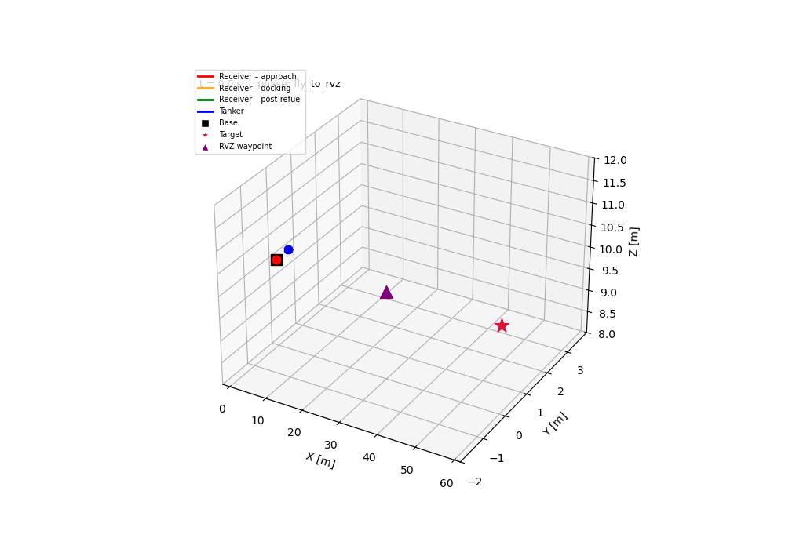

# S027 Aerial Refueling Relay

**Domain**: Logistics & Delivery | **Difficulty**: ⭐⭐⭐ | **Status**: ✅ Completed

---

## Problem Definition

A delivery drone (Receiver) departs from a base station toward a target 60 m away. Its battery alone is insufficient for the full round trip. A tanker drone launches simultaneously, flies ahead to a rendezvous waypoint at the mission midpoint, holds a loiter orbit, and waits for the Receiver. When the Receiver achieves soft-docking (relative position < ε_p, relative velocity < ε_v), an energy transfer is executed. The Receiver then resumes delivery; the Tanker returns to base.

---

## Mathematical Model Summary

**Battery drain model**:

$$\dot{E} = -(k_f v^2 + k_h)$$

**Remaining range estimate**:

$$d_{rem} = \frac{E}{k_f v^2 + k_h} \cdot v$$

**Rendezvous waypoint** (midpoint fraction $\alpha$):

$$\mathbf{w}_{rvz} = (1-\alpha)\,\mathbf{p}_{base} + \alpha\,\mathbf{p}_{target}$$

**Tanker loiter orbit**:

$$\mathbf{p}_T(t) = \mathbf{w}_{rvz} + R_{orb}\begin{bmatrix}\cos(\omega t)\\\sin(\omega t)\\0\end{bmatrix}$$

**Receiver approach control** (Phase 1, with Tanker feed-forward):

$$\mathbf{u}_R = -K_p\,\delta\mathbf{r} - K_d\,\delta\mathbf{v} + \mathbf{a}_T$$

**Soft-dock control** (Phase 2):

$$\mathbf{u}_R = -K_{p2}\,\delta\mathbf{r} - K_{d2}\,\delta\mathbf{v}$$

**Energy transfer** (5% loss):

$$E_R \mathrel{+}= \Delta E_{xfer}, \qquad E_T \mathrel{-}= \Delta E_{xfer}(1 + \eta_{loss})$$

---

## Key Parameters

| Parameter | Value |
|---|---|
| Cruise speed (both drones) | 5.0 m/s |
| Tanker loiter speed | 1.0 m/s |
| Loiter radius | 2.0 m |
| Flight power coefficient k_f | 0.3 W·s²/m² |
| Hover baseline drain k_h | 0.5 W |
| Receiver initial battery E0_R | 400 J |
| Tanker initial battery E0_T | 800 J |
| Energy transferred dE_xfer | 300 J |
| Transfer loss fraction eta_loss | 5% |
| Docking engagement radius d_dock | 0.4 m |
| Position dock tolerance eps_p | 0.15 m |
| Velocity dock tolerance eps_v | 0.05 m/s |
| Approach PD gains (Kp, Kd) | (3.0, 2.0) |
| Soft-dock PD gains (Kp2, Kd2) | (6.0, 4.0) |
| Rendezvous fraction alpha | 0.5 (midpoint) |
| Base-to-target distance | 60.0 m |
| Simulation time-step DT | 0.02 s |

---

## Simulation Results

| Metric | Value |
|---|---|
| Simulation duration | 26.56 s |
| Rendezvous waypoint | [30.0, 0.0, 10.0] m |
| Tanker loiter start | 5.96 s |
| Docking phase start | 5.96 s |
| Docking success time | 8.82 s |
| Docking duration | 2.86 s |
| Position error at dock | 0.0023 m (tol 0.15 m) |
| Velocity error at dock | 0.0496 m/s (tol 0.05 m/s) |
| Energy transferred | 300.0 J (5% loss) |
| Receiver final SoC | 508.23 J |
| Tanker final SoC | 381.01 J |
| Mission status | SUCCESS |

---

## Output Files

### 3D Trajectory
Receiver colour-coded by FSM phase (approach=red, docking=orange, post-refuel=green); Tanker in blue. Rendezvous waypoint, docking success point, base and target marked:

### Battery SoC
Battery state-of-charge vs time for both drones with vertical event markers (loiter start, docking start, dock success):

### Docking Relative Motion
Semi-log plots of relative distance and relative velocity during the docking phase:

### Loiter Orbit Top-Down
Top-down XY view showing the Tanker loiter orbit and Receiver spiral approach trajectory:

### Mission Comparison
Battery energy comparison: mission with refueling vs mission without refueling (forced landing scenario):

### Animation
Full 26.56 s mission (665 frames @ 15 fps): Receiver colour-coded by FSM phase, Tanker in blue, 30-frame trails:

---

## Extensions

1. Optimal rendezvous fraction: sweep alpha in [0.3, 0.7] and minimise total mission time
2. Wind disturbance during docking: add turbulence model and re-tune PD gains
3. Multi-hop refueling chain: add a second Tanker for ultra-long-range delivery
4. Partial transfer strategy: transfer only the minimum required energy
5. Moving refueling platform: Tanker flies straight segment, Receiver intercepts a moving target

---

## Related Scenarios

- Prerequisites: [S021](../../../scenarios/02_logistics_delivery/S021_point_delivery.md) — basic delivery, [S024](../../../scenarios/02_logistics_delivery/S024_wind_compensation.md) — wind disturbance compensation
- Follow-ups: [S028](../../../scenarios/02_logistics_delivery/S028_cargo_escort_formation.md) — cargo escort formation, [S036](../../../scenarios/02_logistics_delivery/S036_last_mile_relay.md) — last-mile relay
- Cross-domain: [S012](../../../scenarios/01_pursuit_evasion/S012_relay_pursuit.md) — relay handoff state machine pattern
