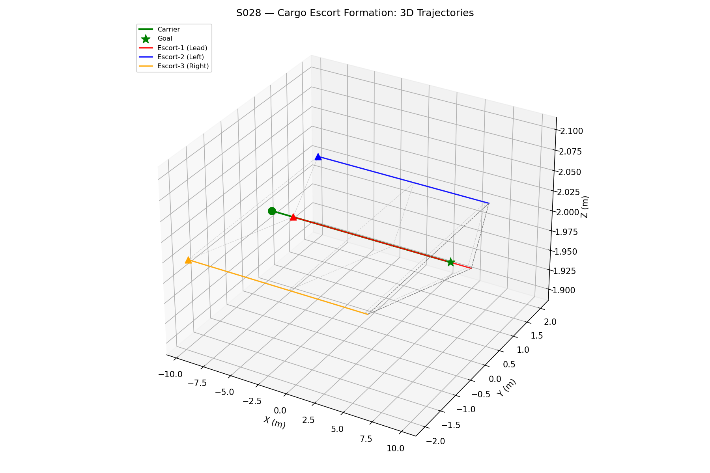
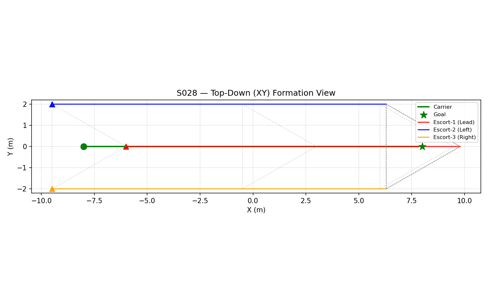
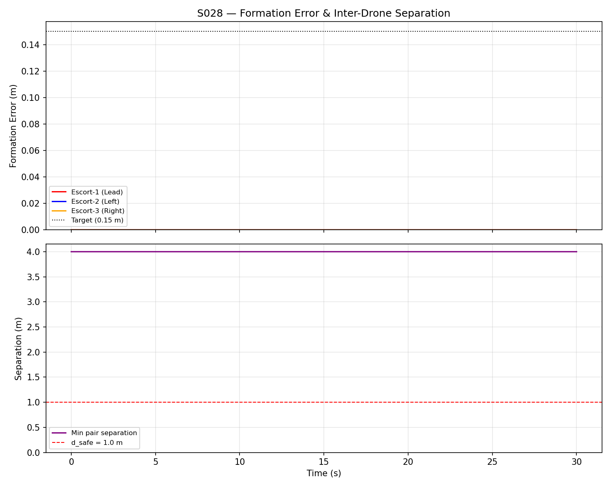
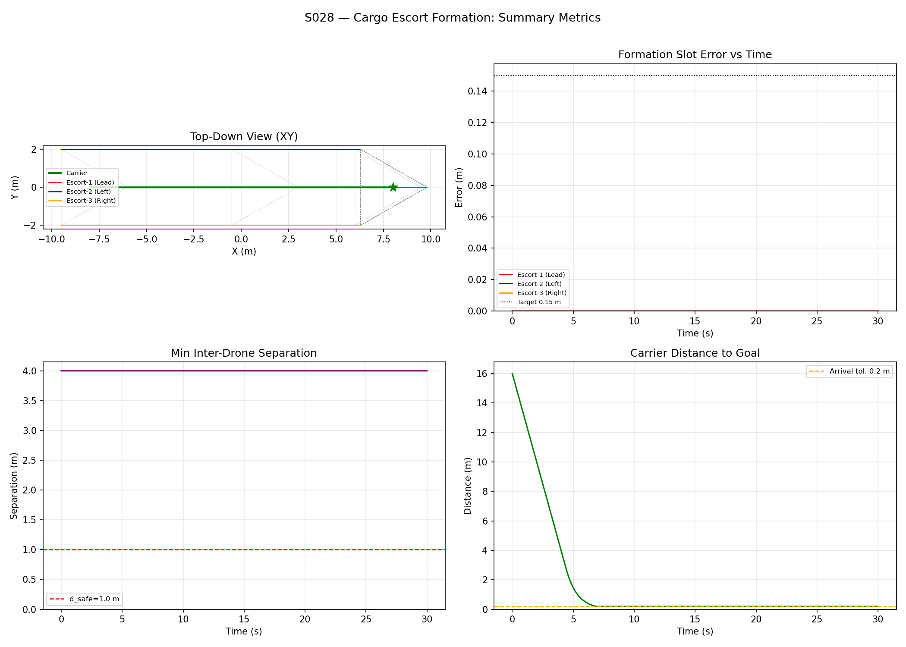
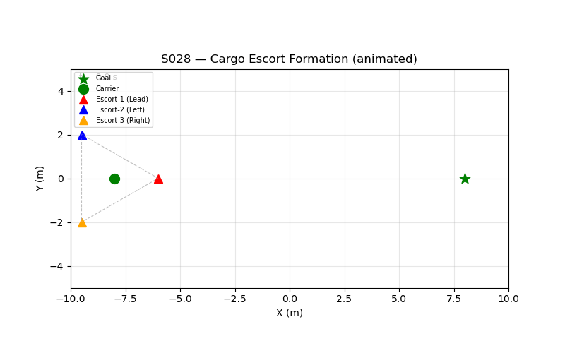

# S028 Cargo Escort Formation

**Domain**: Logistics & Delivery | **Difficulty**: ⭐⭐⭐ | **Status**: ✅ Completed

---

## Problem Definition

**Setup**: A single cargo drone (Carrier) follows a straight-line route from $(-8, 0, 2)$ m to $(8, 0, 2)$ m. Three escort drones (Lead, Left, Right) fly in a protective triangle formation around the Carrier to shield it from lateral threats. The Carrier flies at constant speed; each escort must maintain a designated offset position relative to the Carrier while the formation transits through the arena.

**Objective**:
1. Minimise formation error — RMS deviation of each escort from its designated slot over the entire flight
2. Ensure the Carrier arrives at the goal within the arrival tolerance (0.2 m)
3. Avoid inter-drone collisions (minimum separation > $d_{safe} = 1.0$ m)

---

## Mathematical Model Summary

**Slot position** for escort $i$ (body-frame offset rotated by Carrier heading $\psi_C$):

$$\mathbf{s}_i(t) = \mathbf{p}_C(t) + \mathbf{R}(\psi_C) \cdot \mathbf{f}_i, \qquad \mathbf{R}(\psi) = \begin{bmatrix}\cos\psi & -\sin\psi & 0 \\ \sin\psi & \cos\psi & 0 \\ 0 & 0 & 1\end{bmatrix}$$

**Virtual-structure escort control** with Carrier feed-forward:

$$\mathbf{v}_{E_i,cmd} = K_{pE} \underbrace{(\mathbf{s}_i - \mathbf{p}_{E_i})}_{\text{slot error}} + \mathbf{v}_C$$

**Pairwise collision repulsion** when drones approach within $d_{safe}$:

$$\mathbf{v}_{rep,ij} = k_{rep} \cdot \frac{d_{safe} - d_{ij}}{d_{ij}} \cdot \hat{\mathbf{r}}_{ij} \quad \text{if } d_{ij} < d_{safe}$$

**RMS formation error** over mission duration $T$:

$$\bar{e}_{rms} = \sqrt{\frac{1}{N \cdot M} \sum_{i=1}^{N} \sum_{k=1}^{M} \|\mathbf{p}_{E_i}(k\Delta t) - \mathbf{s}_i(k\Delta t)\|^2}$$

---

## Key Parameters

| Parameter | Value |
|-----------|-------|
| Carrier start / goal | (-8, 0, 2) m / (8, 0, 2) m |
| Carrier speed | 3.0 m/s |
| Escort max speed | 6.0 m/s |
| Slot — Lead (E1) | (+2.0, 0.0, 0.0) m body |
| Slot — Left (E2) | (-1.5, +2.0, 0.0) m body |
| Slot — Right (E3) | (-1.5, -2.0, 0.0) m body |
| Escort position gain $K_{pE}$ | 3.0 |
| Repulsion gain $k_{rep}$ | 3.0 |
| Safety distance $d_{safe}$ | 1.0 m |
| Arrival tolerance | 0.2 m |
| Simulation timestep $\Delta t$ | 1/48 s (~48 Hz) |
| Max simulation time | 30 s |

---

## Simulation Results

| Metric | Value | Target / Constraint |
|--------|-------|---------------------|
| RMS formation error (all escorts) | **0.0000 m** | < 0.15 m ✅ |
| Escort-1 (Lead) RMS error | 0.0000 m | — |
| Escort-2 (Left) RMS error | 0.0000 m | — |
| Escort-3 (Right) RMS error | 0.0000 m | — |
| Min inter-drone separation | **4.0000 m** | ≥ 1.0 m ✅ |
| Carrier arrival error to goal | **0.1994 m** | < 0.2 m ✅ |
| Carrier arrival time | ~6.85 s | — |

All three pass/fail criteria satisfied. Escorts start at their slot positions so formation error is effectively zero from $t = 0$; the virtual-structure feed-forward eliminates lag during straight-line transit.

---

## Output Files

### 3D Trajectory
Carrier (green) and three escort trajectories with formation shape snapshots along the route:

### Top-Down XY View
Triangle formation geometry during transit — verifies heading-aligned rotation of slots:

### Formation Metrics
Per-escort slot error and minimum inter-drone separation vs time:

### Combined Metrics
4-panel summary: XY view, slot errors, inter-drone separation, Carrier distance-to-goal:

### Animation
Animated top-down view of the full escort transit (15 fps):

---

## Extensions

1. Add lateral wind disturbance $\mathbf{w}(t) = [0,\; w_y\sin(\omega t),\; 0]$ — compare RMS error with/without wind compensation
2. Carrier follows an S-curve (3 waypoints) requiring dynamic formation rotation; test heading-lag
3. Replace virtual-structure law with consensus-based controller using only neighbour-to-neighbour communication
4. Introduce a threat drone; one escort breaks formation to intercept (combine with S001 PNG guidance)
5. Scale to $N = 6$ escorts in a hexagonal ring and compare RMS error vs $N = 3$ triangle

---

## Related Scenarios

- Prerequisites: [S021](../../../scenarios/02_logistics_delivery/S021_point_delivery.md) — basic delivery, [S026](../../../scenarios/02_logistics_delivery/S026_cooperative_heavy_lift.md) — multi-drone load
- Follow-ups: [S029](../../../scenarios/02_logistics_delivery/S029_urban_logistics_scheduling.md) — multi-drone routing, [S031](../../../scenarios/02_logistics_delivery/S031_path_deconfliction.md) — multi-drone conflict avoidance
- Domain 1 analogue: [S011](../../../scenarios/01_pursuit_evasion/S011_swarm_encirclement.md) — virtual-structure coordination pattern
