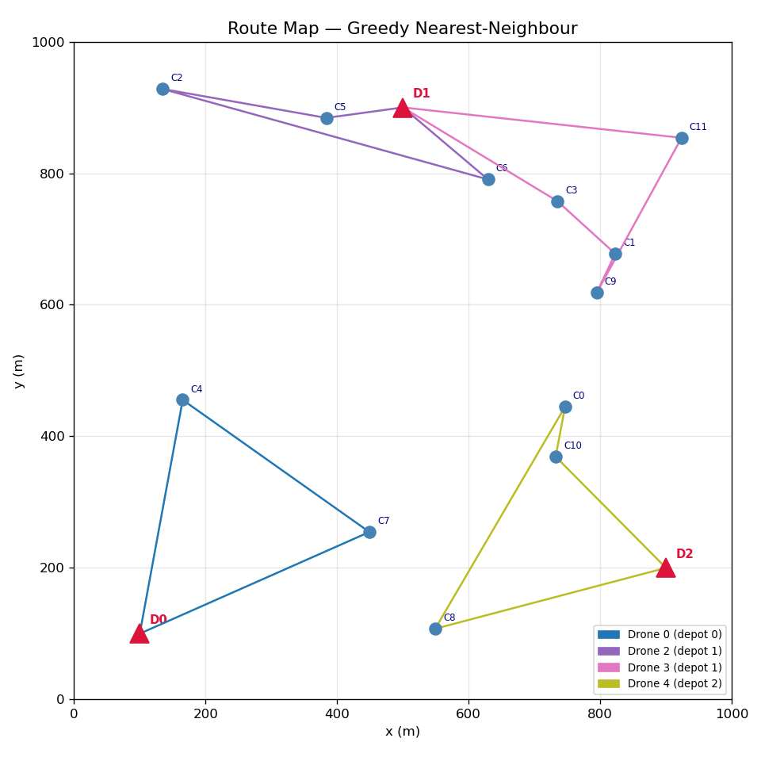
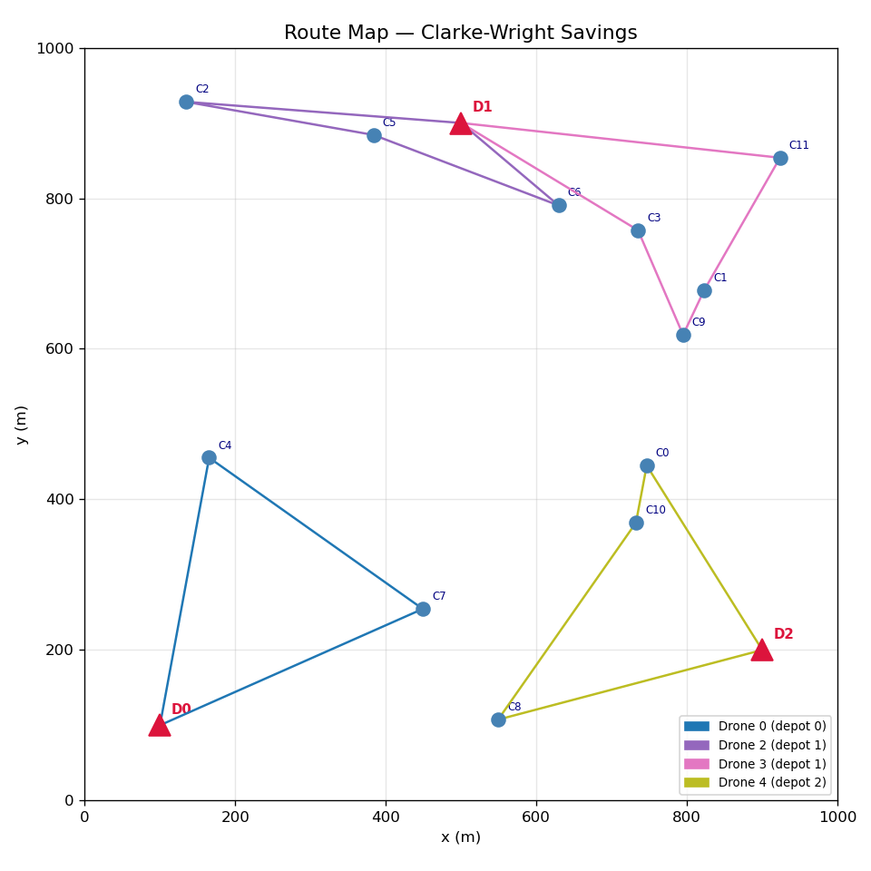
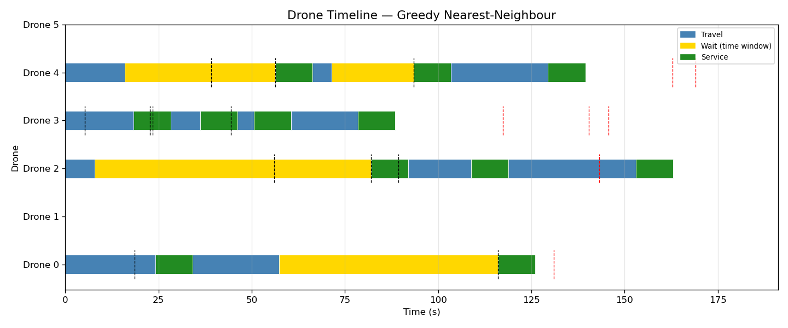
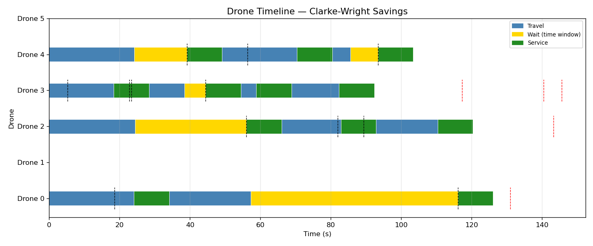
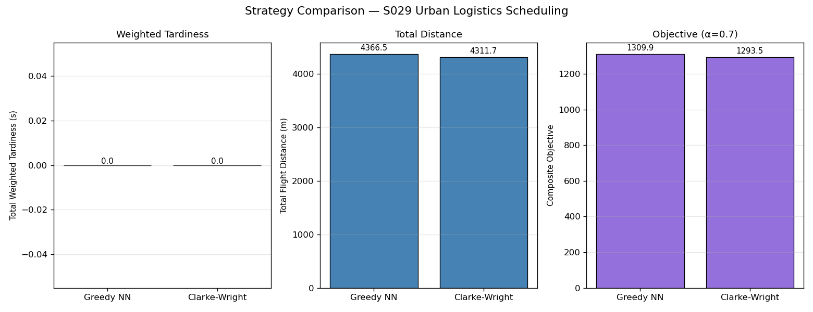
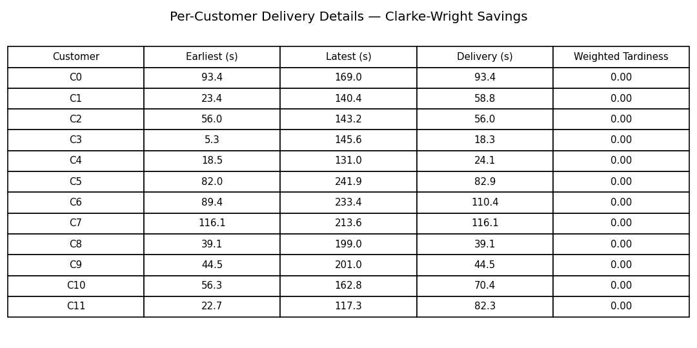

# S029 Urban Logistics Scheduling

**Domain**: Logistics & Delivery | **Difficulty**: ⭐⭐⭐⭐ | **Status**: ✅ Completed

---

## Problem Definition

**Setup**: An urban delivery network contains $D = 3$ depots and $C = 12$ customer delivery points scattered across a $1000 \times 1000$ m grid. A fleet of $K = 6$ drones is distributed across the depots (2 per depot). Each drone has payload capacity $Q = 3.0$ kg and max range $R_{max} = 4000$ m. Each customer order has a demand weight and a hard time-window $[e_c,\, l_c]$ within which delivery must occur.

**Objective**: Assign customers to drones and sequence each drone's route to minimise total weighted tardiness (primary) and total flight distance (secondary), subject to capacity and range constraints.

**Strategies compared**:
1. **Greedy Nearest-Neighbour** — each customer assigned to closest depot; nearest-neighbour tour
2. **Clarke-Wright Savings** — routes merged greedily by savings criterion with capacity and range checks

---

## Mathematical Model Summary

**Travel time** between nodes $i$ and $j$: $t_{ij} = \|\mathbf{p}_i - \mathbf{p}_j\| / v$

**Clarke-Wright savings** from merging routes serving customers $i$ and $j$ (same depot $d$):

$$S_{ij} = d_{d,i} + d_{d,j} - d_{ij}$$

Merge greedily in decreasing $S_{ij}$ order, subject to $\sum q_c \leq Q$ and $\sum d_{ij} \leq R_{max}$.

**Composite objective** (tardiness + distance, weighted sum):

$$\min \; \alpha \sum_{c} w_c \cdot \max(0,\; s_c - l_c) + (1-\alpha) \sum_{k} L_k$$

where $s_c$ = service start time at customer $c$, $L_k$ = total route length of drone $k$, $\alpha = 0.7$.

**Total weighted tardiness**:

$$\text{TWT} = \sum_{c \in \mathcal{C}} w_c \cdot \max(0,\; s_c - l_c)$$

---

## Key Parameters

| Parameter | Value |
|-----------|-------|
| Depots | 3: (100,100), (500,900), (900,200) m |
| Customers | 12, random seed 42, in [50, 950] m |
| Drones | 6 total (2 per depot) |
| Cruising speed | 15 m/s |
| Payload capacity per drone | 3.0 kg |
| Max range per sortie | 4000 m |
| Service time per stop | 10 s |
| Time window earliest | 0 – 120 s |
| Time window width | 60 – 180 s |
| Demand per customer | 0.3 – 1.5 kg |
| Tardiness weight $\alpha$ | 0.7 |

---

## Simulation Results

| Metric | Greedy NN | Clarke-Wright |
|--------|-----------|---------------|
| Total flight distance | 4366.5 m | **4311.7 m** |
| Total weighted tardiness | 0.00 s | 0.00 s |
| Composite objective ($\alpha = 0.7$) | 1309.95 | **1293.50** |
| Customers served | 12 / 12 ✅ | 12 / 12 ✅ |
| Active routes | 4 | 4 |

Clarke-Wright reduced total fleet distance by **1.3%** over the greedy baseline. All 12 customers met their time windows (zero tardiness) under both strategies.

---

## Output Files

### Route Map — Greedy Nearest-Neighbour
2D top-down view: depot triangles, customer circles, drone routes colour-coded by drone index:

### Route Map — Clarke-Wright
Same view for the Clarke-Wright solution; merged routes are visibly shorter:

### Gantt — Greedy NN
Drone timeline showing travel, service, and waiting segments with time-window markers:

### Gantt — Clarke-Wright
Drone timeline for Clarke-Wright solution:

### Strategy Comparison
Side-by-side bar charts: tardiness, total distance, and composite objective for both strategies:

### Per-Customer Delivery Table
Delivery time, time window, and tardiness for each customer under Clarke-Wright:

---

## Extensions

1. Heterogeneous fleet — drones with different speeds and capacities; revisit savings with drone-specific arc costs
2. Online order insertion (S033) — new orders arrive after routes are committed; rolling-horizon re-optimisation
3. Charging queue integration (S032) — replace range constraint with battery model and recharge stops
4. Multi-objective Pareto front — plot tardiness vs distance trade-off across $\alpha \in [0, 1]$
5. Stochastic demand — customer demands drawn from distributions; chance-constrained VRPTW

---

## Related Scenarios

- Prerequisites: [S021](../../../scenarios/02_logistics_delivery/S021_point_delivery.md) — basic A-to-B delivery, [S022](../../../scenarios/02_logistics_delivery/S022_obstacle_avoidance_delivery.md) — RRT* path planning
- Follow-ups: [S030](../../../scenarios/02_logistics_delivery/S030_multi_depot_delivery.md) — multi-depot partition, [S031](../../../scenarios/02_logistics_delivery/S031_path_deconfliction.md) — airspace deconfliction, [S033](../../../scenarios/02_logistics_delivery/S033_online_order_insertion.md) — online VRP
- Algorithmic cross-reference: [S018](../../../scenarios/01_pursuit_evasion/S018_multi_target_intercept.md) — TSP/Hungarian assignment
