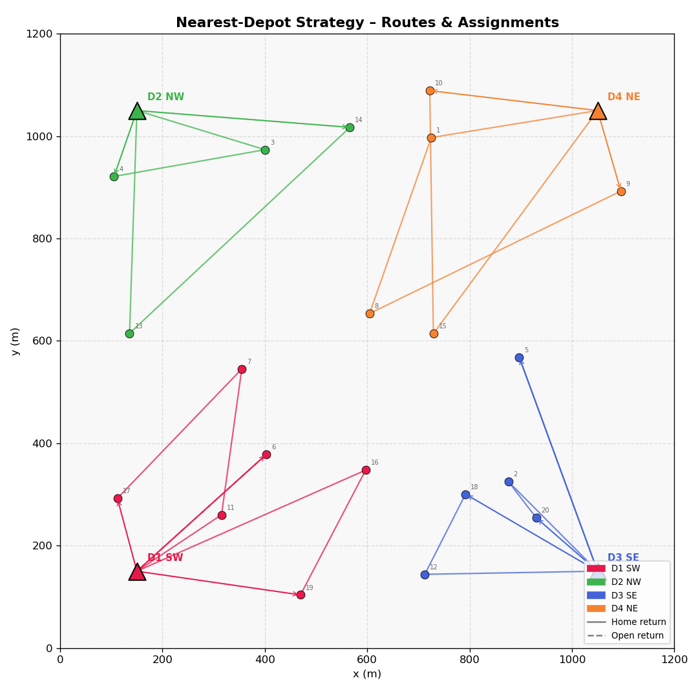
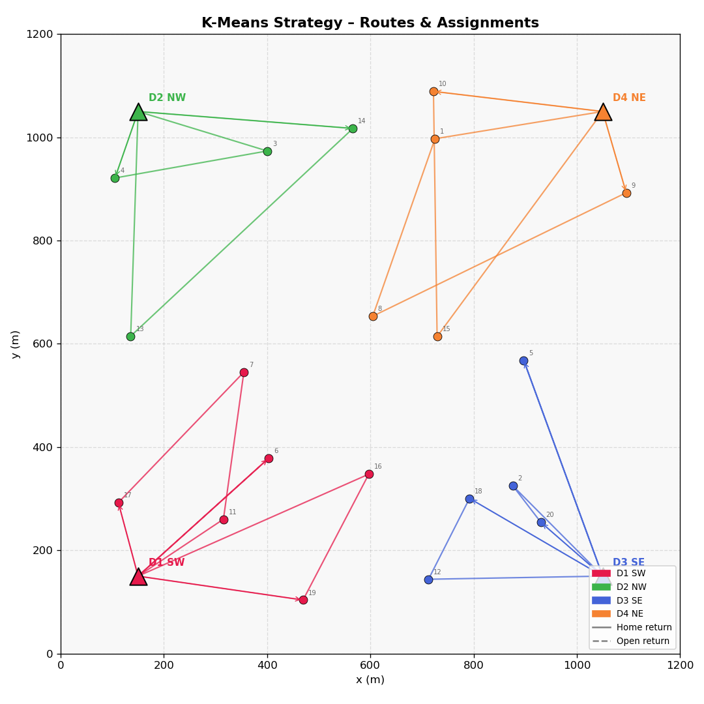
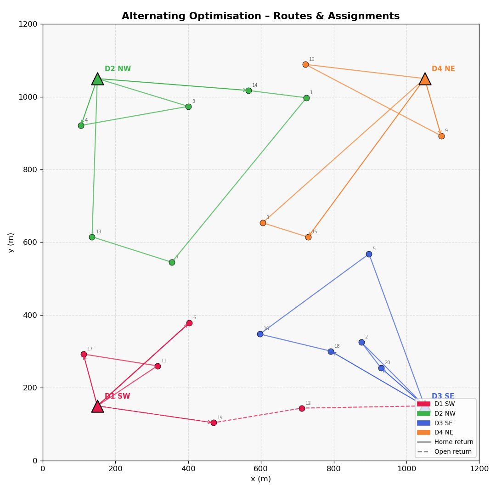
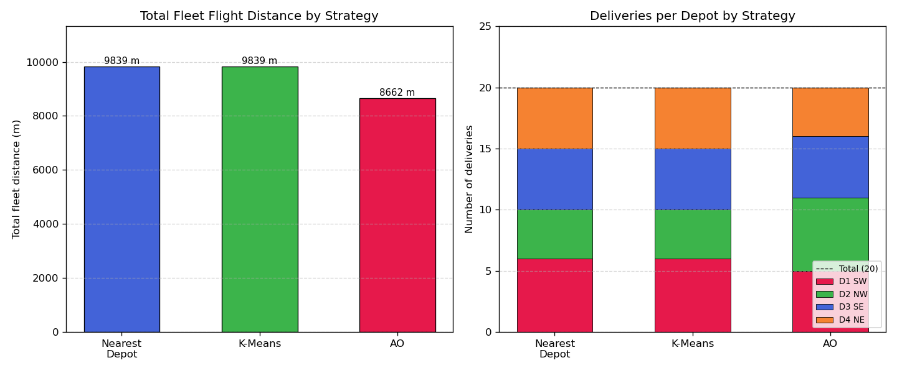
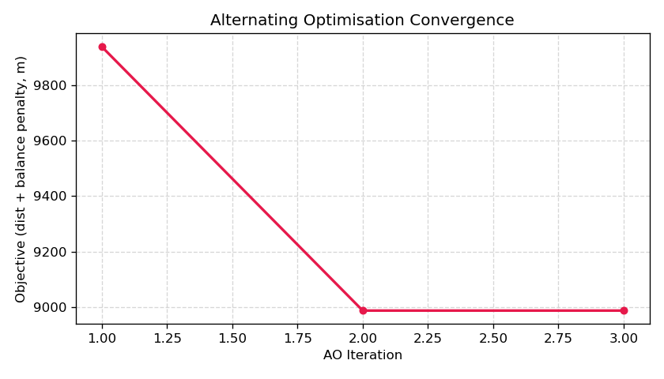
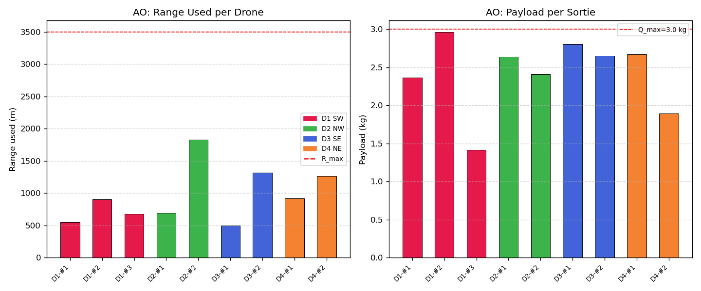

# S030 Multi-Depot Delivery

**Domain**: Logistics & Delivery | **Difficulty**: ⭐⭐⭐ | **Status**: ✅ Completed

---

## Problem Definition

**Setup**: A drone delivery network consists of $D = 4$ depots spread across a $1200 \times 1200$ m area with a total fleet of $K = 10$ drones. A total of $N = 20$ customer orders must be fulfilled. Crucially, each drone may **return to a different depot** than its origin (open-route MD-VRP), avoiding long back-tracking legs when the last delivery is closer to another depot.

**Objective**: Partition the customer set across depots and sequence each drone's route to minimise total fleet flight distance, subject to per-drone payload ($Q = 3.0$ kg) and range ($R_{max} = 3500$ m) constraints, with a secondary load-balance penalty across depots.

**Strategies compared**:
1. **Nearest-Depot** — assign each customer to the geometrically closest depot; nearest-neighbour tour per drone
2. **K-Means** — cluster customers with depot-seeded K-Means; assign each cluster to its nearest depot
3. **Alternating Optimisation (AO)** — iteratively reassign boundary customers to reduce cost, then 2-opt improve routes, until convergence

---

## Mathematical Model Summary

**Multi-depot VRP objective** (distance + load-balance penalty):

$$\min \; \sum_{k \in \mathcal{K}} L_k + \lambda \sum_{m \in \mathcal{D}} (n_m - \bar{n})^2$$

where $L_k$ = route length of drone $k$, $n_m$ = deliveries dispatched from depot $m$, $\bar{n} = N/D$.

**2-opt swap gain** (accept when positive):

$$\text{gain}(i,j) = d_{v_{i-1},v_i} + d_{v_j,v_{j+1}} - d_{v_{i-1},v_j} - d_{v_i,v_{j+1}}$$

**Open-route return** — after last delivery, drone returns to nearest available depot:

$$m^*_k = \arg\min_{m \in \mathcal{D}} d_{last_k, m}, \qquad \Delta R_k = d_{last_k,\,\delta(k)} - d_{last_k,\,m^*_k}$$

**AO convergence criterion**:

$$|\text{TotalDist}^{(t+1)} - \text{TotalDist}^{(t)}| < \varepsilon_{AO} = 1.0 \text{ m}$$

---

## Key Parameters

| Parameter | Value |
|-----------|-------|
| Depots | 4 (corners): (150,150), (150,1050), (1050,150), (1050,1050) m |
| Fleet distribution | [3, 2, 3, 2] drones per depot = 10 total |
| Depot inventory | [25, 18, 25, 20] kg |
| Customers | 20, random seed 7, in [100, 1100] m |
| Demand per customer | 0.3 – 1.8 kg |
| Drone payload $Q$ | 3.0 kg |
| Max range $R_{max}$ | 3500 m per sortie |
| Cruising speed $v$ | 14 m/s |
| Service time per stop | 8 s |
| Balance weight $\lambda$ | 50 m²/delivery² |
| AO convergence $\varepsilon_{AO}$ | 1.0 m |
| Open-route return | enabled |

---

## Simulation Results

| Strategy | Total Distance (m) | Balance Std | Open-Route Saving (m) |
|----------|--------------------|-------------|----------------------|
| Nearest-Depot | 9839.0 | 0.71 | 0.0 |
| K-Means | 9839.0 | 0.71 | 0.0 |
| **Alternating Optimisation** | **8661.8** | 0.71 | **225.1** |

- AO achieved a **12.0% distance reduction** over the nearest-depot baseline
- Open-route return saved **225.1 m** across the fleet vs forced home-base return
- AO converged in **3 iterations**

### Per-Drone Summary (AO Strategy)

| Drone | Origin | Return | Stops | Route (m) | Load (kg) |
|-------|--------|--------|-------|-----------|-----------|
| D1-#1 | 0 | 0 | 2 | 552.2 | 2.37 |
| D1-#2 | 0 | 2 | 2 | 906.7 | 2.97 |
| D1-#3 | 0 | 0 | 1 | 681.8 | 1.41 |
| D2-#1 | 1 | 1 | 2 | 697.4 | 2.64 |
| D2-#2 | 1 | 1 | 4 | 1827.4 | 2.41 |
| D3-#1 | 2 | 2 | 2 | 495.4 | 2.81 |
| D3-#2 | 2 | 2 | 3 | 1316.9 | 2.65 |
| D4-#1 | 3 | 3 | 2 | 915.7 | 2.67 |
| D4-#2 | 3 | 3 | 2 | 1268.3 | 1.90 |

---

## Output Files

### Route Map — Nearest-Depot
Top-down view: coloured depot triangles, customers coloured by assigned depot, drone routes as line segments:

### Route Map — K-Means
Same view for K-Means partition:

### Route Map — Alternating Optimisation
AO solution with open-route return arcs (dashed lines to a different depot than origin):

### Strategy Comparison
Bar charts: total fleet distance and deliveries-per-depot for all 3 strategies:

### AO Convergence
Objective (total distance + balance penalty) vs iteration number — converges in 3 iterations:

### Per-Drone Metrics (AO)
Route length and payload per sortie for each of the 9 active drones:

---

## Extensions

1. Heterogeneous drone speeds — assign faster drones to depots with larger service areas
2. Dynamic depot failure — mid-mission removal of one depot forces re-routing of in-flight drones
3. Time-window integration — augment MD-VRP with per-customer time windows (MD-VRPTW) solved with OR-Tools
4. Depot replenishment — inventory restocked by supply trucks on a known schedule
5. 3D extension — depots at different altitudes; add altitude-change energy cost $E_{alt} = mg|\Delta z|$ to arc cost

---

## Related Scenarios

- Prerequisites: [S021](../../../scenarios/02_logistics_delivery/S021_point_delivery.md) — basic delivery, [S029](../../../scenarios/02_logistics_delivery/S029_urban_logistics_scheduling.md) — single-depot VRP
- Follow-ups: [S031](../../../scenarios/02_logistics_delivery/S031_path_deconfliction.md) — airspace deconfliction, [S033](../../../scenarios/02_logistics_delivery/S033_online_order_insertion.md) — online order insertion
- Range-constrained: [S027](../../../scenarios/02_logistics_delivery/S027_aerial_refueling_relay.md) — aerial refueling, [S036](../../../scenarios/02_logistics_delivery/S036_last_mile_relay.md) — last-mile relay
