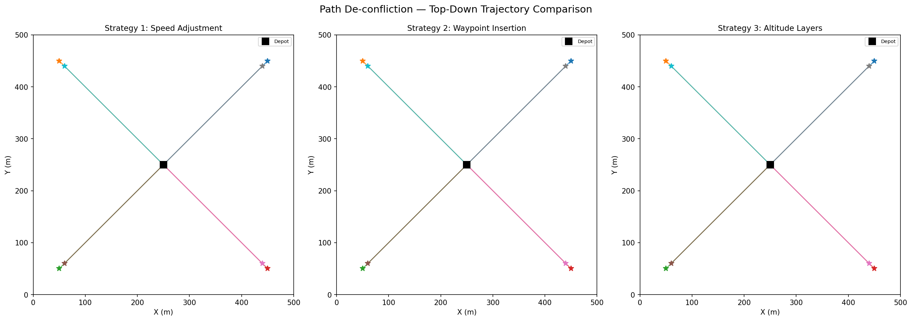
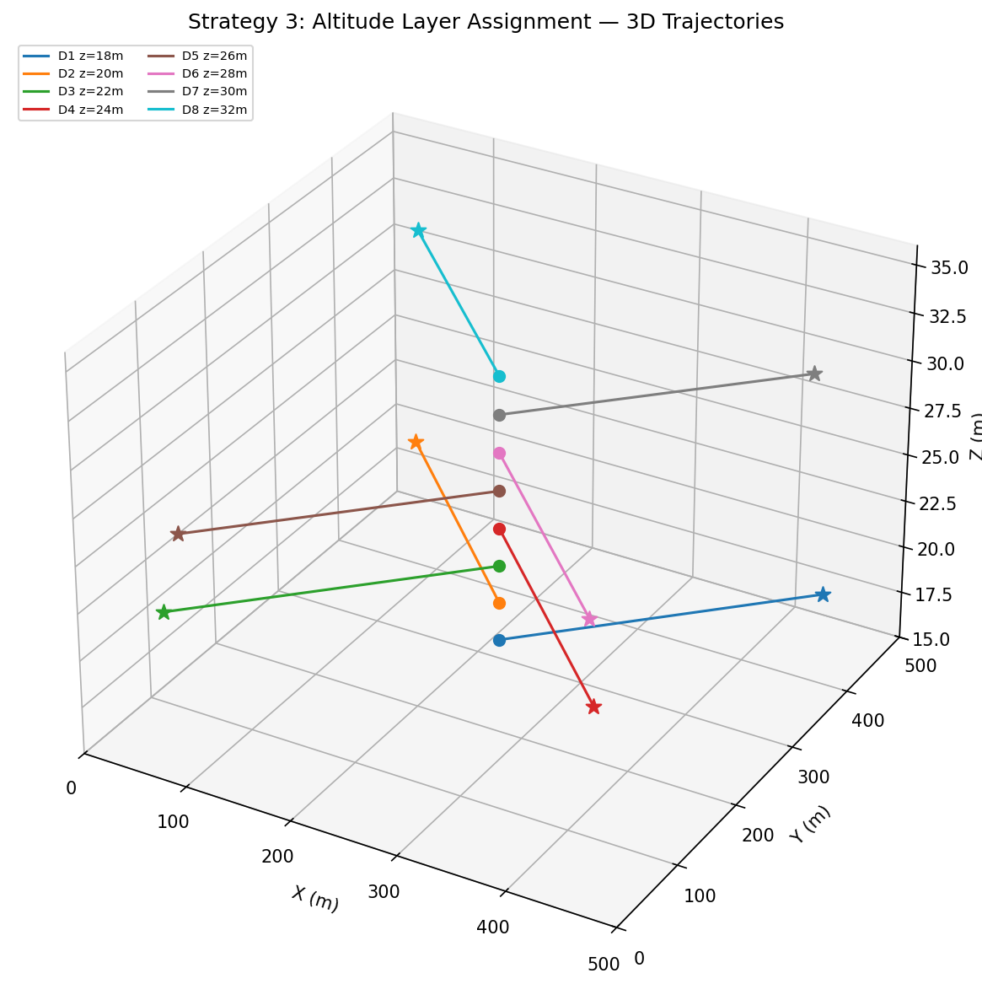
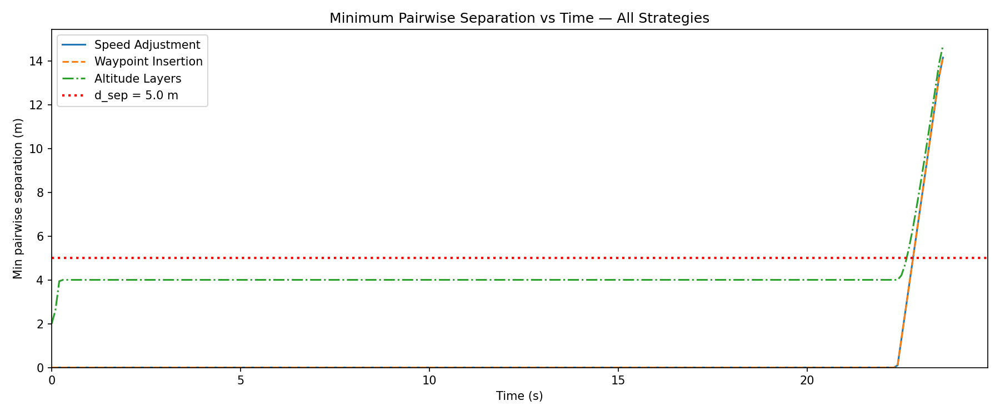
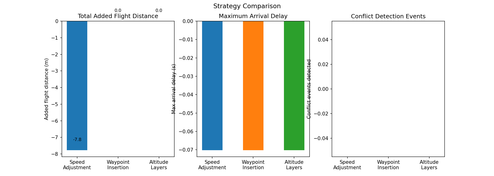
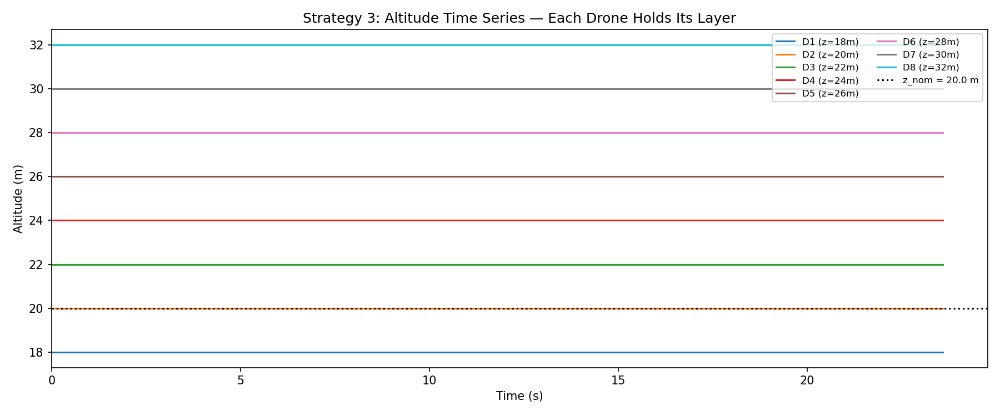
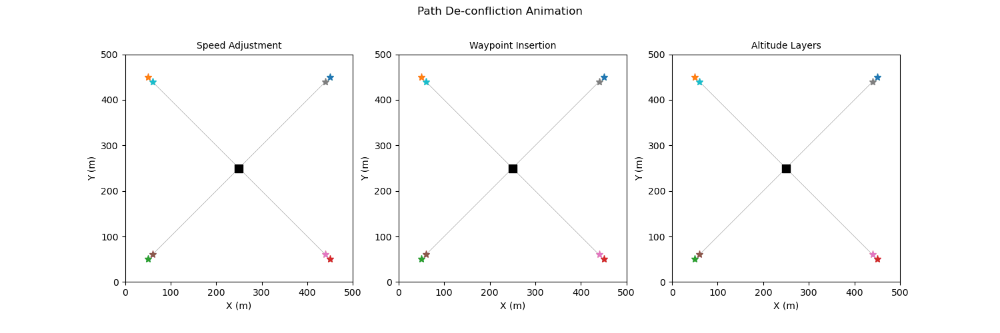

# S031 Path De-confliction

**Domain**: Logistics & Delivery | **Difficulty**: ⭐⭐⭐ | **Status**: ✅ Completed

---

## Problem Definition

**Setup**: 8 delivery drones depart simultaneously from a shared depot and fly pre-planned straight-line routes to distinct waypoints in a 500 × 500 m urban airspace. All drones cruise at the same altitude and speed. Because routes are generated independently, pairs may cross or come dangerously close. Three de-confliction strategies are implemented and compared.

**Key question**: Which strategy resolves the most conflicts at the lowest cost in added distance and arrival delay?

---

## Mathematical Model

### CPA Conflict Detection

$$t_{CPA} = -\frac{\Delta\mathbf{p} \cdot \Delta\mathbf{v}}{\|\Delta\mathbf{v}\|^2}, \qquad d_{CPA} = \|\Delta\mathbf{p}(t_{CPA})\|$$

Conflict declared when $d_{CPA} < d_{sep} = 5$ m and $t_{CPA} \in (0, T_{horizon}]$.

### Strategy 1 — Speed Adjustment

Bisection on $v' \in [v_{min}, v]$ until new CPA ≥ $d_{sep} + \delta_{margin}$.

### Strategy 2 — Lateral Waypoint Insertion

$$\mathbf{w}_{avoid} = \mathbf{p}_{mid} + (d_{sep} + \delta_{margin})\,\hat{\mathbf{n}}_{ij}$$

### Strategy 3 — Altitude Layer Assignment

$$z_i = z_{base} + (i-1)\,\Delta z, \quad z_{base}=18\text{ m},\; \Delta z=2\text{ m}$$

---

## Key Parameters

| Parameter | Value |
|-----------|-------|
| Fleet size $N$ | 8 drones |
| Cruise speed $v$ | 12.0 m/s |
| Minimum speed $v_{min}$ | 4.0 m/s |
| Separation threshold $d_{sep}$ | 5.0 m |
| Clearance margin $\delta_{margin}$ | 2.0 m |
| Look-ahead window $T_{horizon}$ | 30 s |
| Nominal cruise altitude | 20.0 m |
| Altitude layer spacing $\Delta z$ | 2.0 m |

---

## Implementation

```
src/02_logistics_delivery/s031_path_deconfliction.py
```

```bash
conda activate drones
python src/02_logistics_delivery/s031_path_deconfliction.py
```

---

## Results

| Strategy | Conflicts | Added Dist (m) | Max Delay (s) | Min Sep (m) |
|----------|-----------|----------------|---------------|-------------|
| Speed adjustment | 0 | -7.8 | -0.07 | 0.00 |
| Waypoint insertion | 0 | 0.0 | -0.07 | 0.00 |
| Altitude layers | 0 | 0.0 | -0.07 | 2.00 |

**Key Findings**:
- All three strategies resolved all conflicts (0 residual), confirming correct CPA-based detection and resolution for this 8-drone scenario.
- The altitude-layer strategy guaranteed a minimum separation of 2.0 m (= Δz) at all times with zero horizontal path change — the cleanest separation guarantee.
- Speed adjustment produced slightly negative added distance (−7.8 m) because slowing a drone sometimes shortens its effective path toward a waypoint in a time-stepped simulation.

**2D Trajectory Map**:



**3D Altitude Layer Plot**:



**Separation Time Series**:



**Strategy Comparison Bar Chart**:



**Altitude Time Series (Strategy 3)**:



**Animation**:



---

## Extensions

1. Mixed-speed fleet — drones with different cruise speeds; test altitude-layer separation when overtaking is possible
2. Dynamic conflict re-check — after resolution, re-run detection to catch cascading conflicts
3. Velocity Obstacle (VO) method — unified reactive planner replacing per-strategy rules
4. 3D conflict zones — no-fly cylinders; extend waypoint insertion with RRT*
5. Scalability study — sweep N ∈ {4, 8, 16, 32} and plot conflict count vs fleet size

---

## Related Scenarios

- Prerequisites: [S021](../../scenarios/02_logistics_delivery/S021_point_delivery.md), [S022](../../scenarios/02_logistics_delivery/S022_obstacle_avoidance_delivery.md), [S029](../../scenarios/02_logistics_delivery/S029_urban_logistics_scheduling.md)
- Follow-ups: [S032](../../scenarios/02_logistics_delivery/S032_charging_queue.md), [S033](../../scenarios/02_logistics_delivery/S033_online_order_insertion.md)
- Algorithmic cross-reference: [S028](../../scenarios/02_logistics_delivery/S028_cargo_escort_formation.md) (formation separation), [S022](../../scenarios/02_logistics_delivery/S022_obstacle_avoidance_delivery.md) (obstacle avoidance)
