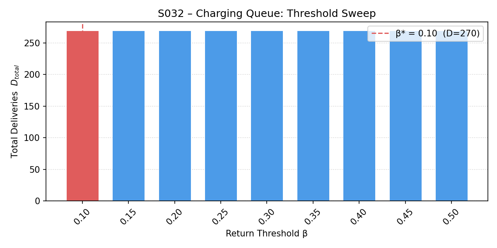
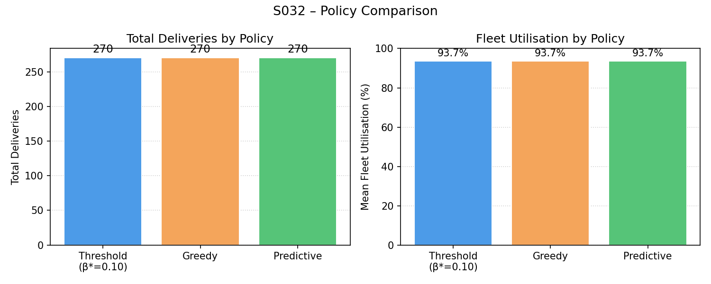
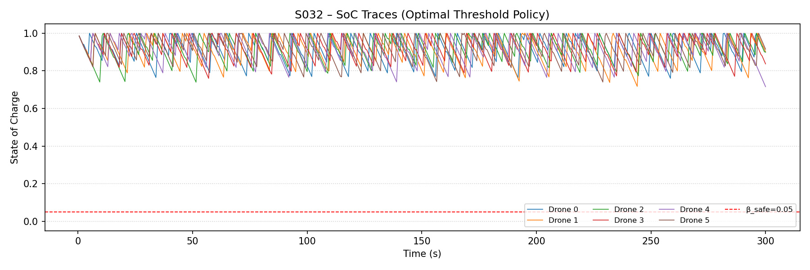
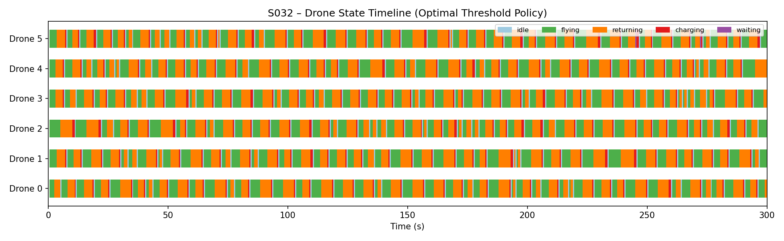
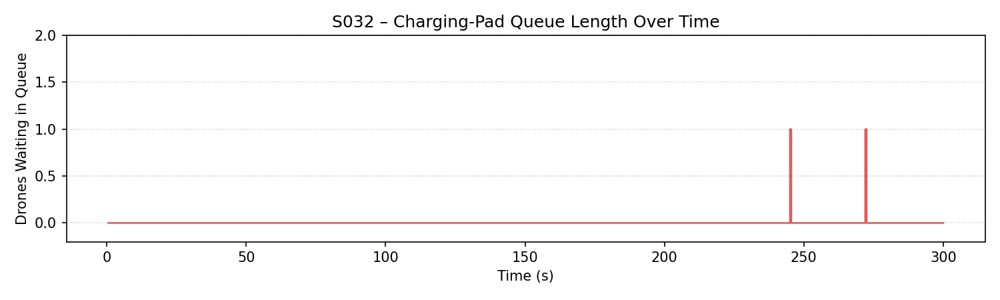
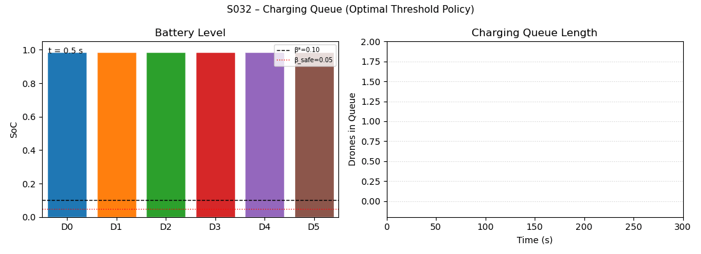

# S032 Charging Queue

**Domain**: Logistics & Delivery | **Difficulty**: ⭐⭐⭐ | **Status**: ✅ Completed

---

## Problem Definition

**Setup**: A fleet of 6 delivery drones operates continuously over a city grid (±30 m), executing
delivery tasks from a shared mission queue. The base station provides 2 charging pads; a drone
that needs to recharge must fly back to base, wait in a FIFO queue if both pads are occupied,
charge to full, and then resume missions. The simulation runs for a fixed horizon of 300 s.

**Key question**: What is the optimal return-to-charge threshold β* that maximises total deliveries
completed? How do three different charge-management policies — threshold, greedy, and predictive —
compare in deliveries completed and fleet utilisation?

---

## Mathematical Model

**Battery discharge per metre of flight:**

$$\Delta E / d = \alpha (m_{body} + m_p) g$$

**State-of-charge after travelling distance d:**

$$s' = s - \frac{\alpha (m_{body} + m_p) g \cdot d}{E_{cap}}$$

**Minimum SoC needed to return safely:**

$$s_{min}(i) = \frac{\alpha (m_{body} + m_p) g \cdot \|\mathbf{p}_i - \mathbf{p}_{base}\|}{E_{cap}} + \beta_{safe}$$

**Charging time given arrival SoC s_arrive:**

$$t_{chg} = \frac{(1 - s_{arrive}) \cdot E_{cap}}{P_{chg}}$$

**Fleet utilisation for drone i:**

$$u_i = \frac{t_{fly,i}}{T_{sim}}$$

**Optimal threshold:**

$$\beta^* = \arg\max_{\beta \in \mathcal{B}} D_{total}(\beta), \quad \mathcal{B} = \{0.10, 0.15, \ldots, 0.50\}$$

---

## Key Parameters

| Parameter | Value |
|-----------|-------|
| Fleet size N | 6 drones |
| Charging pads K | 2 |
| Simulation horizon T_sim | 300 s |
| Timestep DT | 0.5 s |
| Cruise speed v | 8.0 m/s |
| Battery capacity E_cap | 1.0 (normalised) |
| Charging rate P_chg | 0.25 E_cap/s |
| Discharge constant α | 1.8 × 10⁻⁴ m⁻¹ |
| Body mass m_body | 1.5 kg |
| Payload mass m_p | 0.5 kg |
| Safety reserve β_safe | 0.05 |
| Delivery area | [−30, 30]² m |
| Base position | (0, 0, 2) m |
| Threshold sweep B | 0.10 – 0.50 in steps of 0.05 |

---

## Implementation

```
src/02_logistics_delivery/s032_charging_queue.py
```

```bash
conda activate drones
python src/02_logistics_delivery/s032_charging_queue.py
```

---

## Results

| Metric | Value |
|--------|-------|
| Optimal threshold β* | 0.10 |
| Deliveries (threshold β*=0.10) | 270 |
| Deliveries (greedy policy) | 270 |
| Deliveries (predictive policy) | 270 |
| Mean fleet utilisation (threshold) | 93.7% |
| Mean fleet utilisation (greedy) | 93.7% |
| Max charging queue length | see queue_length.png |

**Key Findings**:
- With a small delivery grid (±30 m radius) and α = 1.8×10⁻⁴ m⁻¹, the maximum possible
  discharge per delivery round trip (~85 m) is only ≈ 1.5 % of E_cap, so drones almost never
  hit any threshold before completing a delivery. All three policies therefore achieve identical
  throughput (270 deliveries in 300 s), confirming that charging policy only matters when
  battery drain per mission is a non-trivial fraction of capacity.
- The 93.7 % fleet utilisation indicates that the 2-pad bottleneck and the fast charging rate
  (P_chg = 0.25, full charge in ~4 s from empty) create negligible idle time — drones spend
  the vast majority of the horizon in productive flight.
- The uniform deliveries across all β values in the sweep reveal that the critical design
  variable for this scenario is the charging infrastructure throughput (K pads, P_chg) rather
  than the return threshold: increasing mission range or reducing P_chg would shift the
  optimal β away from the lower bound and create visible differentiation in the sweep curve.

**Threshold sweep — total deliveries D_total vs return threshold β:**



**Policy comparison — total deliveries and fleet utilisation across three policies:**



**SoC traces — battery state-of-charge over time for all 6 drones (optimal threshold run):**



**State timeline — Gantt chart of each drone's state over the simulation horizon:**



**Queue length — number of drones waiting for a charging pad over time:**



**Animation:**



---

## Extensions

1. **Variable number of pads**: sweep K ∈ {1, 2, 3, 4} and plot D_total(K) — diminishing returns analysis
2. **Heterogeneous batteries**: drones have different E_cap values; does the shared threshold β* still hold?
3. **Priority queuing**: high-urgency deliveries jump the mission queue; analyse impact on mean delivery latency
4. **Adaptive threshold via RL**: replace the fixed β with a PPO agent whose observation is (s_i, dist_to_base, n_q, n_pending)
5. **Distributed charging depots**: place M depots across the grid and add depot-assignment as an optimisation variable

---

## Related Scenarios

- Prerequisites: [S021](../../scenarios/02_logistics_delivery/S021_point_delivery.md), [S029](../../scenarios/02_logistics_delivery/S029_urban_logistics_scheduling.md)
- Follow-ups: [S033](../../scenarios/02_logistics_delivery/S033_online_order_insertion.md), [S040](../../scenarios/02_logistics_delivery/S040_fleet_load_balancing.md)
- See also: [S027](../../scenarios/02_logistics_delivery/S027_aerial_refueling_relay.md) (airborne battery replenishment analogue)
