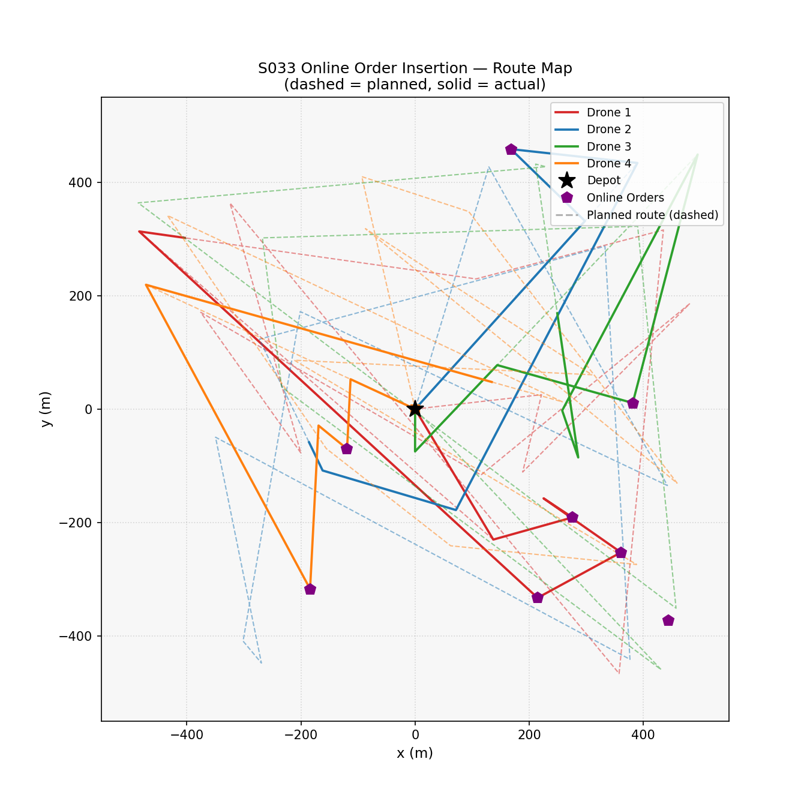
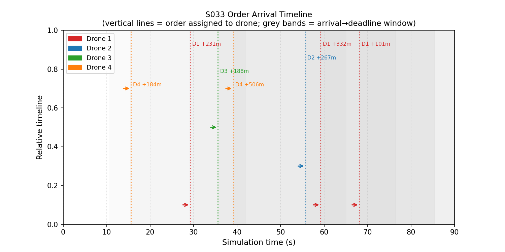
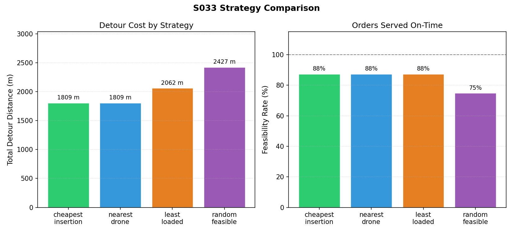
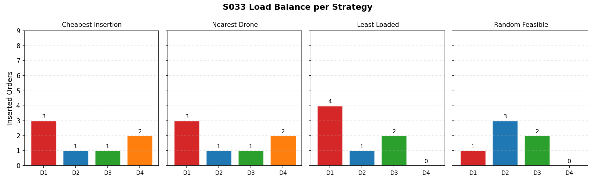
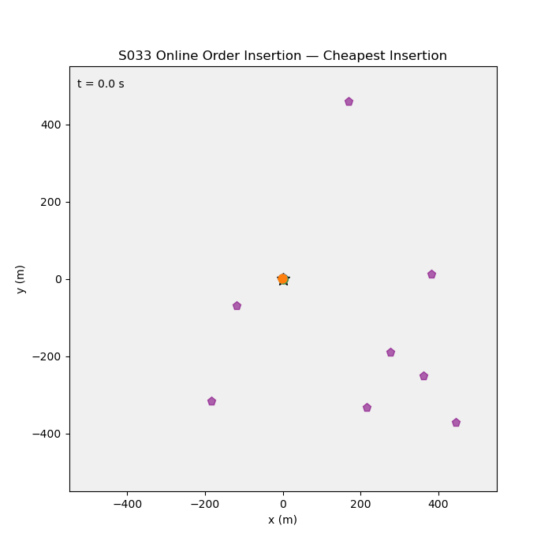

# S033 Online Order Insertion

**Domain**: Logistics & Delivery | **Difficulty**: ⭐⭐⭐ | **Status**: ✅ Completed

---

## Problem Definition

**Setup**: 4 drones are mid-flight on pre-planned routes when 8 new online orders arrive. Each new order must be inserted into an existing drone's route without exceeding the drone's remaining battery range. Four insertion strategies are compared: Cheapest Insertion, Nearest Drone, Least Loaded, and Random Feasible.

**Key question**: Which online insertion strategy minimises total detour while maximising the number of new orders served?

---

## Mathematical Model

### Cheapest Insertion

For each new order $o$ and each drone $k$, find the route position $p^*$ minimising:

$$\Delta L_k(o, p) = d(r_{p-1}, o) + d(o, r_p) - d(r_{p-1}, r_p)$$

Assign order to the drone-position pair with minimum $\Delta L$.

### Feasibility Check (Range Constraint)

$$L_k^{current} + \Delta L_k(o, p^*) \leq R_k^{remaining}$$

where $R_k^{remaining} = \text{SoC}_k \cdot R_{max} - L_k^{flown}$.

### Detour Overhead

$$\Delta L_{total} = \sum_{k} \left(L_k^{final} - L_k^{planned}\right)$$

---

## Key Parameters

| Parameter | Value |
|-----------|-------|
| Fleet size | 4 drones |
| Pre-planned stops | 12 original waypoints |
| Online orders | 8 new requests |
| Drone speed | 10 m/s |
| Max range per drone | 3000 m |
| Arena | 500 × 500 m |

---

## Implementation

```
src/02_logistics_delivery/s033_online_order_insertion.py
```

```bash
conda activate drones
python src/02_logistics_delivery/s033_online_order_insertion.py
```

---

## Results

| Strategy | Detour (m) | Served | Queued | Feasibility |
|----------|-----------|--------|--------|-------------|
| Cheapest Insertion | 1808.7 | 7/8 | 1 | 88% |
| Nearest Drone | 1808.7 | 7/8 | 1 | 88% |
| Least Loaded | 2062.3 | 7/8 | 1 | 88% |
| Random Feasible | 2427.2 | 6/8 | 2 | 75% |

**Key Findings**:
- Cheapest Insertion and Nearest Drone produced identical results (1808.7 m detour, 7/8 served) — on this instance, the nearest drone was always the cheapest insertion point, so both heuristics converged.
- Least Loaded added 14% more detour than Cheapest Insertion because it distributes orders evenly across drones without regard to spatial proximity, creating longer cross-city detours.
- Random Feasible served only 6/8 orders (75%), confirming that non-spatial insertion choices waste range and leave some orders unfeasible.

**Route Map (planned vs actual)**:



**Order Arrival Timeline**:



**Strategy Comparison**:



**Load Balance per Drone**:



**Animation**:



---

## Extensions

1. Time-window constraints on online orders — must be delivered within deadline $d_o$
2. Re-optimise full route after each insertion (not just greedy local insertion)
3. Rejection policy — decline orders whose cheapest insertion exceeds a detour budget
4. Multi-depot online insertion — orders can be re-assigned to a different depot drone if closer
5. Stochastic order forecast — predict likely future orders to pre-position drones

---

## Related Scenarios

- Prerequisites: [S021](../../scenarios/02_logistics_delivery/S021_point_delivery.md), [S029](../../scenarios/02_logistics_delivery/S029_urban_logistics_scheduling.md)
- Follow-ups: [S034](../../scenarios/02_logistics_delivery/S034_weather_rerouting.md), [S040](../../scenarios/02_logistics_delivery/S040_fleet_load_balancing.md)
- Algorithmic cross-reference: [S030](../../scenarios/02_logistics_delivery/S030_multi_depot_delivery.md) (multi-depot routing), [S037](../../scenarios/02_logistics_delivery/S037_reverse_logistics.md) (VRPTW)
