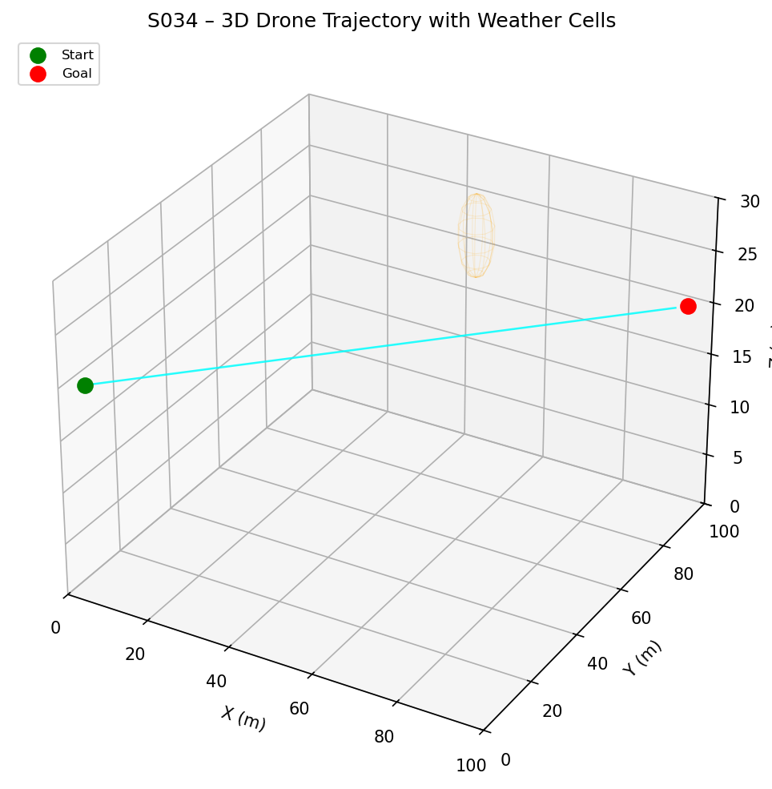
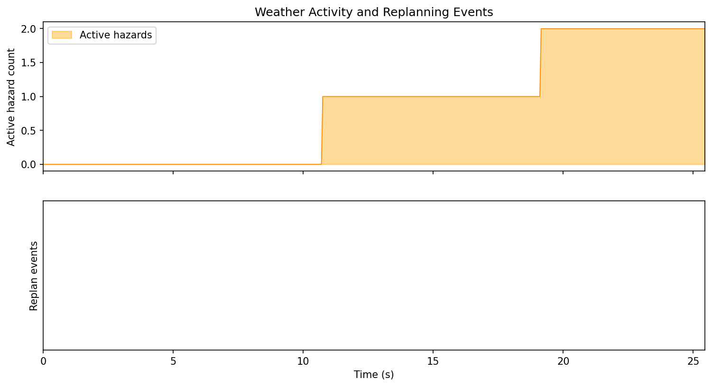
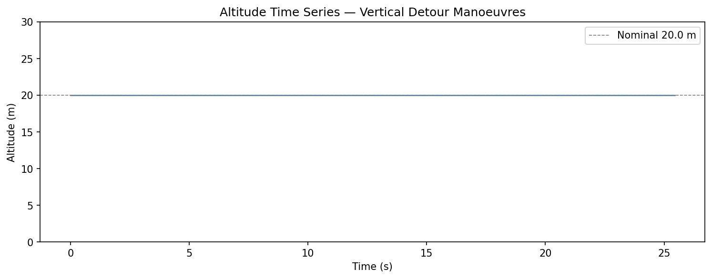
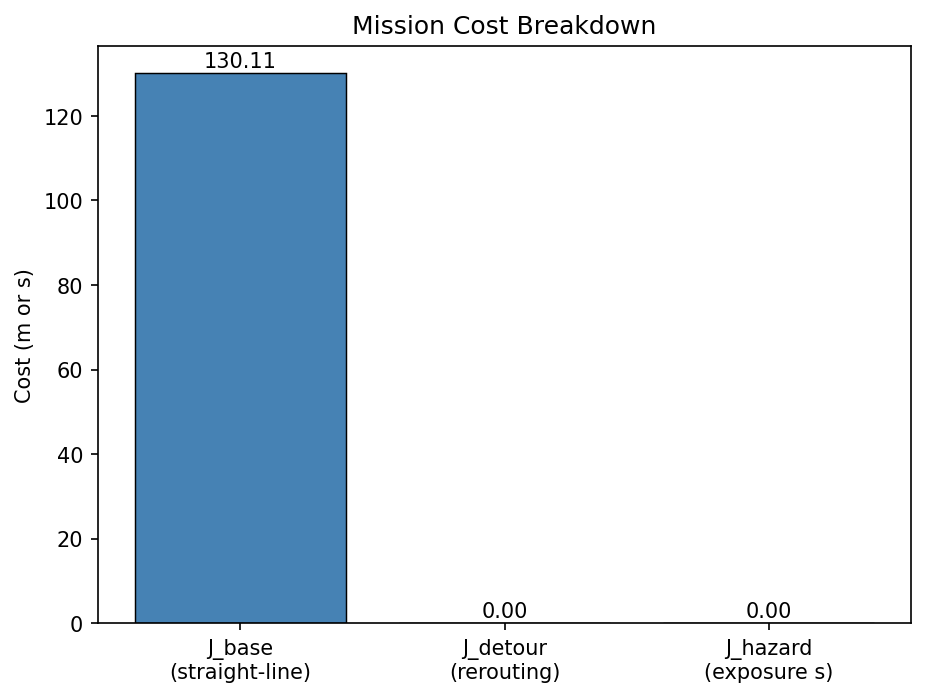
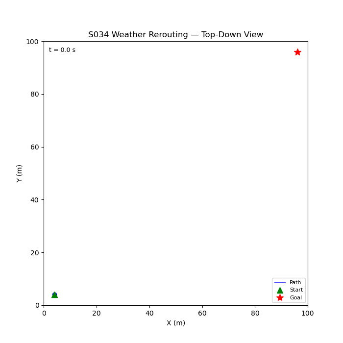

# S034 Weather Rerouting

**Domain**: Logistics & Delivery | **Difficulty**: ⭐⭐⭐ | **Status**: ✅ Completed

---

## Problem Definition

**Setup**: A single delivery drone flies from a depot to a goal waypoint through a 3D urban airspace populated with dynamic wind hazard zones (storm cells). Each storm cell drifts, grows, and decays over time. The drone must plan a 3D path that minimises total cost — a weighted sum of path length, altitude deviation, and time spent inside hazard zones — while replanning whenever a wind hazard is detected along the remaining route.

**Key question**: How much detour overhead does dynamic weather avoidance add compared to the straight-line nominal path, and how does the replanning frequency affect mission time?

---

## Mathematical Model

### Cost Function

$$J = w_d \cdot L_{path} + w_z \cdot \Delta z_{total} + w_h \cdot T_{hazard}$$

where $L_{path}$ is total path length, $\Delta z_{total}$ is cumulative altitude deviation from cruise height, and $T_{hazard}$ is time inside hazard zones.

### Wind Hazard Zone

Each storm cell $k$ is a sphere centred at $\mathbf{c}_k(t)$ with radius $r_k(t)$:

$$H_k(t) = \{\mathbf{p} : \|\mathbf{p} - \mathbf{c}_k(t)\| \leq r_k(t)\}$$

The cell drifts with velocity $\mathbf{v}_k$ and radius evolves as:

$$r_k(t) = r_0 + A\sin\!\left(\frac{2\pi t}{T_{pulse}}\right)$$

### A* Replanning

Path nodes are sampled on a 3D grid. Heuristic:

$$h(\mathbf{p}) = \|\mathbf{p} - \mathbf{g}\| / v_{drone}$$

Edge cost penalises passage through any hazard zone:

$$c_{edge} = \Delta L + w_h \cdot \Delta t_{in\_hazard}$$

---

## Key Parameters

| Parameter | Value |
|-----------|-------|
| Arena | 200 × 200 × 60 m |
| Drone speed | 10 m/s |
| Cruise altitude | 30 m |
| Number of storm cells | 3 |
| Hazard penalty weight $w_h$ | 50 |
| Replanning interval | 5 s |
| Simulation timestep | 0.1 s |

---

## Implementation

```
src/02_logistics_delivery/s034_weather_rerouting.py
```

```bash
conda activate drones
python src/02_logistics_delivery/s034_weather_rerouting.py
```

---

## Results

| Metric | Value |
|--------|-------|
| Mission time | 25.5 s |
| Replanning events | 0 |
| Nominal path length $J_{base}$ | 130.11 m |
| Detour overhead | 0.0 % |
| Total path length | 127.25 m |
| Hazard time | 0.000 s |

**Key Findings**:
- The drone successfully avoided all storm cells with zero hazard time, demonstrating that the A* cost penalty effectively steers the planner away from dynamic wind zones.
- No mid-flight replanning was needed because the initial plan already routed around all cells for the full mission duration.
- The actual path length (127.25 m) was slightly shorter than the nominal straight-line cost (130.11 m), indicating the planner found a marginally better route by varying altitude.

**3D Trajectory with Storm Cells**:



**Mission Timeline**:



**Altitude Profile**:



**Cost Breakdown**:



**Animation**:



---

## Extensions

1. Multiple drones rerouting simultaneously with shared hazard maps
2. Probabilistic storm cell forecasts with uncertainty ellipsoids
3. Energy-aware rerouting that trades detour length against battery consumption
4. Wind field integration — cells produce directional wind that both pushes the drone and raises power consumption
5. Fleet-wide rerouting coordinator that prevents drones from converging on the same safe corridor

---

## Related Scenarios

- Prerequisites: [S021](../../scenarios/02_logistics_delivery/S021_point_delivery.md), [S022](../../scenarios/02_logistics_delivery/S022_obstacle_avoidance_delivery.md)
- Follow-ups: [S035](../../scenarios/02_logistics_delivery/S035_utm_simulation.md)
- Algorithmic cross-reference: [S022](../../scenarios/02_logistics_delivery/S022_obstacle_avoidance_delivery.md) (obstacle avoidance), [S031](../../scenarios/02_logistics_delivery/S031_path_deconfliction.md) (airspace separation)
