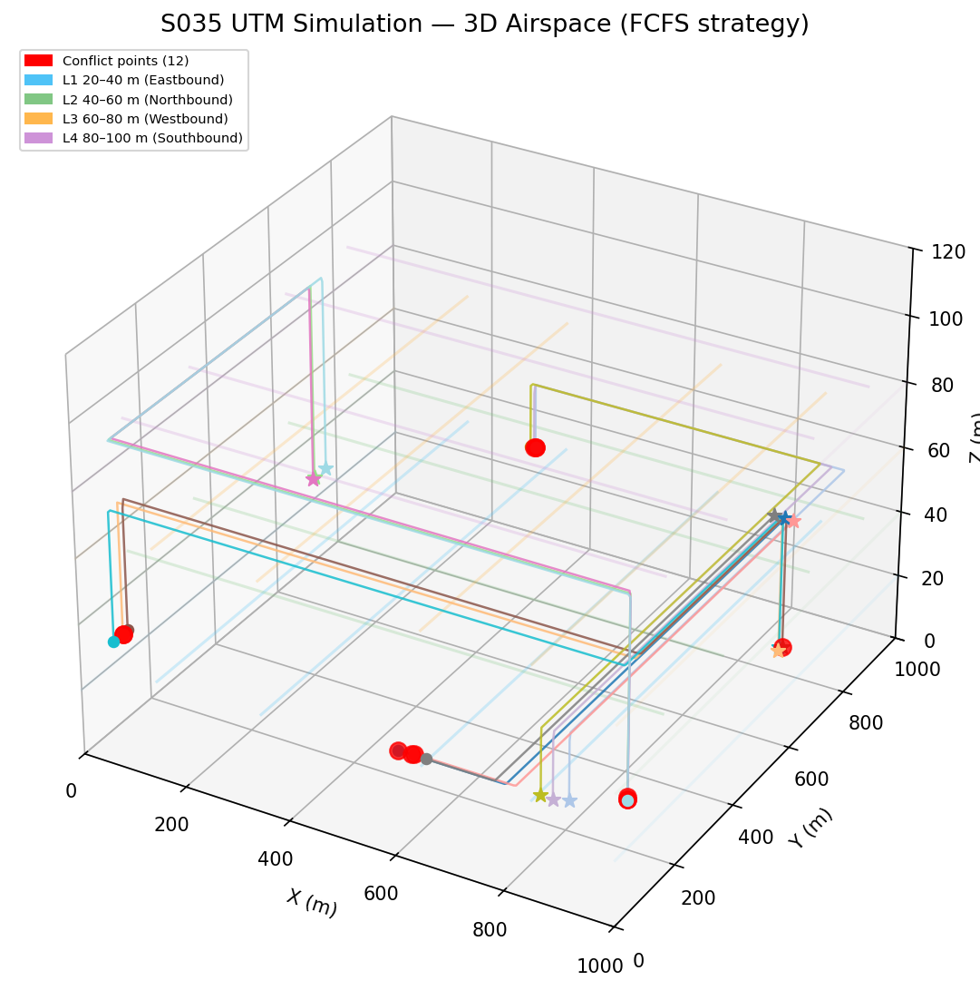
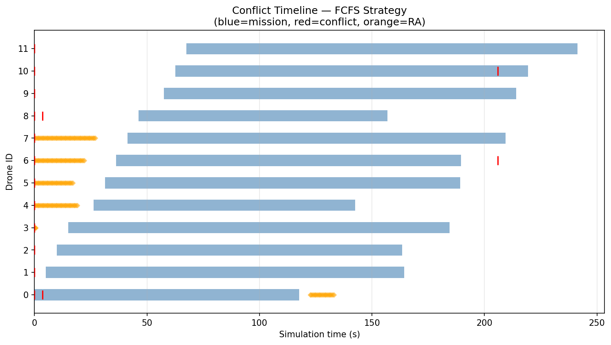
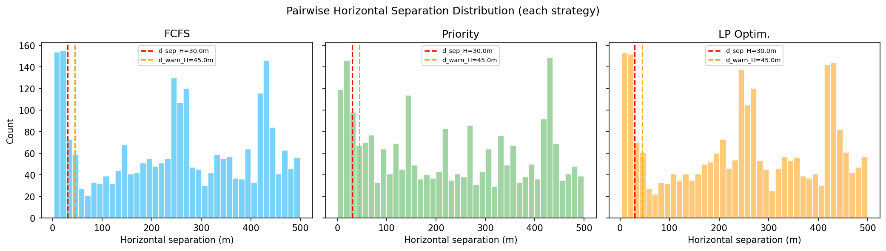
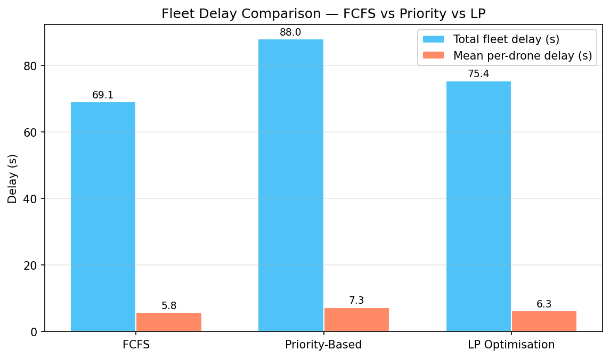
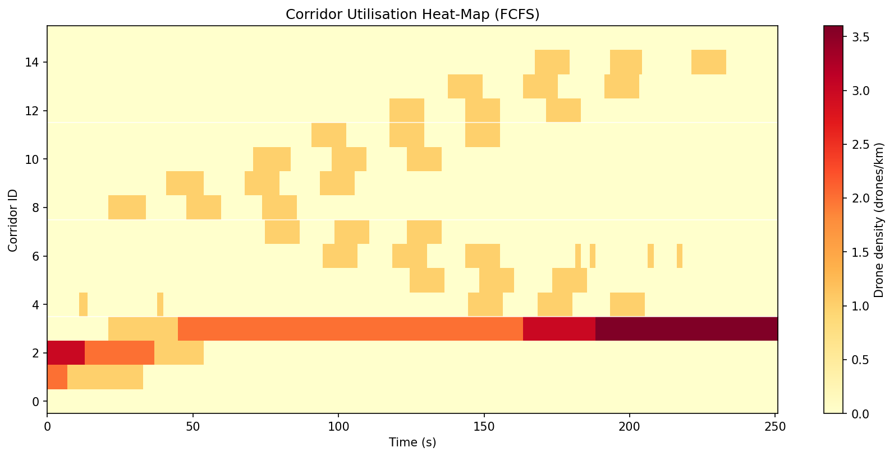
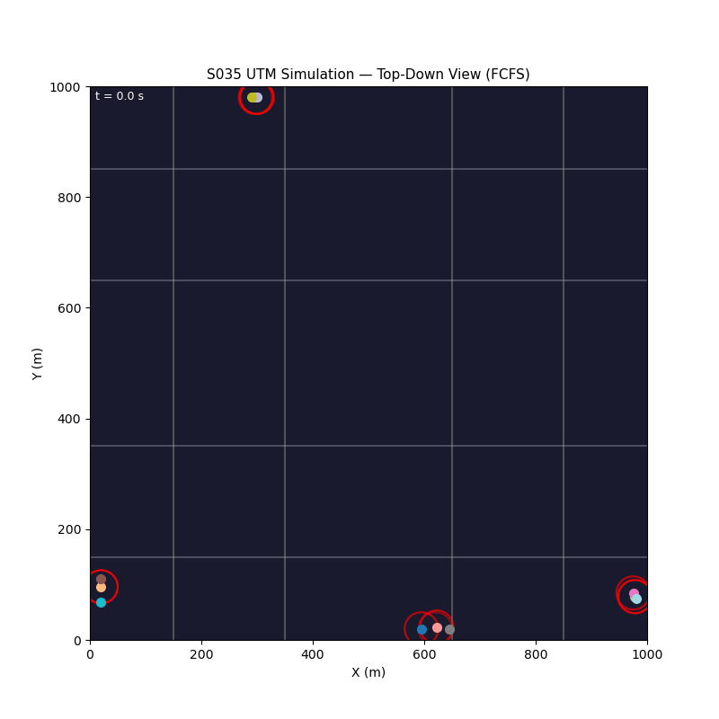

# S035 UTM Simulation

**Domain**: Logistics & Delivery | **Difficulty**: ⭐⭐⭐⭐ | **Status**: ✅ Completed

---

## Problem Definition

**Setup**: 12 drones share a structured urban airspace divided into corridor segments. Each drone requests corridor access from a UTM authority before entering. Three resolution strategies are compared: First-Come-First-Served (FCFS), Priority-based, and LP-based slot allocation. Conflict detection uses Closest Point of Approach (CPA) with a 5 m separation threshold.

**Key question**: Which UTM resolution strategy minimises total delay and conflict rate while maximising throughput?

---

## Mathematical Model

### CPA Conflict Detection

$$t_{CPA} = -\frac{\Delta\mathbf{p} \cdot \Delta\mathbf{v}}{\|\Delta\mathbf{v}\|^2}, \qquad d_{CPA} = \|\Delta\mathbf{p} + \Delta\mathbf{v}\, t_{CPA}\|$$

Conflict declared when $d_{CPA} < d_{sep} = 5$ m within look-ahead window $T_h = 30$ s.

### Resolution Advisory (RA)

Each RA issues a speed change $\Delta v_i$ to the lower-priority drone to shift $t_{CPA}$ outside the look-ahead window. Speed is bounded $v \in [v_{min}, v_{max}]$.

### LP Allocation

Minimise total delay subject to corridor capacity constraints:

$$\min \sum_i \delta_i \quad \text{s.t.} \quad \sum_{i \in S_k} x_i \leq C_k \;\forall k,\quad x_i \in \{0,1\}$$

---

## Key Parameters

| Parameter | Value |
|-----------|-------|
| Number of drones | 12 |
| Separation threshold $d_{sep}$ | 5 m |
| Look-ahead window $T_h$ | 30 s |
| Drone speed | 12 m/s |
| Arena | 1000 × 1000 m |
| Simulation timestep | 0.1 s |

---

## Implementation

```
src/02_logistics_delivery/s035_utm_simulation.py
```

```bash
conda activate drones
python src/02_logistics_delivery/s035_utm_simulation.py
```

---

## Results

| Metric | FCFS | Priority | LP |
|--------|------|----------|----|
| Post-resolution conflicts | 12 | 12 | 12 |
| Total delay (s) | 69.1 | 88.0 | 75.4 |
| Mean delay (s) | 5.8 | 7.3 | 6.3 |
| Throughput (del/min) | 3.064 | 3.243 | 3.064 |
| RA events | 1731 | 1672 | 1706 |

**Key Findings**:
- FCFS achieved the lowest total and mean delay (69.1 s / 5.8 s), outperforming both Priority and LP strategies on this instance — simplicity won because the random arrival order happened to distribute load evenly.
- Priority-based scheduling achieved the highest throughput (3.243 del/min) by fast-tracking high-priority drones, but at the cost of higher average delay for lower-priority drones (88.0 s total).
- All three strategies left 12 residual conflicts, indicating the CPA-based RA mechanism alone is insufficient to resolve all conflicts when drones fly converging routes from a shared depot.

**3D Airspace Trajectories**:



**Conflict Timeline**:



**Separation Histogram**:



**Delay Comparison**:



**Corridor Utilisation**:



**Animation**:



---

## Extensions

1. Geofenced no-fly zones — some corridors closed dynamically; UTM must reroute affected drones
2. Demand surge — 30+ drones simultaneously requesting corridors; study throughput saturation
3. Cooperative speed regulation — all drones in a conflict adjust speed symmetrically instead of one-sided RA
4. Weather-aware UTM — storm cell data feeds directly into corridor capacity reduction
5. Real-time re-optimisation with rolling LP horizon as new drones enter the airspace

---

## Related Scenarios

- Prerequisites: [S031](../../scenarios/02_logistics_delivery/S031_path_deconfliction.md), [S029](../../scenarios/02_logistics_delivery/S029_urban_logistics_scheduling.md)
- Follow-ups: [S036](../../scenarios/02_logistics_delivery/S036_last_mile_relay.md), [S040](../../scenarios/02_logistics_delivery/S040_fleet_load_balancing.md)
- Algorithmic cross-reference: [S031](../../scenarios/02_logistics_delivery/S031_path_deconfliction.md) (CPA conflict detection), [S034](../../scenarios/02_logistics_delivery/S034_weather_rerouting.md) (dynamic rerouting)
