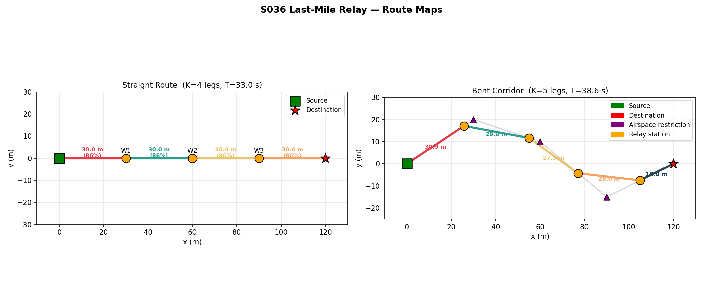
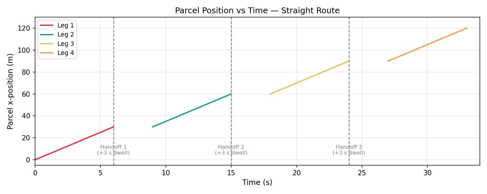
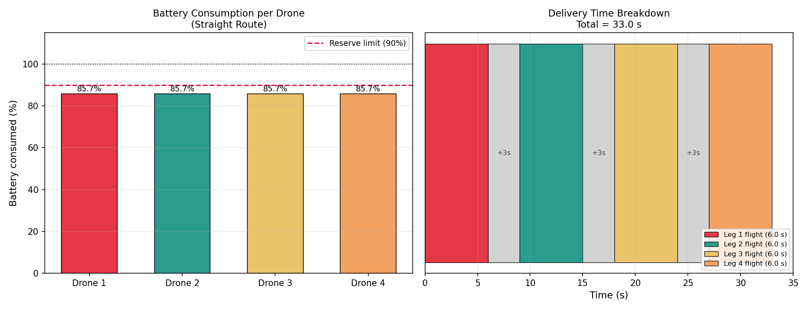
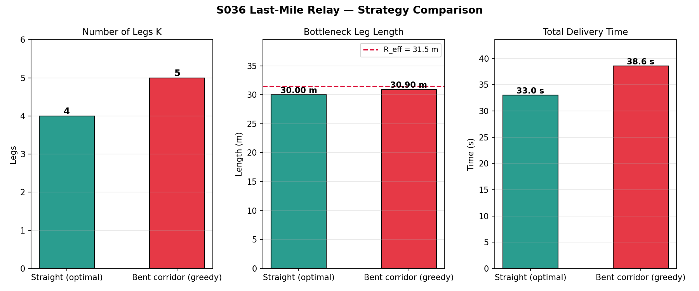
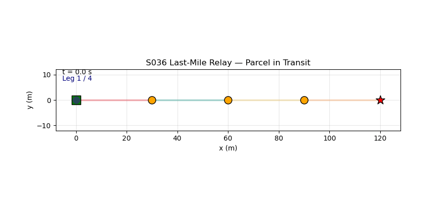

# S036 Last-Mile Relay

**Domain**: Logistics & Delivery | **Difficulty**: ⭐⭐⭐ | **Status**: ✅ Completed

---

## Problem Definition

**Setup**: A parcel must be delivered over a long corridor that exceeds any single drone's battery range. A chain of relay drones hands off the parcel mid-air at transfer points along the route. Two corridor geometries are compared: a straight route (optimally segmented into equal legs) and a bent corridor (greedy segmentation following waypoints). The goal is to minimise the bottleneck leg length (which determines the minimum battery capacity required) and total delivery time.

**Key question**: How does corridor curvature affect the optimal number of relay legs and the bottleneck leg length?

---

## Mathematical Model

### Optimal Leg Count (Straight Route)

$$K^* = \left\lceil \frac{L_{total}}{R_{eff}} \right\rceil, \qquad R_{eff} = \eta \cdot R_{max}$$

where $\eta$ is the usable battery fraction and $R_{max}$ is the maximum range.

### Battery Consumption per Leg

$$\text{SoC}_{remaining} = 1 - \frac{L_{leg}}{R_{max}}$$

### Bottleneck Leg

$$L_{bottleneck} = \max_{k} L_k$$

Minimising $L_{bottleneck}$ ensures the drone with the longest leg does not run out of battery.

### Total Delivery Time

$$T_{total} = \frac{L_{total}}{v} + (K-1) \cdot t_{handoff}$$

where $t_{handoff}$ is the mid-air transfer time per relay point.

---

## Key Parameters

| Parameter | Value |
|-----------|-------|
| Total corridor length | ~132 m (straight) / ~132 m (bent) |
| Effective range $R_{eff}$ | 35 m per drone |
| Drone speed | 10 m/s |
| Handoff time | 3 s |
| Nominal cruise altitude | 20 m |

---

## Implementation

```
src/02_logistics_delivery/s036_last_mile_relay.py
```

```bash
conda activate drones
python src/02_logistics_delivery/s036_last_mile_relay.py
```

---

## Results

| Metric | Straight (optimal) | Bent (greedy) |
|--------|-------------------|---------------|
| Number of legs $K$ | 4 | 5 |
| Bottleneck leg (m) | 30.00 | 30.90 |
| Battery per drone | 85.7% each | 47.9%–88.3% |
| Total delivery time (s) | 33.00 | 38.56 |

**Key Findings**:
- The straight route achieves perfectly equal legs (30 m each, 85.7% battery each) with just 4 relay drones, demonstrating optimal segmentation when corridor geometry allows it.
- The bent corridor requires 5 legs due to curvature, and greedy segmentation creates unequal legs — the last drone uses only 47.9% battery while others use up to 88.3%, showing wasted capacity from sub-optimal splitting.
- Total delivery time for the bent corridor (38.56 s) is 17% longer than the straight route (33.00 s), entirely due to the extra relay leg and longer path.

**Route Map**:



**Parcel Position Over Time**:



**Battery and Timing per Drone**:



**Strategy Comparison**:



**Animation**:



---

## Extensions

1. Dynamic transfer points — relay drones pre-position optimally rather than waiting at fixed nodes
2. Wind-aware segmentation — legs into headwind are shorter; adjust $K$ and leg lengths accordingly
3. Parallel relay chains — two parcels delivered simultaneously on overlapping corridors
4. Battery heterogeneity — drones with different capacities assigned to legs proportionally
5. Failure recovery — if one relay drone fails, re-route parcel to nearest available drone

---

## Related Scenarios

- Prerequisites: [S021](../../scenarios/02_logistics_delivery/S021_point_delivery.md), [S027](../../scenarios/02_logistics_delivery/S027_aerial_refueling_relay.md)
- Follow-ups: [S037](../../scenarios/02_logistics_delivery/S037_reverse_logistics.md), [S039](../../scenarios/02_logistics_delivery/S039_offshore_platform_exchange.md)
- Algorithmic cross-reference: [S027](../../scenarios/02_logistics_delivery/S027_aerial_refueling_relay.md) (aerial relay), [S032](../../scenarios/02_logistics_delivery/S032_charging_queue.md) (battery management)
