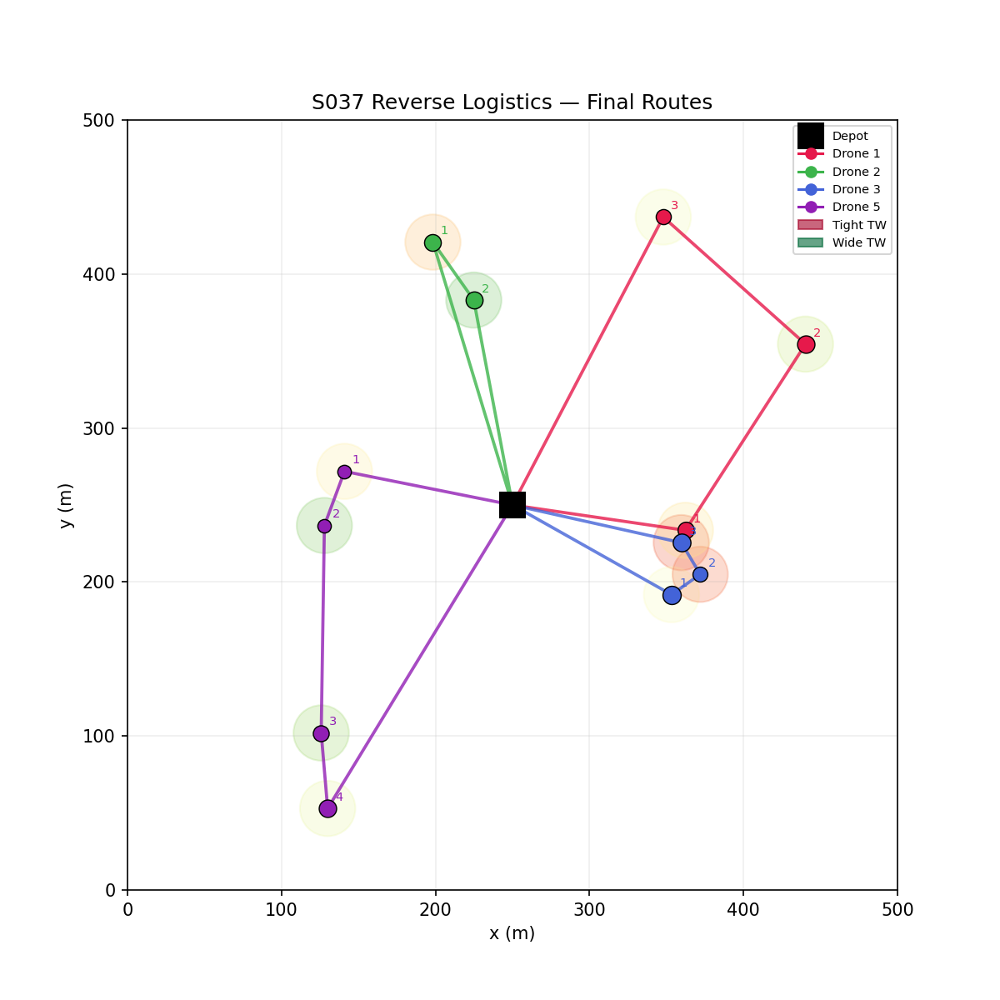
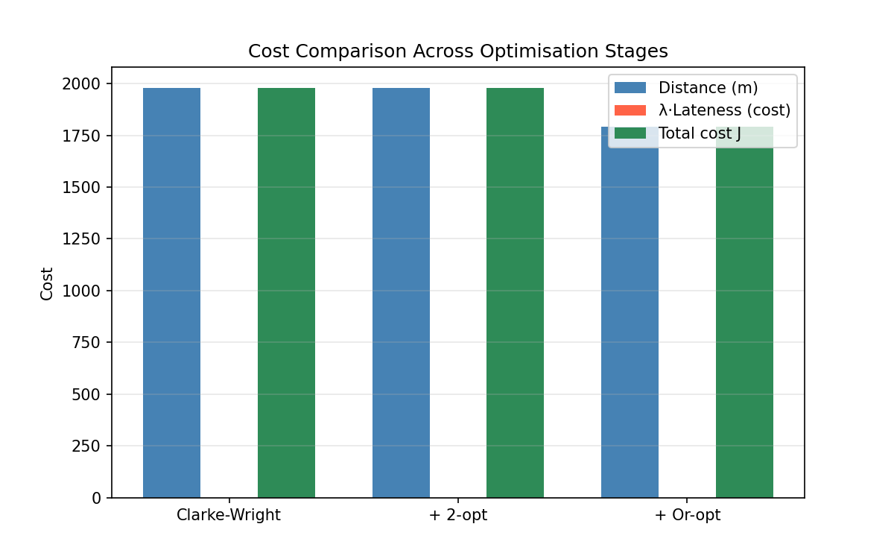
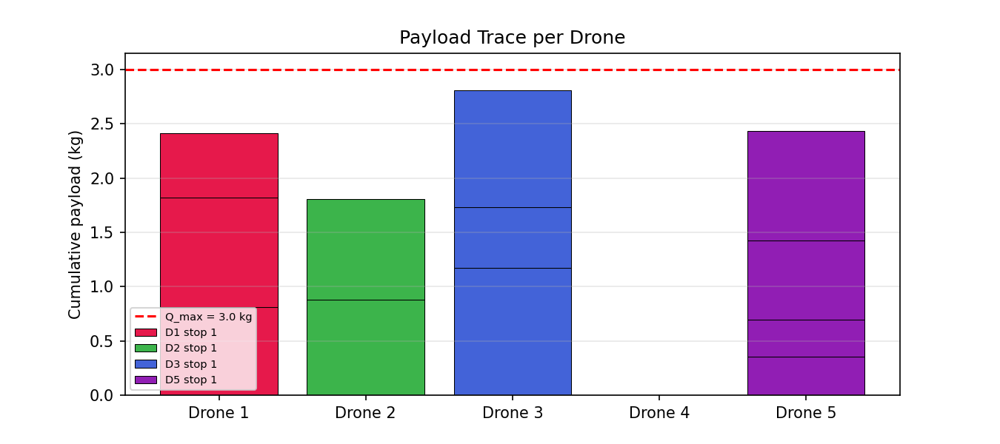
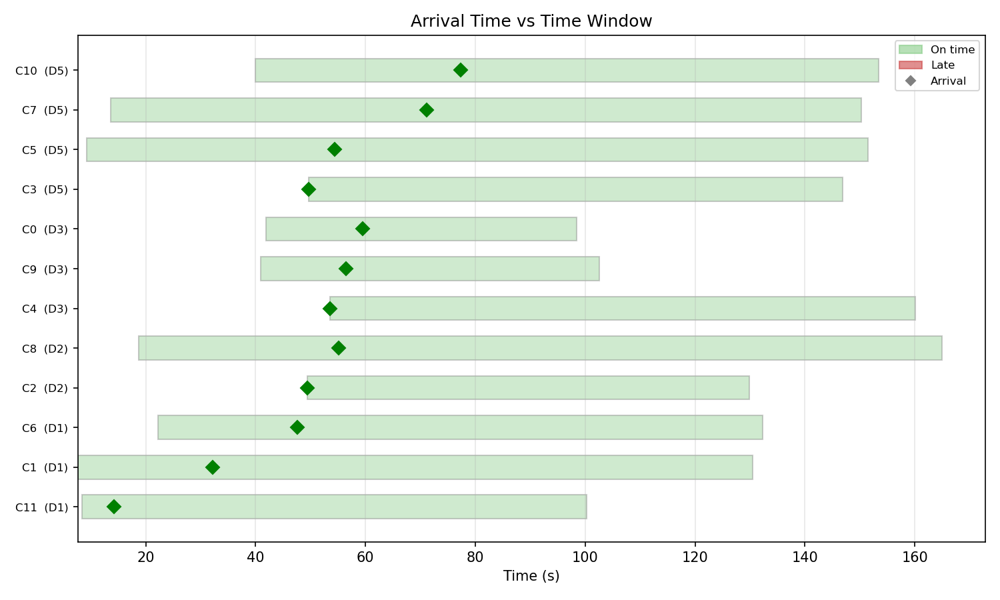
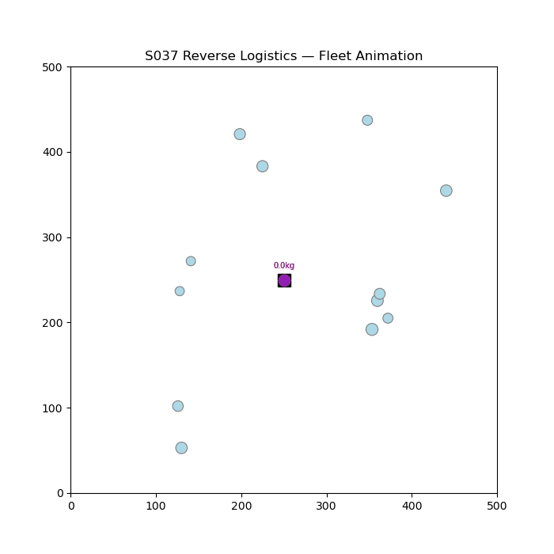

# S037 Reverse Logistics

**Domain**: Logistics & Delivery | **Difficulty**: ⭐⭐⭐ | **Status**: ✅ Completed

---

## Problem Definition

**Setup**: A fleet of 5 drones must collect damaged/returned items from 12 customer locations and return them to a central depot. Each customer has a pickup payload and a time window. The problem is solved as a Vehicle Routing Problem with Time Windows (VRPTW): first seeded with a Clarke-Wright savings heuristic, then improved by 2-opt and Or-opt local search.

**Key question**: How much route distance can local search recover from the initial greedy solution, and can all customers be served within their time windows?

---

## Mathematical Model

### Clarke-Wright Savings

$$s_{ij} = d(depot, i) + d(depot, j) - d(i, j)$$

Merge routes visiting $i$ and $j$ in decreasing order of savings $s_{ij}$, subject to capacity and time-window constraints.

### 2-opt Improvement

Reverse a sub-sequence $[i+1, \ldots, j]$ in a route if:

$$d(r_i, r_{i+1}) + d(r_j, r_{j+1}) > d(r_i, r_j) + d(r_{i+1}, r_{j+1})$$

### Or-opt Improvement

Relocate a single customer or a chain of 2–3 customers to a cheaper position in the same or different route.

### Total Cost

$$J = \sum_k L_k + w_{late} \cdot \sum_k \max(0,\, t_k^{arrive} - t_k^{deadline})$$

---

## Key Parameters

| Parameter | Value |
|-----------|-------|
| Fleet size | 5 drones |
| Customers | 12 pickup locations |
| Drone speed | 10 m/s |
| Max payload per drone | 3.5 kg |
| Lateness penalty weight | 100 |
| Arena | 500 × 500 m |

---

## Implementation

```
src/02_logistics_delivery/s037_reverse_logistics.py
```

```bash
conda activate drones
python src/02_logistics_delivery/s037_reverse_logistics.py
```

---

## Results

| Metric | Value |
|--------|-------|
| Clarke-Wright total distance | 1980.8 m |
| After 2-opt | 1980.8 m |
| After Or-opt | 1793.1 m |
| Distance improvement vs CW | 9.5 % |
| Customers on-time | 12/12 |
| Late customers | 0/12 |

**Key Findings**:
- Or-opt achieved a 9.5% distance reduction over the Clarke-Wright seed, while 2-opt yielded no improvement on this instance — demonstrating that segment relocation is more effective than reversal for pickup-centric routes.
- All 12 customers were served within their time windows with zero lateness, confirming the feasibility of the optimised routes.
- D4 carried no stops, suggesting the 5-drone fleet is oversized for 12 pickups; a smaller fleet would suffice while maintaining feasibility.

**Route Map**:



**Cost Comparison (CW → 2-opt → Or-opt)**:



**Payload Trace per Drone**:



**Time Windows Compliance**:



**Animation**:



---

## Extensions

1. Mixed fleet with heterogeneous payload capacities and speeds
2. Stochastic pickup weights — customer payload only revealed on arrival
3. Dynamic insertion of new pickup requests during the mission (cf. S033)
4. Battery-constrained routing with mandatory recharging stops at the depot
5. Multi-depot reverse logistics where damaged items are sorted to different repair facilities

---

## Related Scenarios

- Prerequisites: [S021](../../scenarios/02_logistics_delivery/S021_point_delivery.md), [S029](../../scenarios/02_logistics_delivery/S029_urban_logistics_scheduling.md)
- Follow-ups: [S038](../../scenarios/02_logistics_delivery/S038_disaster_relief_drop.md), [S040](../../scenarios/02_logistics_delivery/S040_fleet_load_balancing.md)
- Algorithmic cross-reference: [S030](../../scenarios/02_logistics_delivery/S030_multi_depot_delivery.md) (multi-depot VRP), [S033](../../scenarios/02_logistics_delivery/S033_online_order_insertion.md) (online insertion)
