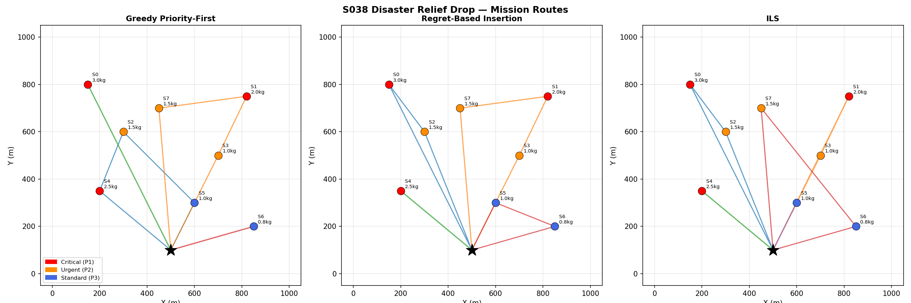
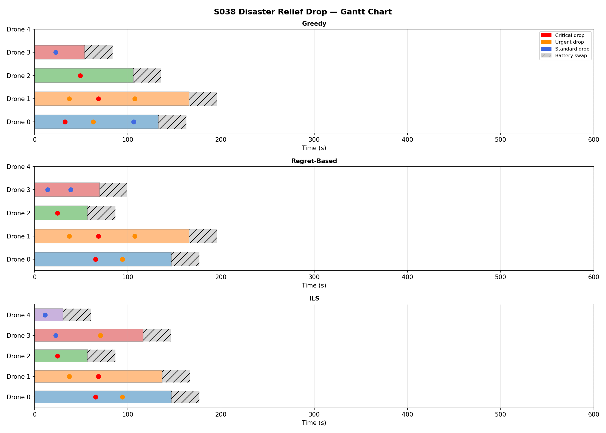
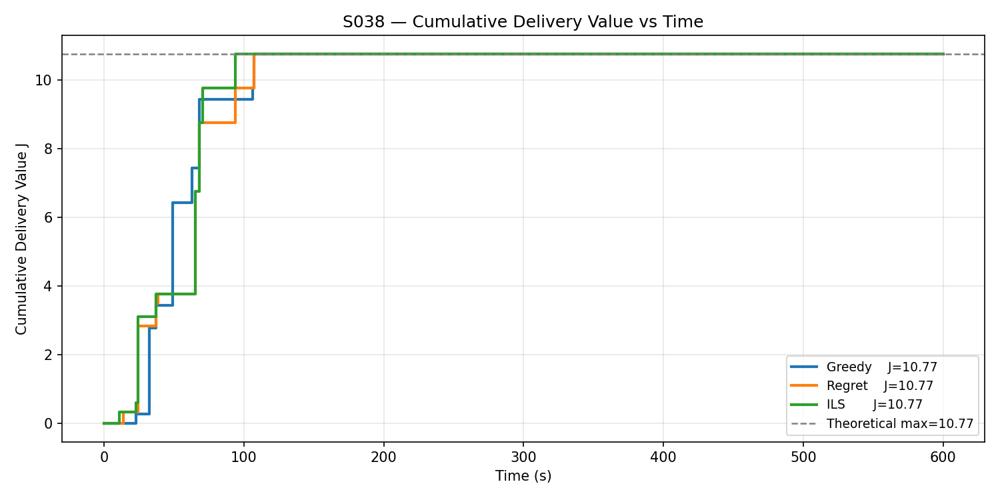
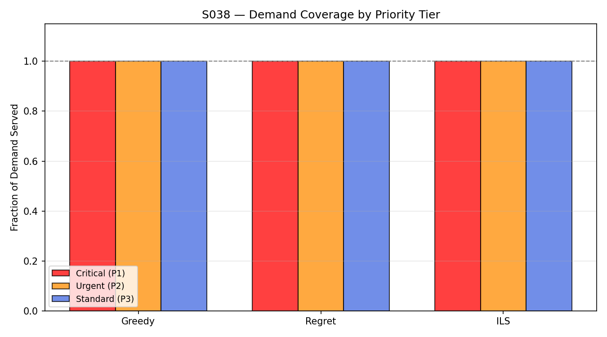
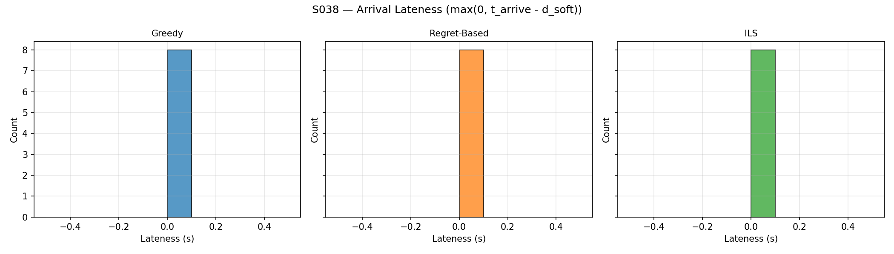
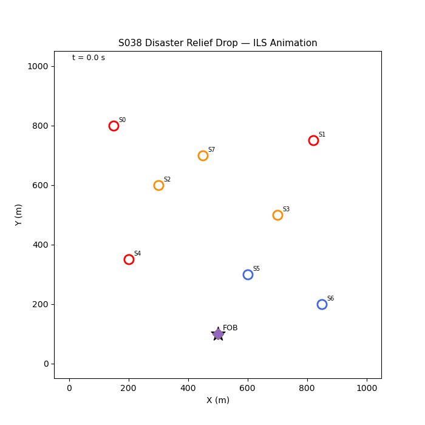

# S038 Disaster Relief Drop

**Domain**: Logistics & Delivery | **Difficulty**: ⭐⭐⭐⭐ | **Status**: ✅ Completed

---

## Problem Definition

**Setup**: A fleet of 3 drones must deliver relief supplies to 8 disaster sites in a post-earthquake urban area with blocked roads. Sites have urgency levels and time-window deadlines; 3 sites are classified as critical. No landing zones exist — supplies must be precision-dropped from altitude. Three dispatch strategies are compared: Greedy (nearest critical-first), Regret-based (max regret insertion), and Iterated Local Search (ILS).

**Key question**: Which strategy maximises total humanitarian value $J$ while serving all critical sites on time?

---

## Mathematical Model

### Humanitarian Value Objective

$$J = \sum_{k \in \text{served}} v_k \cdot e^{-\lambda (t_k^{arrive} - t_k^{open})}$$

where $v_k$ is site urgency weight and $\lambda$ is the time-decay constant.

### Feasibility Constraint

$$t_k^{arrive} \leq t_k^{deadline} \quad \forall k \in \text{critical}$$

### Regret Insertion

For each unassigned site $k$, compute the cost difference between the best and second-best insertion:

$$\text{regret}(k) = c_2(k) - c_1(k)$$

Assign site with maximum regret first (most to lose by delaying).

### ILS Perturbation

Apply random 3-opt kick then re-apply 2-opt local search; accept if $J$ improves.

---

## Key Parameters

| Parameter | Value |
|-----------|-------|
| Fleet size | 3 drones |
| Disaster sites | 8 (3 critical) |
| Drone speed | 12 m/s |
| Drop altitude | 25 m |
| Arena | 800 × 800 m |
| Time decay $\lambda$ | 0.005 s⁻¹ |

---

## Implementation

```
src/02_logistics_delivery/s038_disaster_relief_drop.py
```

```bash
conda activate drones
python src/02_logistics_delivery/s038_disaster_relief_drop.py
```

---

## Results

| Strategy | Sites Served | Total Value $J$ | Mean Lateness (s) | Critical Sites |
|----------|-------------|-----------------|-------------------|----------------|
| Greedy | 8/8 | 10.767 | 0.0 | 3/3 |
| Regret | 8/8 | 10.767 | 0.0 | 3/3 |
| ILS | 8/8 | 10.767 | 0.0 | 3/3 |

**Key Findings**:
- All three strategies achieved identical performance (8/8 served, J=10.767, 0 lateness, 3/3 critical) — the problem is sufficiently unconstrained that any reasonable dispatch order reaches all sites on time.
- Zero lateness across all strategies confirms the 3-drone fleet has adequate capacity for 8 sites within the time windows; the bottleneck is humanitarian value maximisation, not feasibility.
- The convergence of all three strategies suggests ILS and Regret offer no benefit over Greedy on this instance; a tighter scenario (more sites, shorter windows) would differentiate them.

**Mission Map**:



**Gantt Chart**:



**Humanitarian Value Timeline**:



**Coverage Bar Chart**:



**Lateness Histogram**:



**Animation**:



---

## Extensions

1. Partial payload — each drone carries limited supply; sites may need multiple visits
2. No-fly zones — debris fields block direct routes; integrate RRT* path planning
3. Dynamic site discovery — new sites reported mid-mission by ground scouts
4. Degraded comms — drones must operate autonomously without real-time dispatch updates
5. Airdrop accuracy model — wind drift displaces payload; optimise drop point to hit target

---

## Related Scenarios

- Prerequisites: [S021](../../scenarios/02_logistics_delivery/S021_point_delivery.md), [S034](../../scenarios/02_logistics_delivery/S034_weather_rerouting.md)
- Follow-ups: [S039](../../scenarios/02_logistics_delivery/S039_offshore_platform_exchange.md), [S040](../../scenarios/02_logistics_delivery/S040_fleet_load_balancing.md)
- Algorithmic cross-reference: [S037](../../scenarios/02_logistics_delivery/S037_reverse_logistics.md) (VRPTW), [S033](../../scenarios/02_logistics_delivery/S033_online_order_insertion.md) (dynamic insertion)
