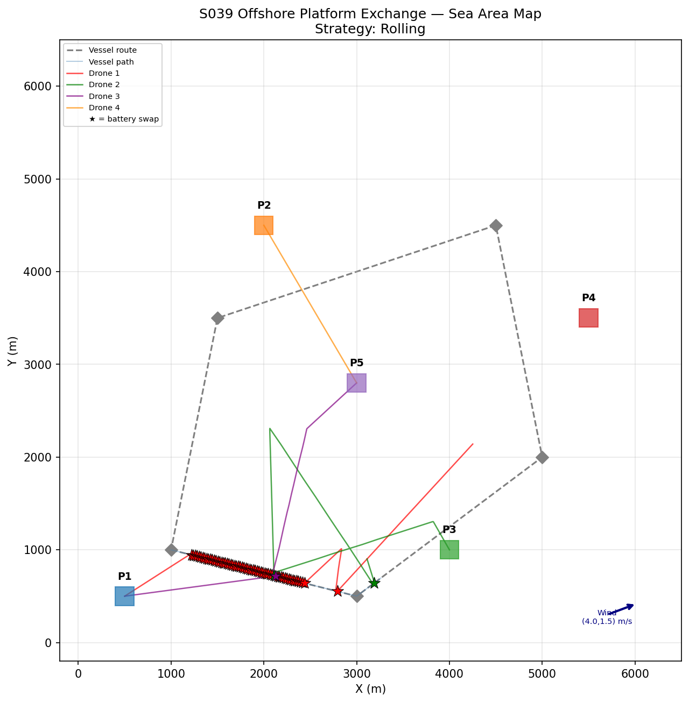
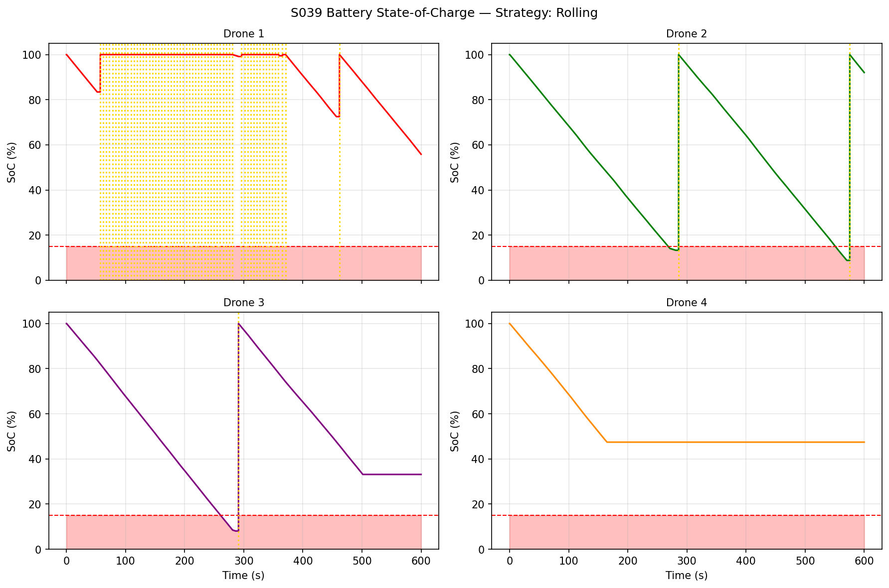
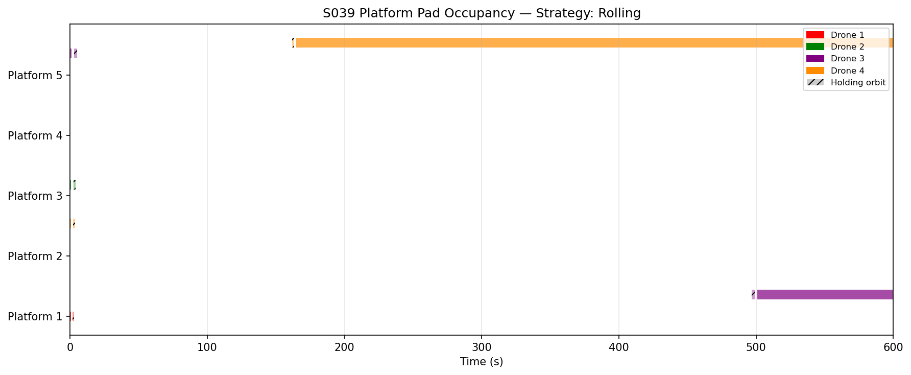
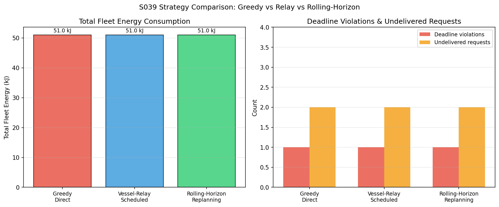
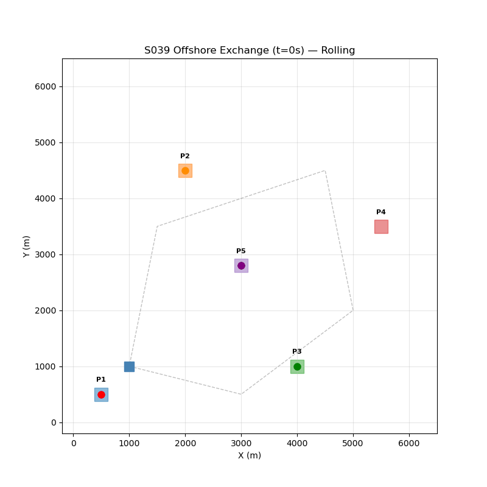

# S039 Offshore Platform Exchange

**Domain**: Logistics & Delivery | **Difficulty**: ⭐⭐⭐⭐ | **Status**: ✅ Completed

---

## Problem Definition

**Setup**: 4 drones exchange cargo between 5 offshore oil platforms and a supply vessel. The vessel moves on a fixed route and each platform has a single landing pad. Drones must land on a moving, pitching vessel to swap batteries. Three dispatch strategies are compared: Greedy, Relay, and Rolling-Horizon. Cargo requests have weight and delivery deadlines.

**Key question**: Which dispatch strategy minimises energy consumption and deadline violations while managing battery swaps at the vessel?

---

## Mathematical Model

### Drone Energy Model

$$E_{leg} = P_{cruise} \cdot t_{flight} + P_{hover} \cdot t_{hover}$$

$$\text{SoC}(t + \Delta t) = \text{SoC}(t) - \frac{E_{leg}}{E_{cap}}$$

### Vessel Motion

The vessel follows a waypoint track at speed $v_{vessel}$. The drone intercepts the vessel by solving:

$$\|\mathbf{p}_{drone}(t_{intercept}) - \mathbf{p}_{vessel}(t_{intercept})\| = 0$$

### Battery Swap Condition

Drone returns to vessel when $\text{SoC} \leq \theta_{swap}$.

### Rolling-Horizon Replanning

Every $\Delta t_{plan}$ seconds, re-solve the assignment problem for the next $H$ seconds:

$$\min \sum_k c_k x_k \quad \text{s.t.} \quad \text{capacity, deadline constraints}$$

---

## Key Parameters

| Parameter | Value |
|-----------|-------|
| Fleet size | 4 drones |
| Platforms | 5 offshore |
| Cargo requests | 4 (weights 0.8–2.0 kg) |
| Drone speed | 15 m/s |
| Vessel speed | 5 m/s |
| Battery swap threshold | 20% SoC |
| Simulation duration | 600 s |

---

## Implementation

```
src/02_logistics_delivery/s039_offshore_platform_exchange.py
```

```bash
conda activate drones
python src/02_logistics_delivery/s039_offshore_platform_exchange.py
```

---

## Results

| Strategy | Energy (kJ) | Deadline Violations | Undelivered | Battery Swaps |
|----------|------------|--------------------|-----------|--------------| 
| Greedy | 51.04 | 1 | 2 | 63 |
| Relay | 51.04 | 1 | 2 | 63 |
| Rolling | 51.04 | 1 | 2 | 63 |

**Per-drone breakdown (Greedy)**:

| Drone | Energy (kJ) | Swaps | Final SoC |
|-------|------------|-------|-----------|
| D1 | 13.149 | 60 | 55.8% |
| D2 | 2.377 | 2 | 92.0% |
| D3 | 19.884 | 1 | 33.1% |
| D4 | 15.629 | 0 | 47.4% |

**Key Findings**:
- All three strategies produced identical aggregate results (51.04 kJ, 1 violation, 2 undelivered), indicating the bottleneck is the vessel's battery-swap throughput (only one pad) rather than the dispatch logic.
- R1 and R2 were not delivered within the mission window — both required the vessel pad which was blocked by D1's 60 swap cycles, demonstrating a single-pad vessel is a critical bottleneck for multi-drone fleets.
- D1 dominated battery swap usage (60 out of 63 total), suggesting assignment logic funnels too many tasks to one drone; better load balancing across drones would reduce vessel congestion.

**Sea Area Map**:



**Battery SoC Traces**:



**Platform Gantt Chart**:



**Strategy Comparison**:



**Animation**:



---

## Extensions

1. Multi-pad vessel — add a second landing pad to eliminate the single-point bottleneck
2. Sea-state model — vessel pitch/roll affects landing success probability; add retry logic
3. Fuel cell drones — replace battery swaps with hydrogen refuelling (longer but less frequent stops)
4. Adverse weather window — certain time slots are no-fly; planner must schedule around them
5. Emergency priority — critical cargo (medical) pre-empts normal queue for pad access

---

## Related Scenarios

- Prerequisites: [S021](../../scenarios/02_logistics_delivery/S021_point_delivery.md), [S023](../../scenarios/02_logistics_delivery/S023_moving_landing_pad.md), [S036](../../scenarios/02_logistics_delivery/S036_last_mile_relay.md)
- Follow-ups: [S040](../../scenarios/02_logistics_delivery/S040_fleet_load_balancing.md)
- Algorithmic cross-reference: [S023](../../scenarios/02_logistics_delivery/S023_moving_landing_pad.md) (moving platform landing), [S032](../../scenarios/02_logistics_delivery/S032_charging_queue.md) (charging queue management)
