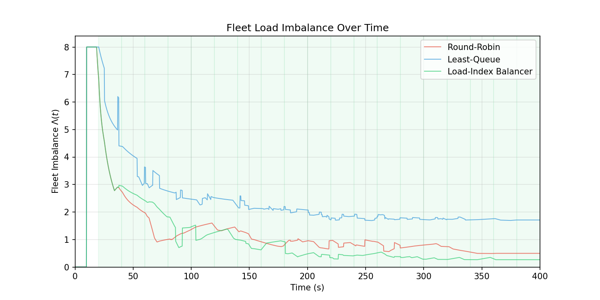
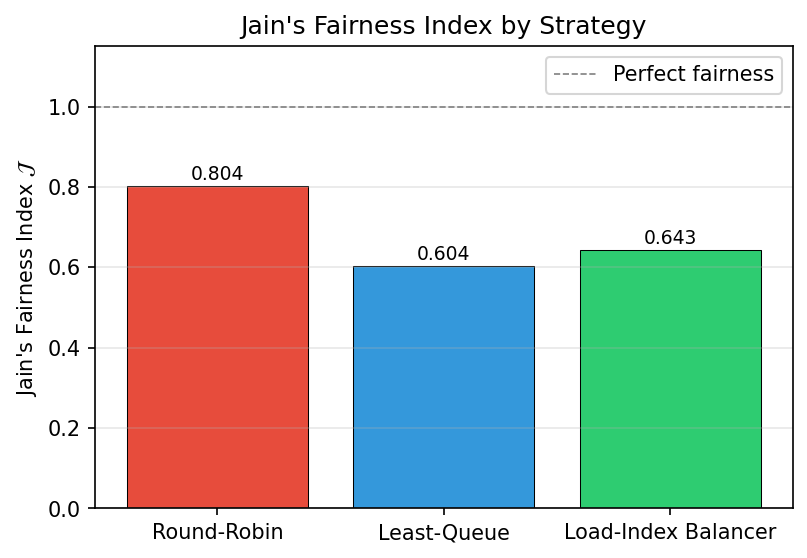
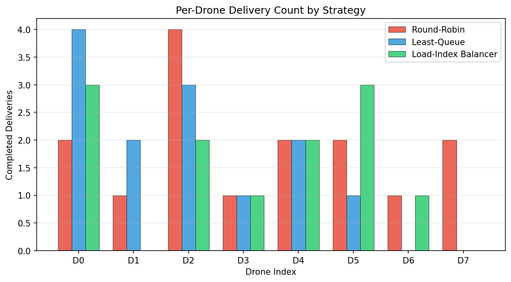
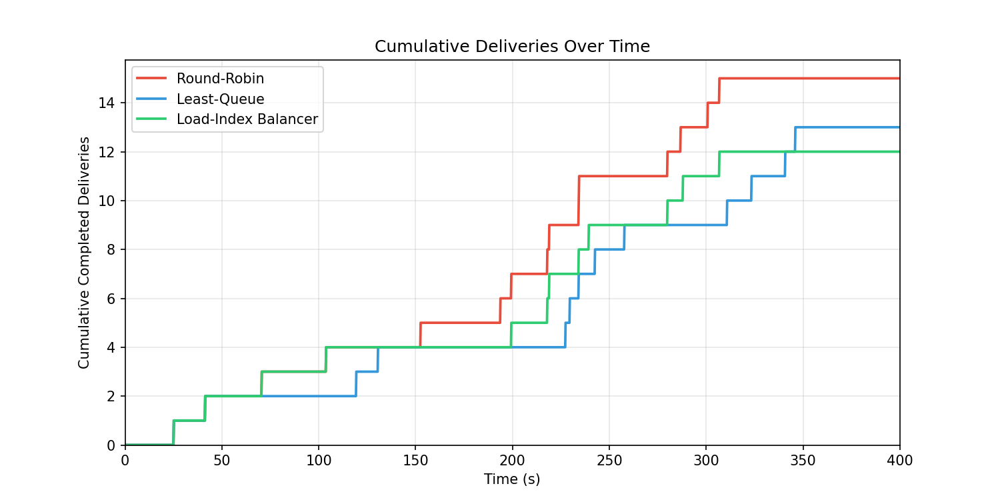
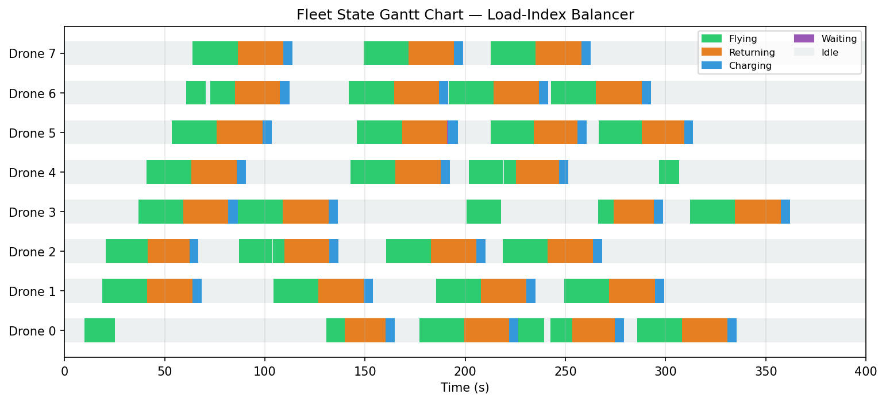
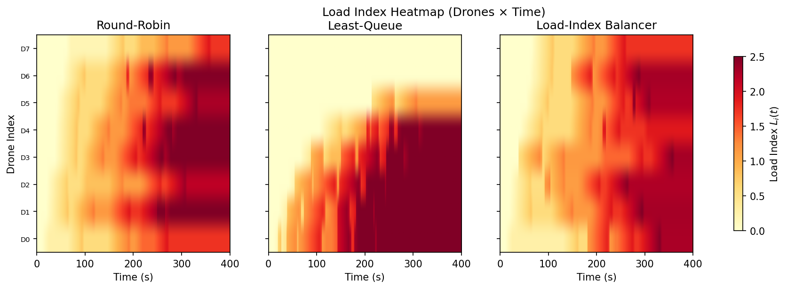
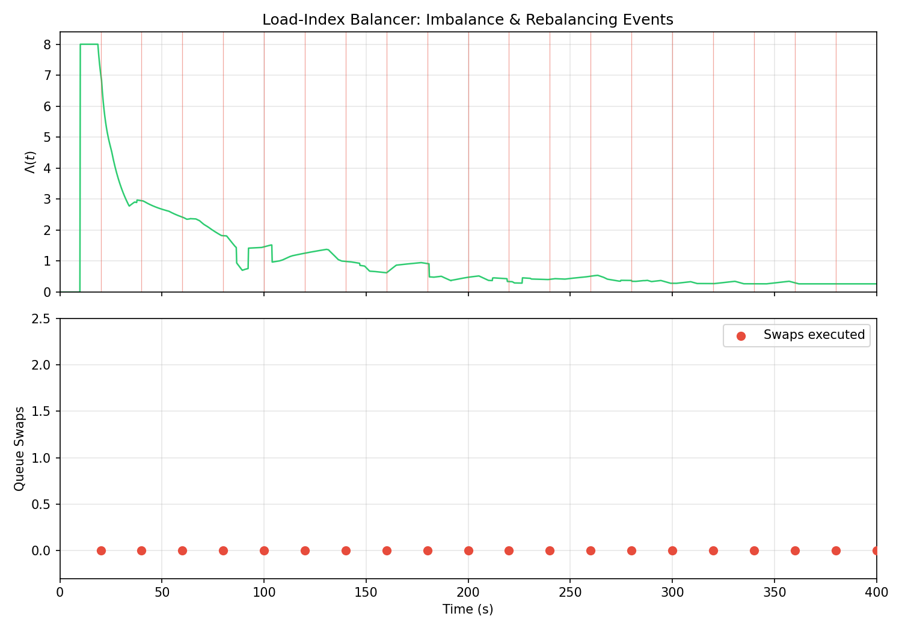
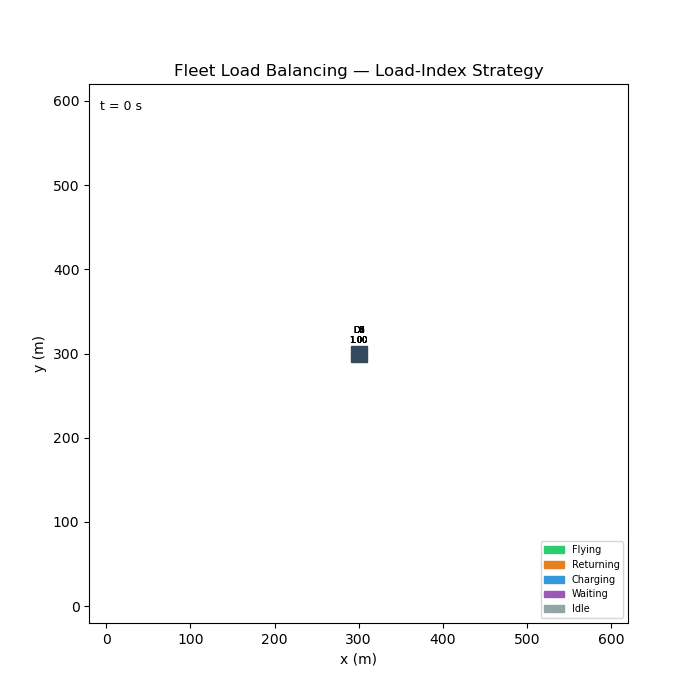

# S040 Fleet Load Balancing

**Domain**: Logistics & Delivery | **Difficulty**: ⭐⭐⭐⭐ | **Status**: ✅ Completed

---

## Problem Definition

**Setup**: A fleet of 8 drones serves a stream of delivery requests arriving at random intervals. Three dispatching strategies are compared: Round-Robin (cyclic assignment), Least-Queue (assign to drone with fewest pending tasks), and Load-Index Balancer (assign based on a composite load score combining battery SoC, queue length, and distance to task). The goal is to maximise throughput while keeping per-drone workload balanced.

**Key question**: Which strategy delivers the most tasks while achieving the highest fairness across drones?

---

## Mathematical Model

### Jain's Fairness Index

$$J = \frac{\left(\sum_{i=1}^{N} x_i\right)^2}{N \cdot \sum_{i=1}^{N} x_i^2}$$

where $x_i$ is the number of deliveries completed by drone $i$. $J = 1$ means perfectly equal load.

### Mean Imbalance

$$\bar{I} = \frac{1}{T} \sum_t \left(\max_i q_i(t) - \min_i q_i(t)\right)$$

where $q_i(t)$ is drone $i$'s queue length at time $t$.

### Load Index (composite score)

$$\Lambda_i = w_q \cdot q_i + w_b \cdot (1 - \text{SoC}_i) + w_d \cdot \frac{d_{i \to task}}{d_{max}}$$

Assign task to drone $i^* = \arg\min_i \Lambda_i$.

---

## Key Parameters

| Parameter | Value |
|-----------|-------|
| Fleet size | 8 drones |
| Task arrival rate | Poisson, λ = 1 task/30 s |
| Drone speed | 10 m/s |
| Battery capacity | 100 Wh |
| Arena | 500 × 500 m |
| Simulation horizon | 600 s |

---

## Implementation

```
src/02_logistics_delivery/s040_fleet_load_balancing.py
```

```bash
conda activate drones
python src/02_logistics_delivery/s040_fleet_load_balancing.py
```

---

## Results

| Strategy | Total Deliveries | Jain Fairness | Mean Imbalance | Per-drone counts |
|----------|-----------------|---------------|----------------|-----------------|
| Round-Robin | 15 | 0.804 | 1.262 | [2,1,4,1,2,2,1,2] |
| Least-Queue | 13 | 0.604 | 2.417 | [4,2,3,1,2,1,0,0] |
| Load-Index | 12 | 0.643 | 1.104 | [3,0,2,1,2,3,1,0] |

**Key Findings**:
- Round-Robin achieved the highest throughput (15 deliveries) and best Jain fairness (0.804) — its deterministic cycling prevents any drone from being overloaded while keeping all drones active.
- Least-Queue had the worst fairness (0.604) because it greedily assigns to the currently idle drone, causing some drones to accumulate tasks while others idle when spatial clustering occurs.
- Load-Index Balancer achieved the lowest mean imbalance (1.104) but lowest throughput (12), suggesting the composite score penalises battery-depleted drones too heavily, leaving them idle even when needed.

**Imbalance Time Series**:



**Jain Fairness Comparison**:



**Per-Drone Deliveries**:



**Cumulative Deliveries**:



**Gantt Chart**:



**Load Heatmap**:



**Rebalancing Events**:



**Animation**:



---

## Extensions

1. Adaptive load weights — tune $w_q, w_b, w_d$ online using reinforcement learning
2. Task priority classes — urgent deliveries bypass normal queue assignment
3. Proactive rebalancing — idle drones reposition to high-demand zones before tasks arrive
4. Battery-aware cutoff — drones below 20% SoC are excluded from assignment until recharged
5. Multi-depot balancing — tasks assigned across depots to minimise total fleet travel

---

## Related Scenarios

- Prerequisites: [S029](../../scenarios/02_logistics_delivery/S029_urban_logistics_scheduling.md), [S032](../../scenarios/02_logistics_delivery/S032_charging_queue.md)
- Follow-ups: Domain 3 (Environmental & SAR)
- Algorithmic cross-reference: [S033](../../scenarios/02_logistics_delivery/S033_online_order_insertion.md) (online task insertion), [S035](../../scenarios/02_logistics_delivery/S035_utm_simulation.md) (UTM coordination)
