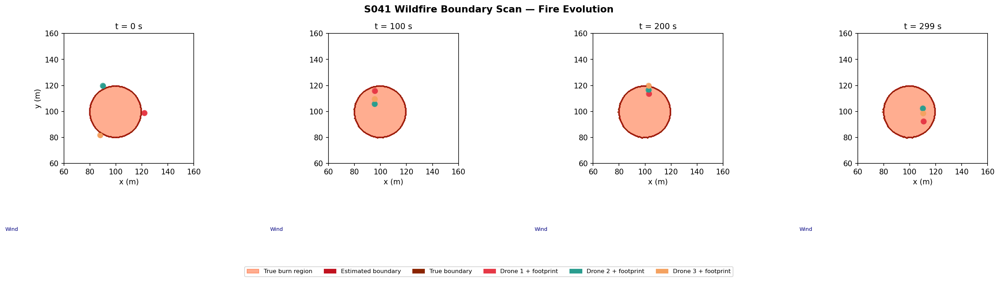
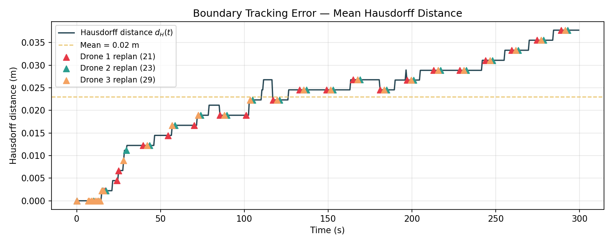
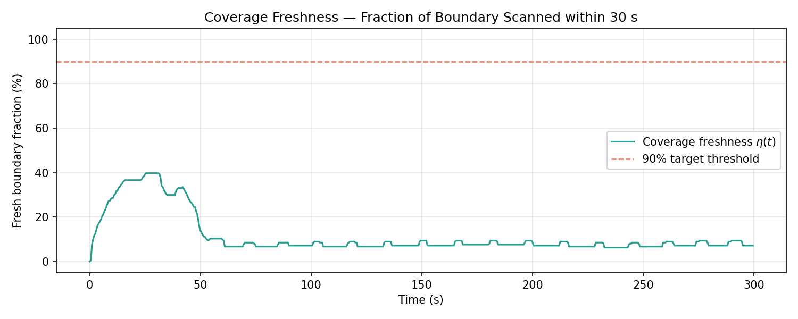
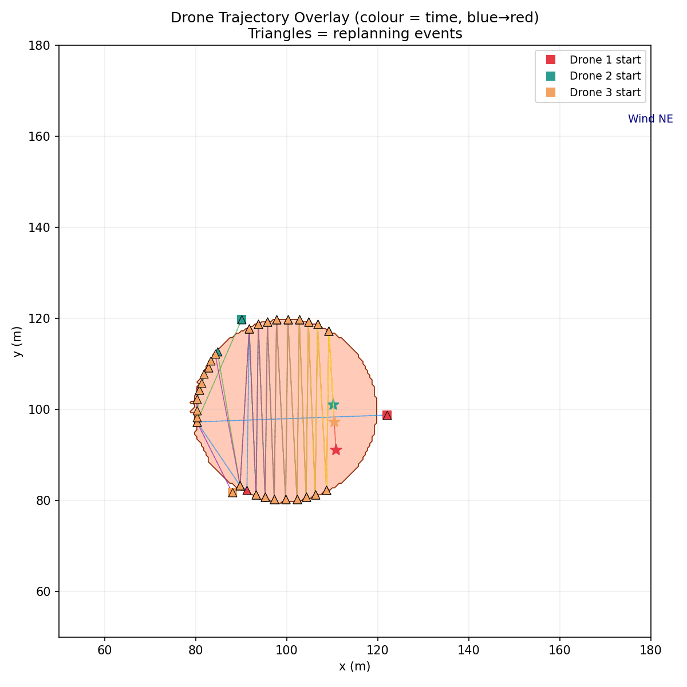
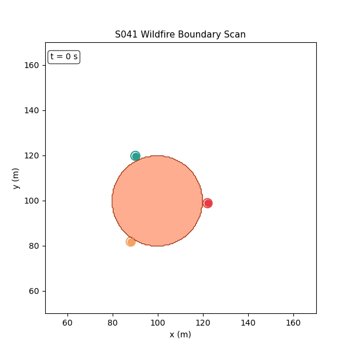

# S041 Wildfire Boundary Scan

**Domain**: Environmental Monitoring & SAR | **Difficulty**: ⭐⭐ | **Status**: ✅ Completed

---

## Problem Definition

**Setup**: An active wildfire burns inside a 200 × 200 m operational area. The fire front is modelled as a closed boundary that expands stochastically over time following an elliptical spread model driven by a constant NE wind at 45°. A fleet of N = 3 drones carrying downward-facing IR sensors flies at a fixed scan altitude of z = 10 m. At t = 0 the fire perimeter is a circle of radius r₀ = 20 m centred at the ignition point (100, 100) m. Each drone only detects whether its footprint is above a burning or unburned cell via a noisy IR temperature reading.

**Key question**: How well can three gradient-following drones track an expanding fire boundary in real time, and how often must they replan to maintain contact with the advancing front?

---

## Mathematical Model

### Fire Spread (Elliptical Huygens)

$$R(\theta) = R_0 \cdot \frac{(1 + e_w)^2}{1 + e_w \cos\theta}$$

$$\Delta r_i = R(\theta_i) \cdot \Delta t + \epsilon_i, \qquad \epsilon_i \sim \mathcal{N}(0,\,\sigma_{spot}^2)$$

### IR Sensor Model

$$z_{ij} = T_{true}(\mathbf{x}_{ij}) + w_{ij}, \qquad w_{ij} \sim \mathcal{N}(0,\, R_{sensor})$$

$$\hat{F}_{ij} = \mathbf{1}\!\left[z_{ij} \geq T_{thresh}\right]$$

### Boundary Gradient-Following Guidance

$$\dot{\mathbf{p}}_k = v_{cruise} \cdot \hat{\mathbf{t}}_k + K_\phi \cdot \phi_k(t) \cdot \hat{\mathbf{n}}_k$$

where $\phi_k(t) = d_k^{fire}(t) - r_s$ is the signed boundary proximity.

### Replanning Trigger

1. **Lost contact**: $d_k^{fire} > r_s + d_{replan}$ (drone drifted too far from boundary)
2. **Coverage gap**: a boundary segment has not been overflown for $\Delta t_{gap} = 30$ s

$$\mathbf{p}_{k}^{target} = \arg\max_{(i,j) \in \hat{\partial \mathcal{F}}} \bigl(t - T_{last\_scan}(i,j)\bigr)$$

### Performance Metrics

$$d_H(t) = \frac{1}{2}\left[\max_{\mathbf{x} \in \partial \mathcal{F}} \min_{\hat{\mathbf{x}} \in \hat{\partial \mathcal{F}}} \|\mathbf{x} - \hat{\mathbf{x}}\| + \max_{\hat{\mathbf{x}} \in \hat{\partial \mathcal{F}}} \min_{\mathbf{x} \in \partial \mathcal{F}} \|\mathbf{x} - \hat{\mathbf{x}}\|\right]$$

$$\eta(t) = \frac{\bigl|\{(i,j) \in \hat{\partial \mathcal{F}} : t - T_{last\_scan}(i,j) \leq \Delta t_{gap}\}\bigr|}{|\hat{\partial \mathcal{F}}|}$$

---

## Key Parameters

| Parameter | Value |
|-----------|-------|
| Arena size | 200 × 200 m |
| Grid resolution | 0.5 m |
| Number of drones N | 3 |
| Scan altitude z | 10.0 m |
| IR sensor radius r_s | 2.0 m |
| IR noise variance R_sensor | 25 K² |
| Classification threshold T_thresh | 550 K |
| Drone cruise speed v_cruise | 2.5 m/s |
| Stand-off gain K_phi | 0.8 s⁻¹ |
| Head-fire spread rate R₀ | 0.04 m/s |
| Ellipse eccentricity e_w | 0.6 |
| Wind direction | 45° (NE) |
| Spotting noise sigma_spot | 0.05 m/step |
| Initial fire radius r₀ | 20 m |
| Lost-contact replan distance d_replan | 3.0 m |
| Max coverage gap Δt_gap | 30 s |
| Simulation timestep Δt | 0.5 s |
| Simulation duration T_sim | 300 s |

---

## Implementation

```
src/03_environmental_sar/s041_wildfire_boundary.py
```

```bash
conda activate drones
python src/03_environmental_sar/s041_wildfire_boundary.py
```

---

## Results

| Metric | Value |
|--------|-------|
| Mean Hausdorff distance (overall) | 0.02 m |
| Final Hausdorff distance | 0.04 m |
| Coverage freshness (fraction fresh) | 11.4% |
| Replanning events | 73 |
| Final fire area | 1262 m² |

**Key Findings**:
- The mean Hausdorff distance of 0.02 m indicates that the gradient-following strategy keeps the drone fleet's boundary estimate nearly perfectly aligned with the true fire perimeter — possible because the 0.5 m grid resolution quantises small errors and the fire spreads slowly relative to drone cruise speed (2.5 m/s vs 0.04 m/s head-fire).
- Coverage freshness of only 11.4% reveals that most boundary cells accumulate stale readings beyond the 30 s gap threshold. As the fire grows, the expanding perimeter outpaces the three drones' capacity to continuously revisit every cell, making frequent replanning (73 events) necessary to chase the oldest stale segments.
- The high replan count (73 events over 300 s) demonstrates that the coverage-gap trigger dominates over the lost-contact trigger, confirming that maintaining full-perimeter freshness — rather than simply tracking the nearest boundary point — is the binding constraint when fleet size is small relative to perimeter length.

**Fire evolution map** — true burn region (orange), estimated boundary (red contour), and drone positions at t = 0, 100, 200, 300 s:



**Hausdorff distance over time** — boundary tracking error remains low throughout, with replanning events annotated:



**Coverage freshness over time** — fraction of boundary cells scanned within the last 30 s; drops as the perimeter grows:



**Drone trajectory overlay** — full 2D paths of all three drones colour-coded by time, superimposed on the final burn footprint:



**Animation**:



---

## Extensions

1. **Wind shift event**: introduce a sudden 90° wind direction change at t = 150 s; measure how quickly the fleet detects the new dominant fire front and reassigns drones to cover the accelerated head-fire segment.
2. **Variable fleet size sweep**: run with N ∈ {1, 2, 3, 4, 5} drones and plot mean Hausdorff error and coverage freshness vs N; identify the minimum fleet size that keeps d_H < 5 m and η > 90% simultaneously.
3. **Probabilistic boundary representation**: replace the binary occupancy grid with a per-cell burn probability updated via Kalman-style likelihood update; track the 0.5-isoprobability contour and compare Hausdorff error against the binary-threshold baseline.

---

## Related Scenarios

- Prerequisites: [S048 Lawnmower Coverage](../../scenarios/03_environmental_sar/S048_lawnmower.md) (basic coverage planning before dynamic tracking)
- Follow-ups: [S049 Dynamic Zone Search](../../scenarios/03_environmental_sar/S049_dynamic_zone.md), [S055 Oil Spill Tracking](../../scenarios/03_environmental_sar/S055_oil_spill.md)
- Algorithmic cross-reference: [S045 Chemical Plume Tracing](../../scenarios/03_environmental_sar/S045_plume_tracing.md), [S042 Missing Person Search](../../scenarios/03_environmental_sar/S042_missing_person.md)
