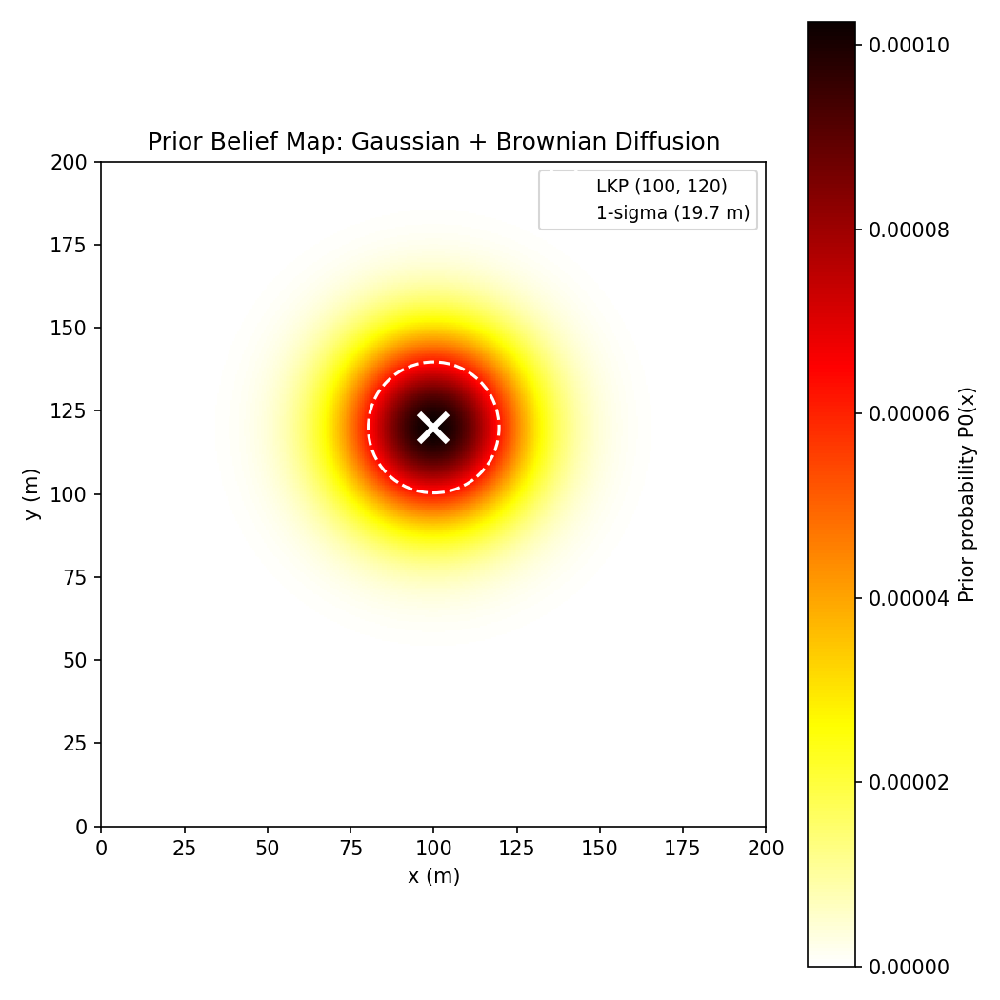
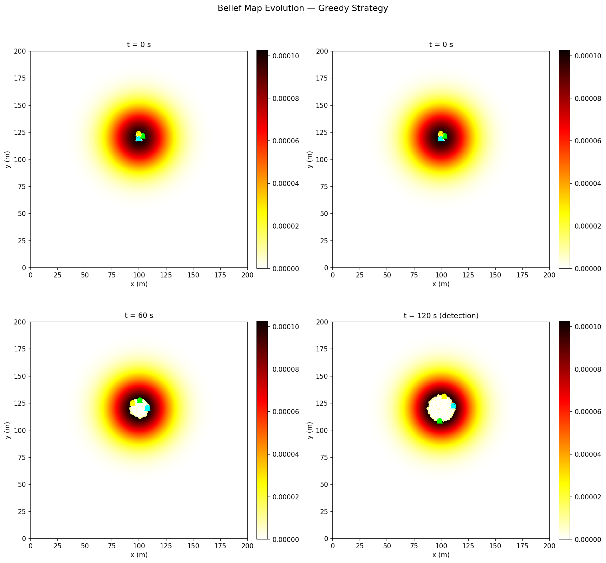
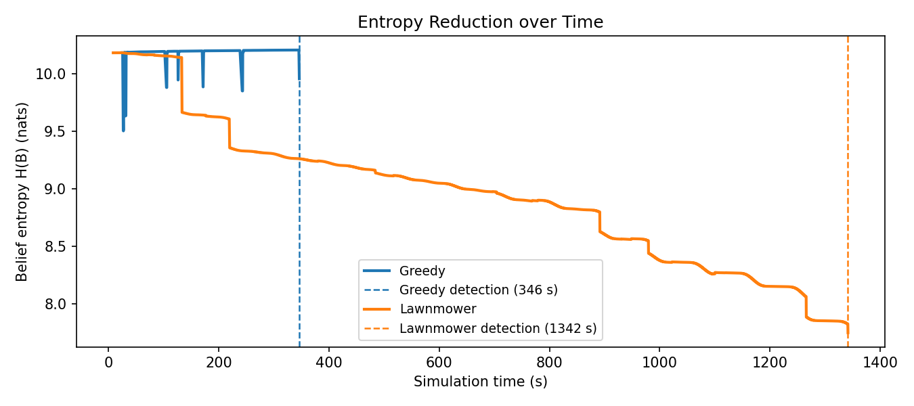
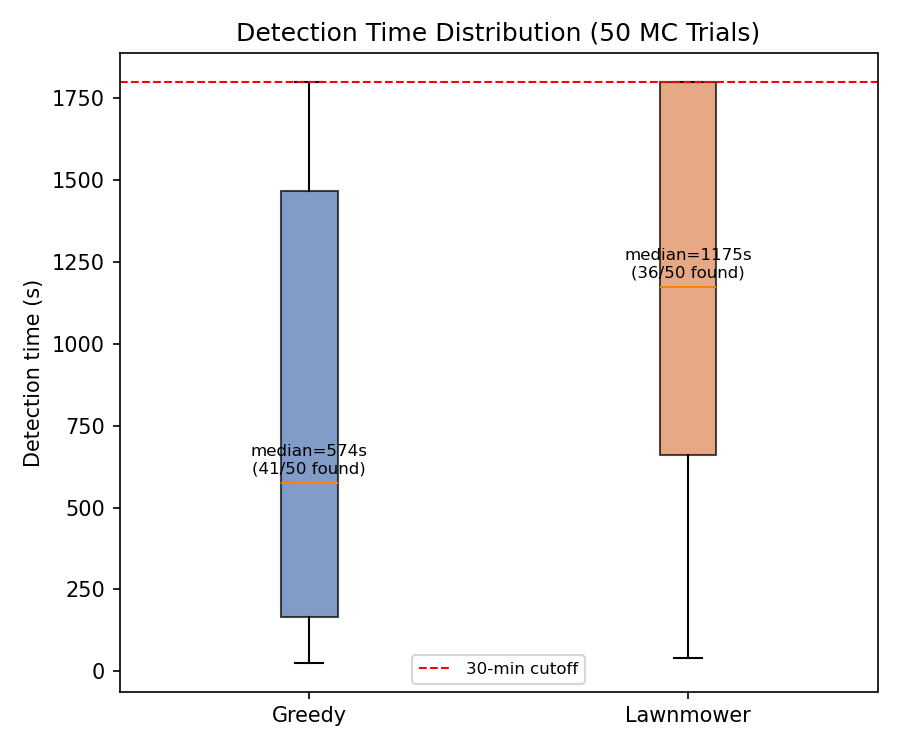
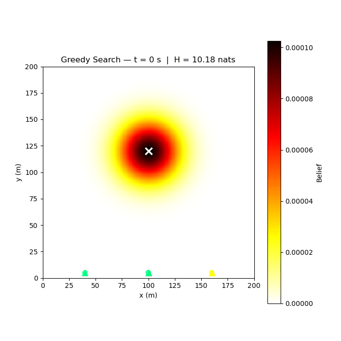

# S042 Missing Person Localization

**Domain**: Environmental Monitoring & SAR | **Difficulty**: ⭐⭐⭐ | **Status**: ✅ Completed

---

## Problem Definition

**Setup**: A hiker has gone missing in a flat 200 × 200 m wilderness area. The last known position (LKP) was recorded 2 hours before the search begins. The person's initial probability of presence is modelled as a Gaussian centred on the LKP, broadened by a diffusion term proportional to elapsed time. A fleet of $N = 3$ drones is deployed to localise the person as quickly as possible.

**Objective**:
- Minimise expected time to first confirmed detection ($P_D \geq 0.95$)
- Maximise rate of belief entropy reduction $\dot{H}$ over the search area

**Comparison Strategies**:
1. **Greedy max-belief frontier** — each drone flies toward the unvisited cell with the highest current belief value
2. **Lawnmower sweep** — systematic boustrophedon coverage, ignoring the belief map
3. **Entropy-weighted random walk** — probabilistic waypoint selection weighted by per-cell belief

---

## Mathematical Model

### Prior Distribution

The prior probability of the missing person being at cell $\mathbf{x}$ is:

$$P_0(\mathbf{x}) = \frac{1}{Z} \exp\!\left(-\frac{\|\mathbf{x} - \mathbf{x}_{LKP}\|^2}{2\,\sigma_0^2}\right)$$

where $\sigma_0^2 = \sigma_{LKP}^2 + 2 D \Delta t$ combines positional uncertainty at the LKP ($\sigma_{LKP} = 10$ m) with Brownian diffusion ($D = 0.02$ m²/s, $\Delta t = 7200$ s), giving $\sigma_0 \approx 17.2$ m.

### Bayesian Belief Update

After drone $i$ reports observation $z_i$ (hit/miss):

$$B_{t+1}(\mathbf{x}) = \frac{P(z_i \mid H_{\mathbf{x}}) \cdot B_t(\mathbf{x})}{\sum_{\mathbf{x}'} P(z_i \mid H_{\mathbf{x}'}) \cdot B_t(\mathbf{x}')}$$

### Belief Entropy

The Shannon entropy quantifies remaining uncertainty:

$$H(B_t) = -\sum_{\mathbf{x} \in \mathcal{G}} B_t(\mathbf{x}) \log B_t(\mathbf{x})$$

The greedy frontier policy selects each drone's next waypoint as:

$$\mathbf{w}_i^* = \arg\max_{\mathbf{w} \in \mathcal{W}} \; B_t(\mathbf{w})$$

subject to $\|\mathbf{w}_i^* - \mathbf{w}_j^*\| > 2\,r_s$ for all $j \neq i$ (collision and redundancy avoidance).

---

## Key Parameters

| Parameter | Value | Notes |
|-----------|-------|-------|
| Search area | 200 × 200 m | |
| Grid resolution | 0.5 m/cell | 400 × 400 = 160,000 cells |
| Number of drones $N$ | 3 | Homogeneous |
| Sensor footprint radius $r_s$ | 2.0 m | |
| Scan altitude $h$ | 10.0 m | |
| Drone cruise speed $v_d$ | 5.0 m/s | |
| Sensor dwell per waypoint $\tau_{dwell}$ | 1.0 s | |
| Probability of detection $P_d$ | 0.90 | 10% miss rate |
| False alarm rate $P_{fa}$ | 0.02 | |
| LKP positional uncertainty $\sigma_{LKP}$ | 10.0 m | |
| Brownian diffusion coefficient $D$ | 0.02 m²/s | |
| Time since LKP $\Delta t$ | 7200 s (2 hours) | |
| Prior spread $\sigma_0$ | ≈ 17.2 m | |
| LKP coordinates | (100, 120) m | |
| Hard mission cutoff | 1800 s (30 minutes) | |
| Redundancy exclusion radius | $2\,r_s = 4.0$ m | |

---

## Implementation

```
src/03_environmental_sar/s042_missing_person.py   # Main simulation script
```

```bash
conda activate drones
python src/03_environmental_sar/s042_missing_person.py
```

---

## Results

**Strategy comparison**: Greedy max-belief frontier vs. Lawnmower sweep

The greedy strategy directs all drones toward high-probability zones first, achieving faster entropy reduction and earlier detection. The lawnmower sweep provides systematic coverage but ignores the prior distribution.

**Prior Belief Map** — Gaussian prior centred on LKP with $\sigma_0 \approx 17.2$ m:



**Belief Snapshots** — Evolution of the belief map at $t = 0, 60, 120$ s and at detection time; drone positions (cyan triangles) and sensor footprints overlay the probability heatmap:



**Entropy Reduction** — Shannon entropy $H(B_t)$ vs. simulation time for both strategies; detection events marked with dashed vertical lines; greedy frontier achieves faster entropy reduction:



**Monte Carlo Detection Rate** — Distribution of detection times across 50 Monte Carlo trials; greedy strategy shows lower median and tighter IQR:



**Animation**:



---

## Extensions

1. **Non-stationary target**: replace the fixed person assumption with a correlated random walk model; apply a predict-step (convolution with a diffusion kernel) to the belief map before each Bayes update.
2. **Terrain-aware prior**: incorporate terrain features (cliffs, rivers, dense vegetation) as a non-Gaussian prior by reweighting cells using a terrain traversal cost map.
3. **Particle filter for large areas**: replace the grid belief map with $N_p = 5000$ weighted particles for a 1 km × 1 km area where a full grid is computationally prohibitive.
4. **Coordinated entropy-based path planning**: replace the greedy next-waypoint policy with a receding-horizon planner that optimises joint entropy reduction over a 60 s planning window across all drones simultaneously.
5. **Communication-degraded search**: introduce intermittent communication loss; implement a divergence-aware merge step when contact is restored (KL-divergence between local and shared beliefs).

---

## Related Scenarios

- Prerequisites: [S041 Area Coverage Sweep](../../scenarios/03_environmental_sar/S041_area_coverage_sweep.md)
- Follow-ups: [S043 Confined Space Exploration](../../scenarios/03_environmental_sar/S043_confined_space.md), [S049 Dynamic Zone Assignment](../../scenarios/03_environmental_sar/S049_dynamic_zone.md)
- Algorithmic cross-reference: [S013 Particle Filter Intercept](../../scenarios/01_pursuit_evasion/S013_particle_filter_intercept.md) (particle filter state estimation)
