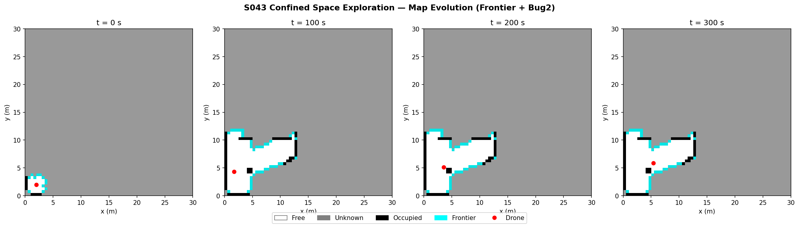
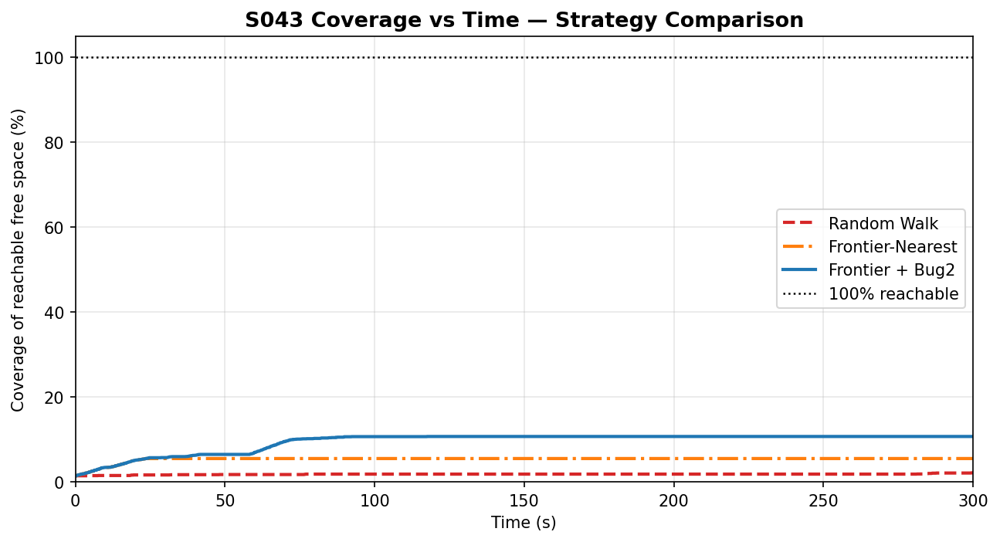
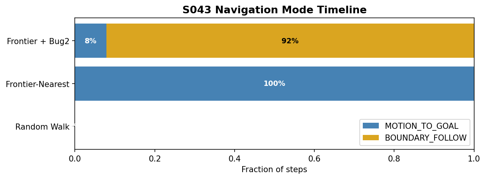
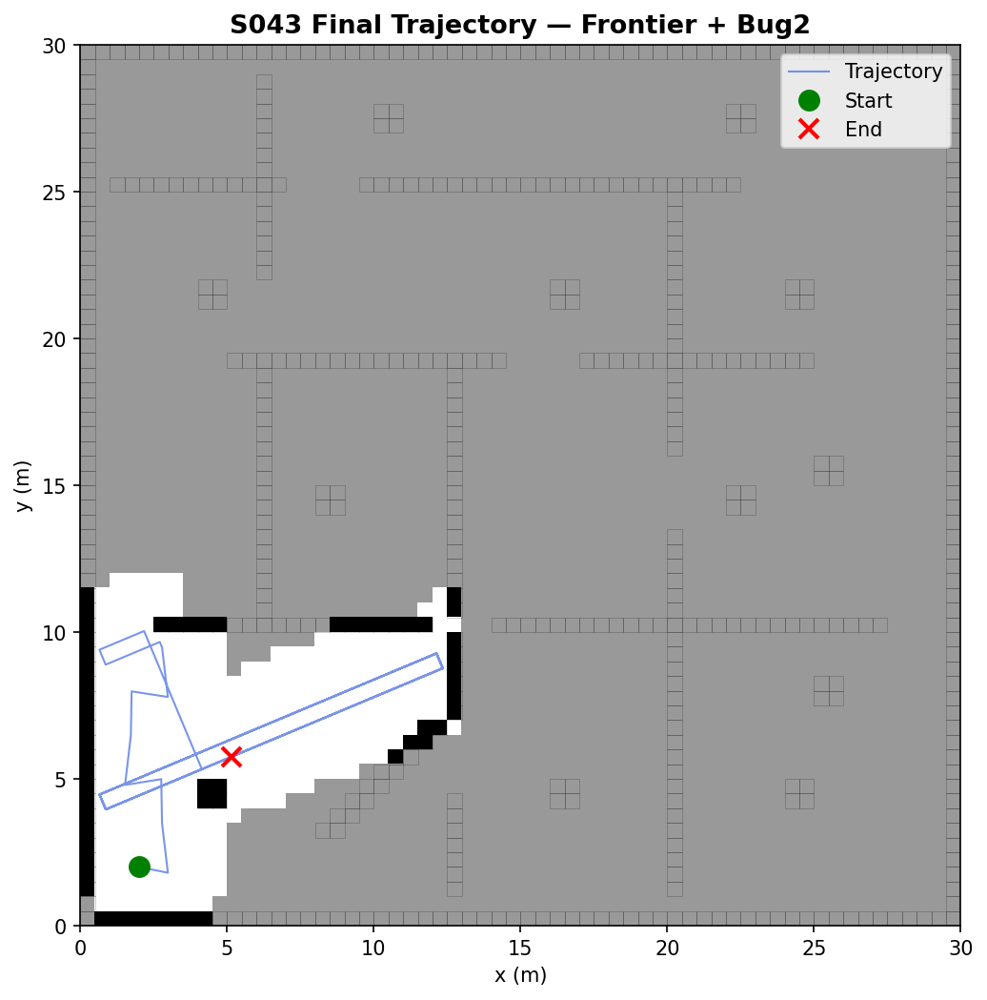
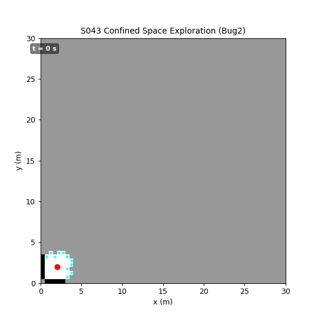

# S043 Confined Space Exploration

**Domain**: Environmental Monitoring & SAR | **Difficulty**: ⭐⭐⭐ | **Status**: ✅ Completed

---

## Problem Definition

**Setup**: A small rescue drone is deployed inside a collapsed building whose interior is completely unknown. The floor plan (30 × 30 m) contains load-bearing walls, fallen debris columns, and narrow corridors formed by partial collapses. No prior map is available; the drone must build one from scratch while navigating safely. The environment is discretised into a 60 × 60 occupancy grid at Δ = 0.5 m resolution. The drone carries a 360° lidar-range sensor (radius $r_s = 2.0$ m) with Gaussian range noise.

**Objective**: Maximise the fraction of reachable free space mapped within $T_{max} = 300$ s, while never entering a cell whose occupancy probability exceeds $p_{occ} = 0.65$ and never squeezing through a gap narrower than $g_{min} = 0.35$ m.

**Comparison Strategies**:
1. **Random walk** — choose a random free direction at each step (baseline)
2. **Frontier-based (nearest)** — always navigate to the nearest unexplored frontier cell
3. **Frontier-based + Bug2** — frontier selection with Bug2 local planner for obstacle circumnavigation

---

## Mathematical Model

### Occupancy Grid and Log-Odds Update

Each cell $c$ stores a log-odds belief $l(c)$. Sensor model update:

$$l_t(c) = l_{t-1}(c) + \begin{cases} l_{occ} = +0.85 & \text{hit cell} \\ l_{free} = -0.40 & \text{free cell along beam} \\ 0 & \text{otherwise} \end{cases}$$

with clamping bounds $[l_{min}, l_{max}] = [-2.0, 3.5]$. Recovered probability: $p(c) = e^{l(c)} / (1 + e^{l(c)})$.

### Frontier Extraction

A frontier cell is a free cell adjacent to at least one unknown cell:

$$\mathcal{F} = \left\{ c \in \mathcal{M} \;\middle|\; p(c) < 0.35 \;\text{ and }\; \exists\, c' \in \mathcal{N}_4(c):\; 0.35 \leq p(c') \leq 0.65 \right\}$$

The nearest frontier is found via BFS on the current free-cell map (avoiding routes through walls).

### Bug2 Algorithm

Bug2 follows the M-line (straight line from start to current goal) unless an obstacle is detected within $d_{turn} = 0.4$ m, at which point it switches to right-hand wall-following until the M-line is re-encountered closer to the goal.

### Coverage Metric

$$\text{Coverage}(t) = \frac{\left|\left\{c \in \mathcal{C}_{reach} \;:\; p_t(c) < 0.35\right\}\right|}{|\mathcal{C}_{reach}|} \times 100\%$$

---

## Key Parameters

| Parameter | Value | Notes |
|-----------|-------|-------|
| Environment size | 30 × 30 m | |
| Grid resolution $\Delta$ | 0.5 m/cell | 60 × 60 cells |
| Sensor radius $r_s$ | 2.0 m | |
| Number of lidar beams $N_b$ | 36 | Uniformly spaced |
| Range noise std dev $\sigma_r$ | 0.05 m | |
| Log-odds hit increment $l_{occ}$ | +0.85 | |
| Log-odds free decrement $l_{free}$ | −0.40 | |
| Log-odds clamp $[l_{min}, l_{max}]$ | [−2.0, 3.5] | |
| Occupied probability threshold $p_{occ}$ | 0.65 | |
| Free probability threshold $p_{free}$ | 0.35 | |
| Drone body width | 0.3 m | |
| Minimum passable gap $g_{min}$ | 0.35 m | |
| Bug2 obstacle detection distance $d_{turn}$ | 0.4 m | |
| Drone cruise speed $v_d$ | 0.5 m/s | |
| Mission horizon $T_{max}$ | 300 s | |
| Simulation timestep $\Delta t$ | 0.1 s | |
| Start position $\mathbf{p}_0$ | (2.0, 2.0) m | |

---

## Implementation

```
src/03_environmental_sar/s043_confined_space.py   # Main simulation script
```

```bash
conda activate drones
python src/03_environmental_sar/s043_confined_space.py
```

---

## Results

**Strategy comparison**: Random Walk vs. Frontier-Nearest vs. Frontier + Bug2

Frontier-based exploration with Bug2 achieves the highest final coverage by actively navigating around obstacles en route to unexplored frontiers. Random walk shows slow, inefficient coverage. Frontier-Nearest improves coverage but can get stuck without a local planner.

**Map Evolution** — Occupancy map snapshots at $t = 0, 100, 200, 300$ s; free cells (white), unknown (grey), occupied (black); drone position as a red dot; frontier cells highlighted in cyan:



**Coverage Curve** — Coverage(t) for three strategies from 0 to $T_{max} = 300$ s; Frontier + Bug2 achieves highest final coverage:



**Mode Timeline** — Stacked horizontal bar per strategy showing time fraction in MOTION_TO_GOAL vs. BOUNDARY_FOLLOW modes:



**Trajectory Overlay** — Final trajectory (blue polyline) on the completed occupancy map; start marked green circle, end marked red cross:



**Animation**:



---

## Extensions

1. **Multi-drone coordinated exploration**: deploy $N = 3$ drones from different access points; partition the frontier queue using max-dispersion allocation; merge maps via a shared log-odds accumulation server.
2. **Victim detection layer**: attach a heat sensor; integrate a Bayesian occupancy-augmented victim probability map that triggers hover-and-alert when $p_{victim}(c) > 0.8$.
3. **Structural hazard avoidance**: label cells with a hazard potential $V_h(c)$ proportional to proximity to heavily-loaded occupied cells; weight BFS path cost as $c_{path} = d_{nav} + \alpha V_h$.
4. **Dynamic gap closure**: simulate debris settling by randomly flipping free cells to occupied; require the drone to re-check known gaps on each frontier planning cycle.
5. **3D confined-space extension**: extend the grid to a volumetric voxel map (60 × 60 × 20 cells at 0.5 m); add altitude control to find the vertical slice with maximum clearance through each horizontal gap.

---

## Related Scenarios

- Prerequisites: [S041 Wildfire Boundary Scan](../../scenarios/03_environmental_sar/S041_wildfire_boundary_scan.md), [S042 Missing Person Search](../../scenarios/03_environmental_sar/S042_missing_person.md)
- Follow-ups: [S044 Wall Crack Inspection](../../scenarios/03_environmental_sar/S044_wall_crack_inspection.md), [S048 Lawnmower Coverage](../../scenarios/03_environmental_sar/S048_lawnmower.md)
- Algorithmic cross-reference: [S004 Obstacle Chase](../../scenarios/01_pursuit_evasion/S004_obstacle_chase.md) (Bug algorithm in pursuit context), [S022 Obstacle Avoidance Delivery](../../scenarios/02_logistics_delivery/S022_obstacle_avoidance_delivery.md) (potential field avoidance)
