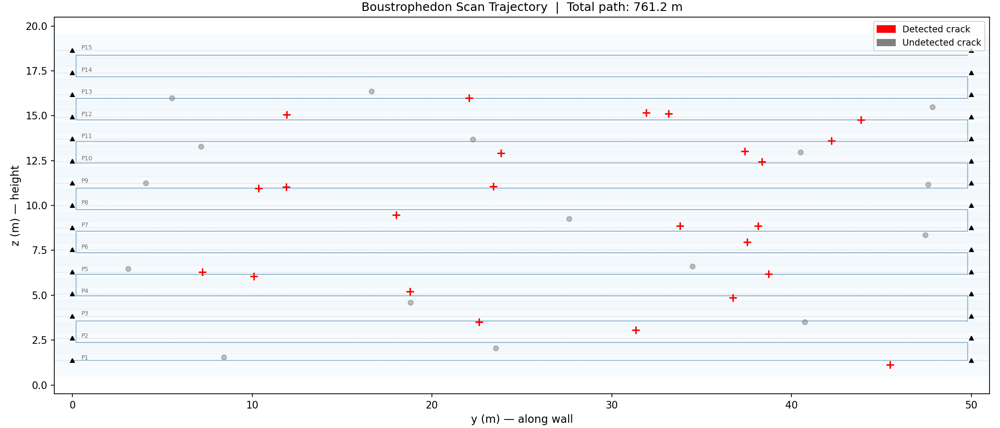
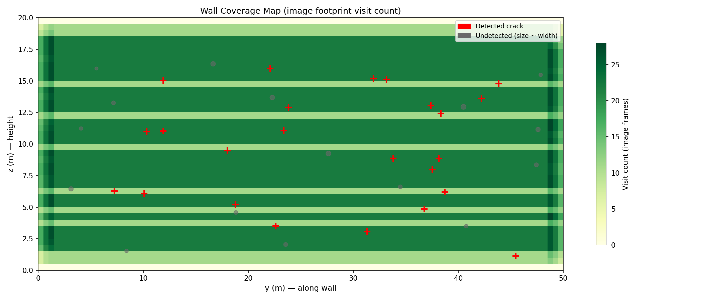
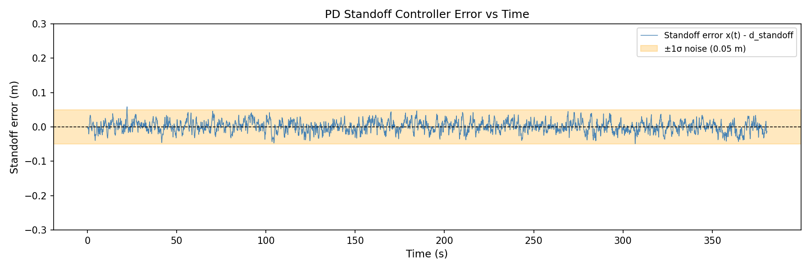
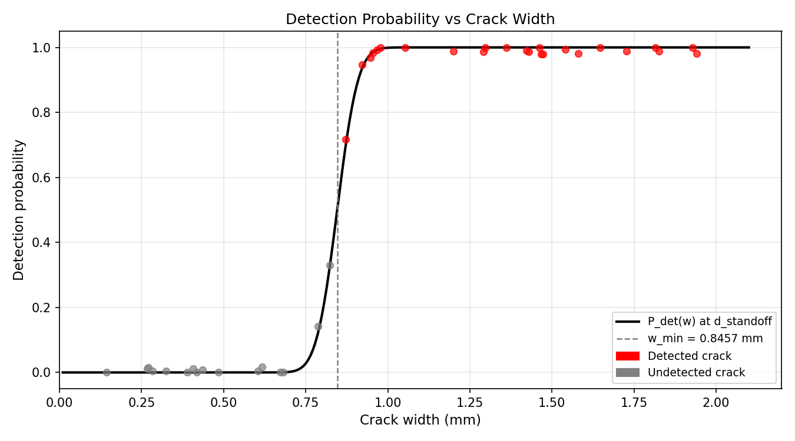
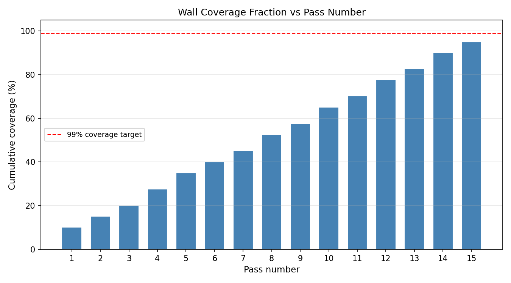
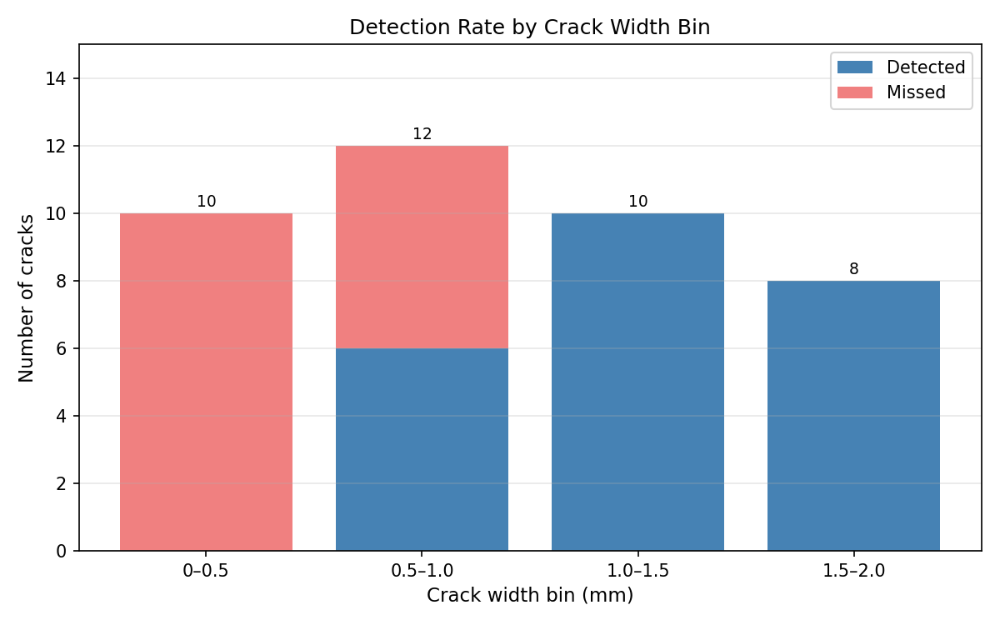

# S044 Wall Crack Inspection

**Domain**: Environmental Monitoring & SAR | **Difficulty**: ⭐⭐ | **Status**: ✅ Completed

---

## Problem Definition

**Setup**: A single inspection drone flies a boustrophedon (serpentine) path along a 50 m × 20 m reinforced-concrete building facade, maintaining a constant standoff distance of 1.5 m from the wall. 40 synthetic cracks are placed at known positions with widths drawn from U(0.1, 2.0) mm.

**Objective**: Achieve complete surface coverage while maximising the number of cracks detected. Report coverage fraction, detection rate by crack width bin, and total flight distance.

---

## Mathematical Model Summary

**Strip geometry**: Camera FOV = 60°, standoff = 1.5 m → strip half-width $h_{strip} = 1.5 \tan 30° \approx 0.866$ m.

**Boustrophedon passes**: 15 passes distributed evenly from z = 1.37 m to z = 18.63 m with 20% strip overlap.

**Crack detection probability**:
$$P_{det}(w_i, r) = \Phi\!\left(\frac{w_i - w_{min}(r)}{\sigma_{noise}}\right), \quad w_{min}(r) = \frac{2r\tan(30°)}{2048} \times 1000 \text{ mm}$$

**PD standoff controller** (critically damped, $\omega_n = 4$ rad/s): $K_p = 16\ \text{s}^{-2}$, $K_d = 8\ \text{s}^{-1}$.

---

## Key Parameters

| Parameter | Value |
|-----------|-------|
| Wall dimensions | 50 m × 20 m |
| Standoff distance | 1.5 m |
| Camera FOV | 60° |
| Strip half-width $h_{strip}$ | 0.866 m |
| Strip overlap | 20% |
| Number of passes | 15 |
| Cruise speed | 2.0 m/s |
| Camera resolution | 2048 px |
| Synthetic cracks | 40 |
| Simulation timestep | 0.1 s |

---

## Simulation Results

| Metric | Value |
|--------|-------|
| Wall coverage fraction | **95.00%** |
| Cracks detected | **24 / 40 (60.0%)** |
| Total flight distance | **761.2 m** |
| Simulation steps | 3807 |
| Simulation time | 380.6 s (6.3 min) |
| Standoff RMS error | 1.61 cm |

**Boustrophedon Trajectory** — drone path overlaid on wall with detected cracks (red +) and missed cracks (grey circles):

**Wall Coverage Map** — visit count heatmap showing full facade coverage:

**PD Standoff Error** — controller holds standoff to within ±1.61 cm RMS:

**Detection Probability Curve** — crack detection vs width at standoff distance:

**Coverage vs Pass Number** — cumulative coverage after each horizontal pass:

**Detection Rate by Width Bin** — stacked bar chart of detected vs missed per width bin:

**Animation**:

---

## Extensions

1. Variable standoff with laser rangefinder for obstacle avoidance
2. Adaptive re-planning: hover for close-up when crack > 1.5 mm detected
3. Multi-facade inspection with inter-facade TSP routing
4. Wind disturbance rejection: PD vs LQR comparison

---

## Related Scenarios

- Prerequisites: [S041 Wildfire Boundary Scan](../../scenarios/03_environmental_sar/S041_wildfire_boundary_scan.md), [S048 Lawnmower Coverage](../../scenarios/03_environmental_sar/S048_lawnmower_coverage.md)
- Follow-ups: [S061 Power Line Inspection](../../scenarios/04_industrial_agriculture/S061_power_line_inspection.md), [S065 Building 3D Scan Path](../../scenarios/04_industrial_agriculture/S065_building_3d_scan_path.md)
- Cross-reference: [S043 Confined Space Exploration](../../scenarios/03_environmental_sar/S043_confined_space_exploration.md)
