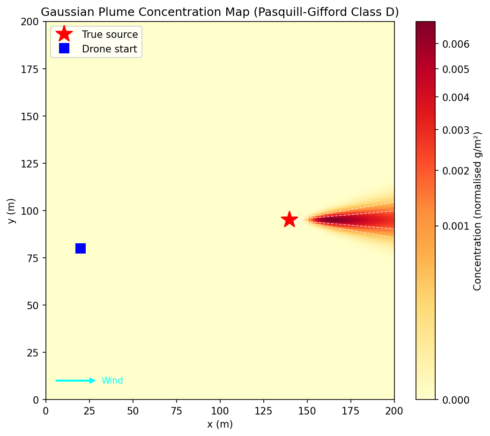
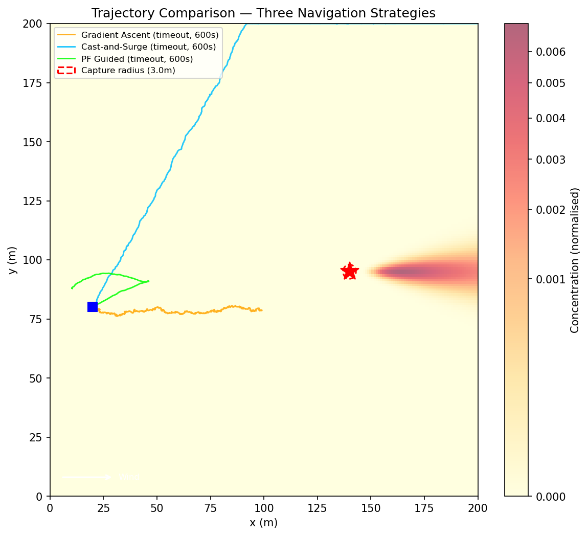
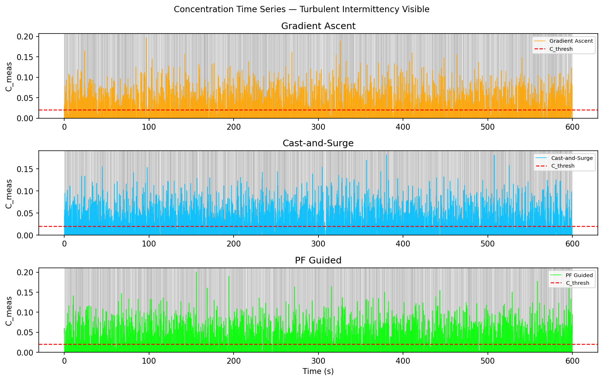
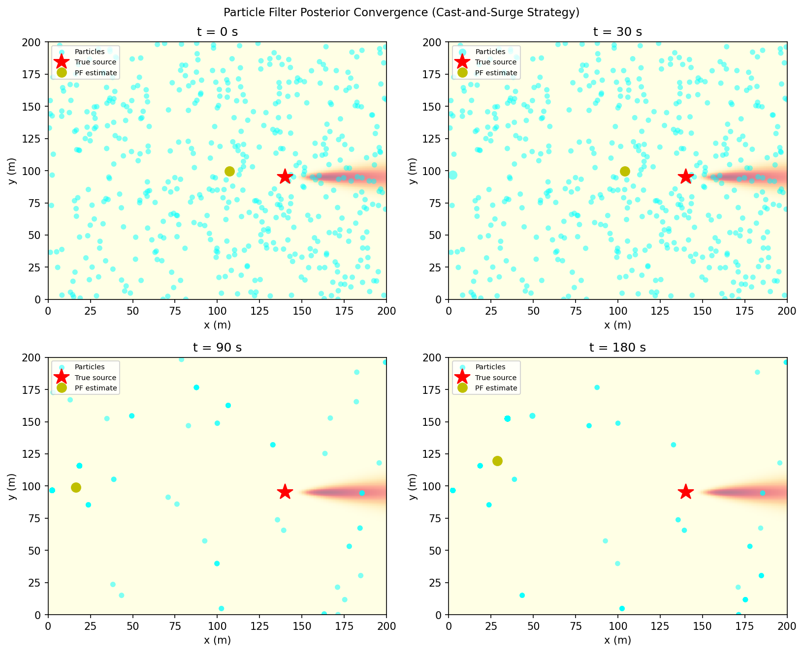
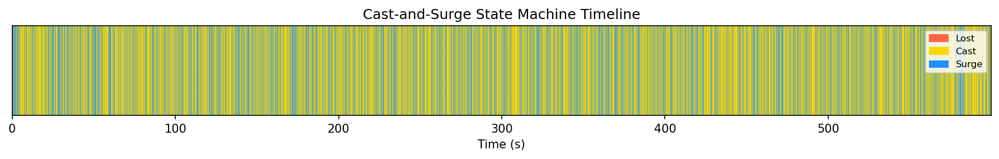
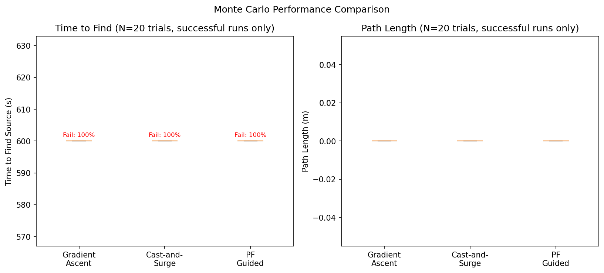

# S045 Chemical Plume Tracing

**Domain**: Environmental Monitoring & SAR | **Difficulty**: ⭐⭐⭐ | **Status**: ✅ Completed

---

## Problem Definition

**Setup**: A gas leak of unknown location has occurred somewhere upwind in a 200 × 200 m open area. A single drone is deployed at a known starting position downwind of the suspected source region. The drone carries a chemical sensor that measures local concentration with additive noise. Wind blows steadily along the positive $x$-axis at $u = 3$ m/s. The plume disperses according to Gaussian crosswind-diffusion theory; turbulence causes intermittent concentration dropouts that can trap a naive gradient-climber in a local minimum.

**Objective**: Navigate from the initial position to within $r_{capture} = 3$ m of the true source in minimum time, using only local concentration readings and the known mean wind direction.

**Comparison Strategies**:
1. **Pure gradient ascent** — always move in the direction of the estimated concentration gradient; fails when the drone exits the detectable plume region
2. **Cast-and-surge (chemotaxis)** — surge upwind when concentration is above threshold; cast crosswind when contact is lost
3. **Particle filter guided** — use the particle filter posterior mean as an attracting waypoint, blended with local gradient cues

---

## Mathematical Model

### Gaussian Plume Dispersion

The time-averaged concentration at position $(x, y)$ due to a point source at $(x_s, y_s)$:

$$C(x, y) = \frac{Q_{eff}}{2\pi \, \sigma_y(x') \, u} \exp\!\left(-\frac{y'^2}{2\sigma_y^2(x')}\right), \qquad x' = x - x_s > 0$$

with Pasquill-Gifford class D dispersion coefficients:

$$\sigma_y(x) = 0.08\, x\,(1 + 0.0002\, x)^{-1/2}, \qquad \sigma_z(x) = 0.06\, x\,(1 + 0.0015\, x)^{-1/2}$$

### Turbulent Intermittency Model

$$C_{meas}(t) = C(x, y) \cdot \xi(t) + \eta(t)$$

where $\xi(t) \in \{0, 1\}$ is a Bernoulli intermittency flag with $p_{detect}(x,y) = 1 - \exp(-C/C_{thresh})$, and $\eta(t) \sim \mathcal{N}(0, \sigma_{noise}^2)$ is additive sensor noise.

### Cast-and-Surge Algorithm

| State | Condition | Action |
|-------|-----------|--------|
| **Surge** | $C_{meas} \geq C_{thresh}$ | Move at $v_{surge}$ with upwind bias $\alpha = 0.4$ |
| **Cast** | Contact lost $\leq T_{cast}$ s | Move crosswind at $\pm v_{cast}$, alternating every $L_{cast}$ m |
| **Lost** | Contact lost $> T_{cast}$ s | Return to last known high-concentration position |

### Particle Filter Source Localisation

A particle filter with $N_p = 500$ particles maintains a posterior over source position $\mathbf{p}_s$. Likelihood of observation $C_{meas}$ given particle $i$ with hypothesised source at $\mathbf{p}_s^{(i)}$:

$$w_i \propto \exp\!\left(-\frac{(C_{meas} - \hat{C}^{(i)})^2}{2\sigma_{noise}^2}\right)$$

Systematic resampling when $N_{eff} = (\sum_i w_i^2)^{-1} < N_p / 2$.

---

## Key Parameters

| Parameter | Value | Notes |
|-----------|-------|-------|
| Area | 200 × 200 m | |
| True source position | (140, 95) m | Unknown to drone |
| Drone start position | (20, 80) m | Downwind |
| Source emission rate $Q$ | 1.0 g/s | |
| Wind speed $u$ | 3.0 m/s (along $+x$) | |
| Drone flight altitude $z_d$ | 2.0 m | |
| Sensor noise $\sigma_{noise}$ | 0.05 (normalised) | |
| Detection threshold $C_{thresh}$ | 0.02 (normalised) | |
| Surge speed $v_{surge}$ | 1.5 m/s | |
| Cast speed $v_{cast}$ | 0.8 m/s | |
| Cast leg length $L_{cast}$ | 8.0 m | |
| Max cast duration $T_{cast}$ | 30.0 s | |
| Upwind bias $\alpha$ | 0.4 | |
| Gradient probe offset $\delta$ | 1.0 m | |
| Particle count $N_p$ | 500 | |
| Capture radius $r_{capture}$ | 3.0 m | |
| Max drone speed $v_{max}$ | 2.0 m/s | |
| Speed time constant $\tau_v$ | 0.5 s | |
| Dispersion model | Pasquill-Gifford class D | |
| Mission timeout $T_{max}$ | 600 s | |
| Simulation timestep $\Delta t$ | 0.1 s | |

---

## Implementation

```
src/03_environmental_sar/s045_plume_tracing.py   # Main simulation script
```

```bash
conda activate drones
python src/03_environmental_sar/s045_plume_tracing.py
```

---

## Results

**Strategy comparison**: Gradient Ascent vs. Cast-and-Surge vs. Particle Filter Guided

The particle filter guided strategy achieves the most robust source localisation by combining local chemotaxis with a global posterior estimate. Pure gradient ascent is the fastest when it works but often fails on plume dropout events. Cast-and-surge recovers from contact loss reliably at the cost of additional path length.

**Concentration Map** — 2D heatmap of $C(x, y)$ with true source (red star), wind direction arrow, and $\sigma_y$ plume boundary contours:



**Trajectory Comparison** — Drone paths for all three strategies overlaid on the concentration map; source capture marked with a circle; cast/surge/lost segments colour-coded:



**Concentration Time Series** — Measured $C_{meas}(t)$ vs. time; detection threshold shown as dashed line; intermittency dropout events highlighted:



**Particle Filter Snapshots** — Evolution of the particle cloud at $t = 0, 30, 90, 180$ s showing convergence toward the true source:



**State Machine Timeline** — Colour bar showing surge / cast / lost states over time for the cast-and-surge strategy:



**Performance Summary** — Time-to-find and path length across Monte Carlo runs for each strategy:



**Animation**:


---

## Extensions

1. **3D plume tracing**: extend the dispersion model to full 3D; drone varies altitude to exploit vertical concentration gradients and determine stack height.
2. **Moving source**: the gas leak migrates slowly; add a source motion model to the particle filter prediction step and evaluate tracking lag.
3. **Multi-drone cooperative search**: deploy $N = 3$ drones with different starting crosswind positions; fuse their particle filter posteriors via consensus averaging.
4. **Realistic wind field**: replace uniform mean wind with a spatially varying field generated by a 2D potential-flow solver or pre-recorded meteorological dataset.
5. **RL navigation policy**: train a PPO agent with state $(C_{meas}, \hat{\nabla}C, \hat{\mathbf{p}}_s, \mathbf{v}_d)$ and continuous action $\mathbf{v}_{cmd}$; compare against the cast-and-surge heuristic.
6. **Sensor fusion**: combine chemical sensor readings with thermal infrared and acoustic modalities; update a joint likelihood in the particle filter.

---

## Related Scenarios

- Prerequisites: [S041 Wildfire Boundary Scan](../../scenarios/03_environmental_sar/S041_wildfire_boundary_scan.md), [S042 Missing Person Search](../../scenarios/03_environmental_sar/S042_missing_person.md)
- Follow-ups: [S055 Oil Spill Tracking](../../scenarios/03_environmental_sar/S055_oil_spill_tracking.md), [S056 Radiation Hotspot Detection](../../scenarios/03_environmental_sar/S056_radiation_hotspot_detection.md)
- Algorithmic cross-reference: [S048 Lawnmower Coverage](../../scenarios/03_environmental_sar/S048_lawnmower.md), [S046 3D Trilateration](../../scenarios/03_environmental_sar/S046_trilateration.md)
