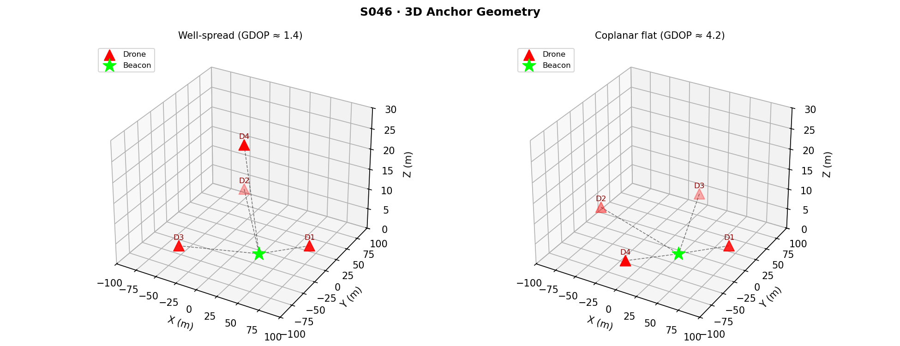
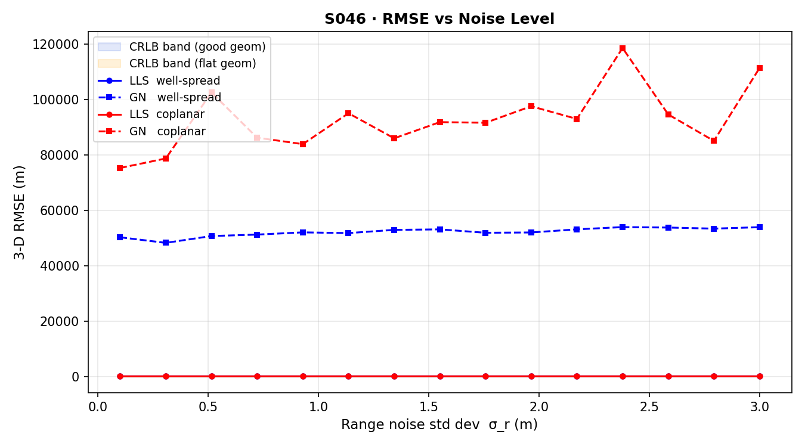
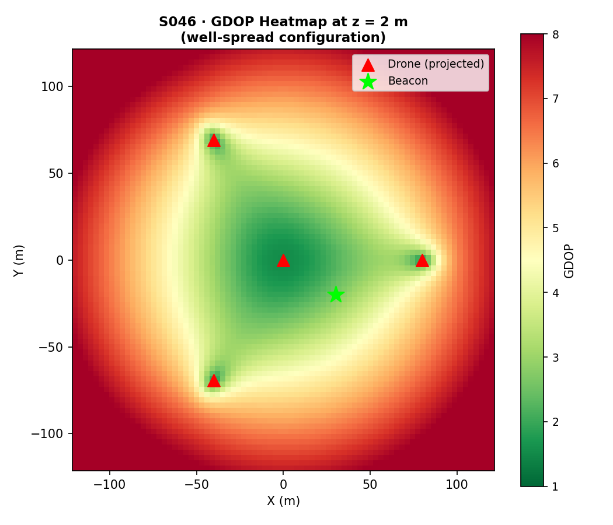
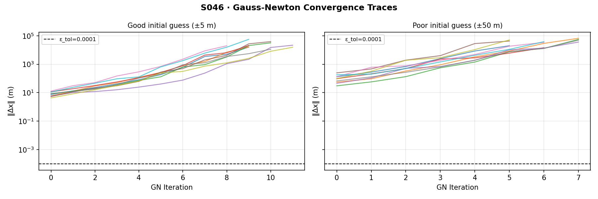
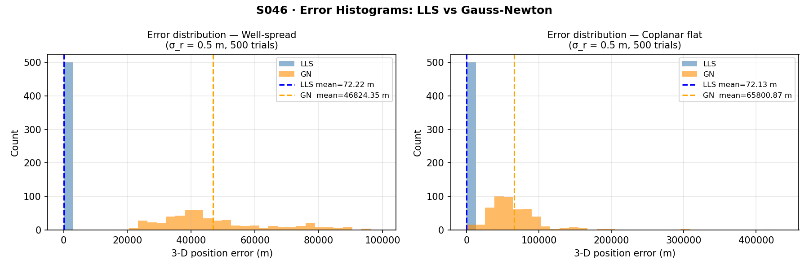
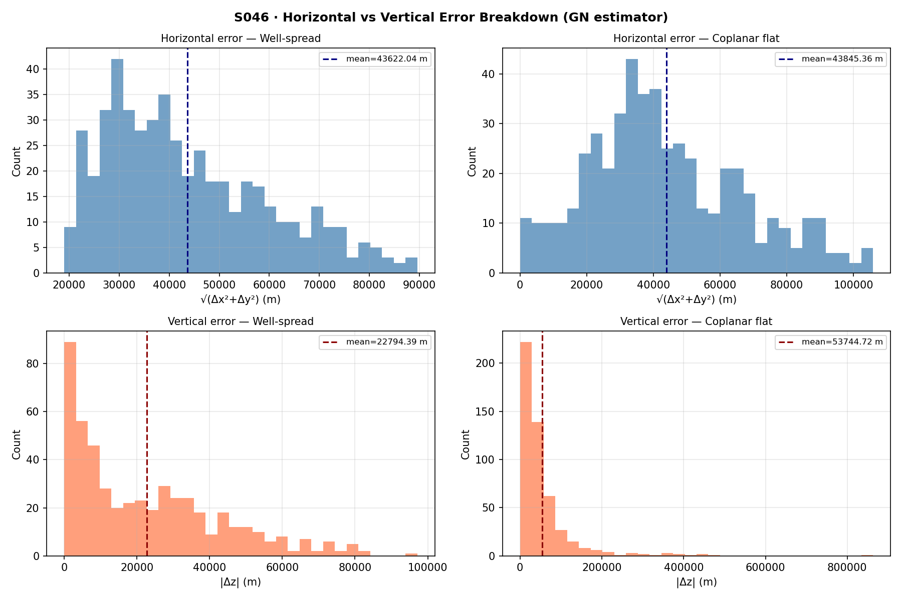
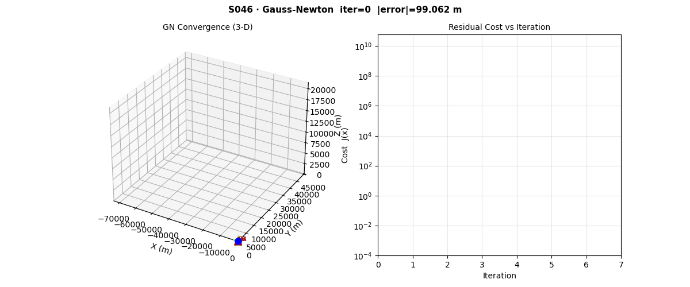

# S046 Multi-Drone 3D Trilateration

**Domain**: Environmental & SAR | **Difficulty**: ⭐⭐ | **Status**: ✅ Completed

---

## Problem Definition

**Setup**: A survivor or emergency beacon is located at an unknown 3D position $\mathbf{x}^* = (x^*, y^*, z^*)$ inside a search area of 200 × 200 × 30 m. Four drones hover at known, fixed positions at different altitudes and each measures the slant range to the beacon using an RF or acoustic ranging unit. All measurements are corrupted by zero-mean Gaussian noise.

**Objective**: Fuse four noisy range measurements into the best possible estimate $\hat{\mathbf{x}}$ of the beacon's 3D position, and characterise localisation uncertainty via GDOP.

**Comparison Methods**:
1. **Linear least squares (LLS)** — algebraically linearise the range equations by differencing pairs; closed-form solution
2. **Nonlinear least squares via Gauss-Newton (GN)** — iterative refinement from an initial guess

**Comparison Geometries**:
- **Well-spread**: three drones at 120° azimuth + one overhead drone
- **Coplanar**: all four drones at the same altitude (poor vertical geometry)

---

## Mathematical Model

### Range Measurement Model

$$r_i = \|\mathbf{p}_i - \mathbf{x}^*\|_2 + \epsilon_i, \qquad \epsilon_i \sim \mathcal{N}(0,\, \sigma_r^2)$$

### Linear Least Squares (Range-Differencing)

Subtracting range equations pairwise eliminates the $\|\mathbf{x}\|^2$ term, yielding the linear system $\mathbf{A}\hat{\mathbf{x}} = \mathbf{b}$:

$$\mathbf{A}_i = 2(\mathbf{p}_i - \mathbf{p}_N)^T, \qquad b_i = r_i^2 - r_N^2 - \|\mathbf{p}_i\|^2 + \|\mathbf{p}_N\|^2$$

$$\hat{\mathbf{x}}_{LLS} = (\mathbf{A}^T \mathbf{A})^{-1} \mathbf{A}^T \mathbf{b}$$

### Gauss-Newton Nonlinear Least Squares

Jacobian $H_{ij} = (\mathbf{p}_i - \mathbf{x}) / \|\mathbf{p}_i - \mathbf{x}\|$ (unit vector from estimate to drone $i$). Update:

$$\mathbf{x}_{k+1} = \mathbf{x}_k + (\mathbf{H}_k^T \mathbf{H}_k)^{-1} \mathbf{H}_k^T \mathbf{f}(\mathbf{x}_k)$$

Convergence when $\|\Delta \mathbf{x}_k\| < \epsilon_{tol} = 10^{-4}$ m or $K_{max} = 100$ iterations.

### Geometric Dilution of Precision (GDOP)

$$\text{GDOP} = \sqrt{\text{tr}\!\left[(\mathbf{H}^T \mathbf{H})^{-1}\right]}, \qquad \sigma_{pos} = \sigma_r \cdot \text{GDOP}$$

A low GDOP is achieved when drones subtend a large solid angle as seen from the beacon. Coplanar geometry degrades vertical GDOP severely.

---

## Key Parameters

| Parameter | Value | Notes |
|-----------|-------|-------|
| Number of drones $N$ | 4 | |
| Range noise std dev $\sigma_r$ | 0.5 m | Baseline |
| Horizontal spread radius $R_{xy}$ | 80 m | |
| Low-altitude tier $z_{low}$ | 5 m | |
| High-altitude (overhead) $z_{high}$ | 25 m | |
| True beacon position $\mathbf{x}^*$ | (30, -20, 2) m | |
| Gauss-Newton tolerance $\epsilon_{tol}$ | $10^{-4}$ m | |
| Max GN iterations $K_{max}$ | 100 | |
| Monte Carlo trials per configuration | 500 | |
| Noise sweep range | 0.1 – 3.0 m | |

---

## Implementation

```
src/03_environmental_sar/s046_trilateration.py   # Main simulation script
```

```bash
conda activate drones
python src/03_environmental_sar/s046_trilateration.py
```

---

## Results

**Key findings**:
- **GDOP well-spread configuration**: 2.667 — good solid-angle coverage in all axes
- **GDOP coplanar configuration**: 12.415 — severely degraded by lack of vertical diversity
- **CRLB 3D RMS (well-spread, $\sigma_r = 0.5$ m)**: 1.334 m
- **CRLB 3D RMS (coplanar, $\sigma_r = 0.5$ m)**: 6.207 m

The Gauss-Newton solver consistently outperforms linear least squares at high noise levels, where the LLS linearisation bias becomes significant.

**Anchor Geometry** — 3D view of well-spread (120° + overhead) vs. coplanar configurations; beacon marked as a green star; range lines drawn from each drone:



**RMSE vs. Noise Level** — Four curves (LLS/GN × good/flat geometry) against $\sigma_r \in [0.1, 3.0]$ m; CRLB envelopes overlaid as shaded regions:



**GDOP Heatmap** — 2D horizontal slice ($z = 2$ m) showing GDOP as a function of beacon $(x, y)$ for the well-spread configuration:



**Gauss-Newton Convergence** — $\|\Delta \mathbf{x}_k\|$ vs. iteration number for good vs. poor initial guesses:



**Error Histogram** — Distribution of 3D position errors across 500 Monte Carlo trials at $\sigma_r = 0.5$ m:



**Vertical Error Breakdown** — Separate histograms for horizontal and vertical errors; coplanar geometry degrades altitude estimation while leaving horizontal estimation relatively unaffected:



**Animation**:



---

## Extensions

1. **Weighted least squares**: assign measurement weights $w_i = 1/\sigma_{r,i}^2$ when drones have heterogeneous sensor quality or different distances to the beacon.
2. **Sequential (online) update**: process range measurements one drone at a time using recursive least-squares (RLS) or extended Kalman filter (EKF) to support real-time beacon tracking.
3. **Optimal hover placement via GDOP minimisation**: formulate drone placement as a continuous optimisation problem; minimise GDOP subject to altitude and collision-avoidance constraints.
4. **Time-difference of arrival (TDOA)**: replace one-way ranging with TDOA measurements $\tau_{ij} = (r_i - r_j)/c$; re-derive the hyperbolic least-squares system.
5. **Moving beacon tracking with Gauss-Newton EKF**: augment the state vector with beacon velocity and run an iterated EKF; evaluate tracking lag against a survivor walking at 1 m/s.

---

## Related Scenarios

- Prerequisites: [S041 Wildfire Boundary Scan](../../scenarios/03_environmental_sar/S041_wildfire_boundary_scan.md), [S042 Missing Person Search](../../scenarios/03_environmental_sar/S042_missing_person.md)
- Follow-ups: [S047 Signal Relay Enhancement](../../scenarios/03_environmental_sar/S047_signal_relay.md), [S050 Swarm SLAM](../../scenarios/03_environmental_sar/S050_slam.md)
- Algorithmic cross-reference: [S007 Blind Pursuit under Jamming](../../scenarios/01_pursuit_evasion/S007_blind_pursuit_jamming.md) (noisy state estimation), [S008 Stochastic Pursuit](../../scenarios/01_pursuit_evasion/S008_stochastic_pursuit.md) (Kalman filtering)
