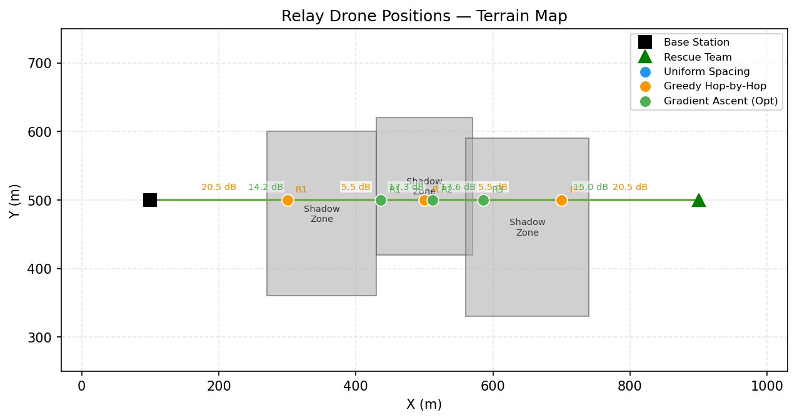
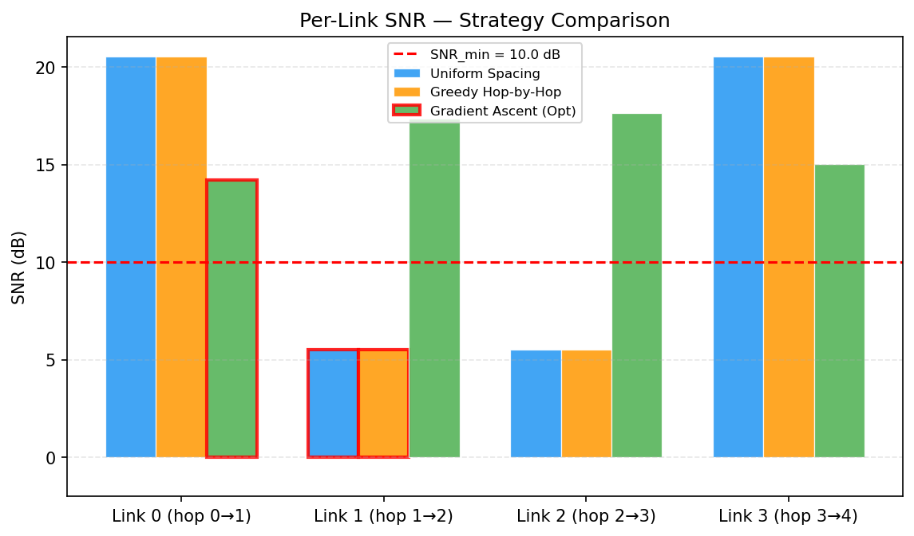
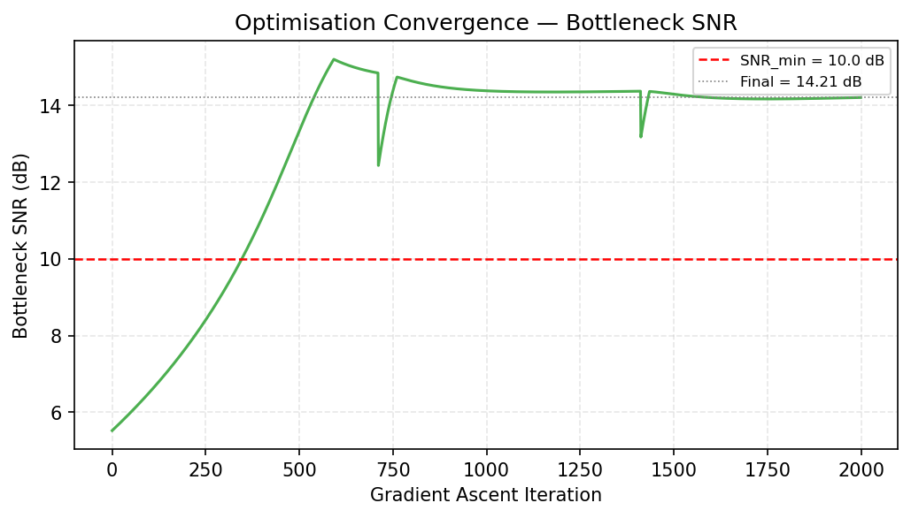
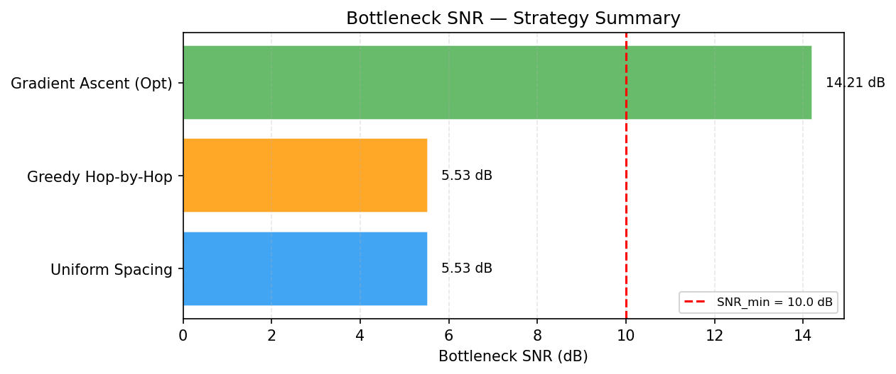
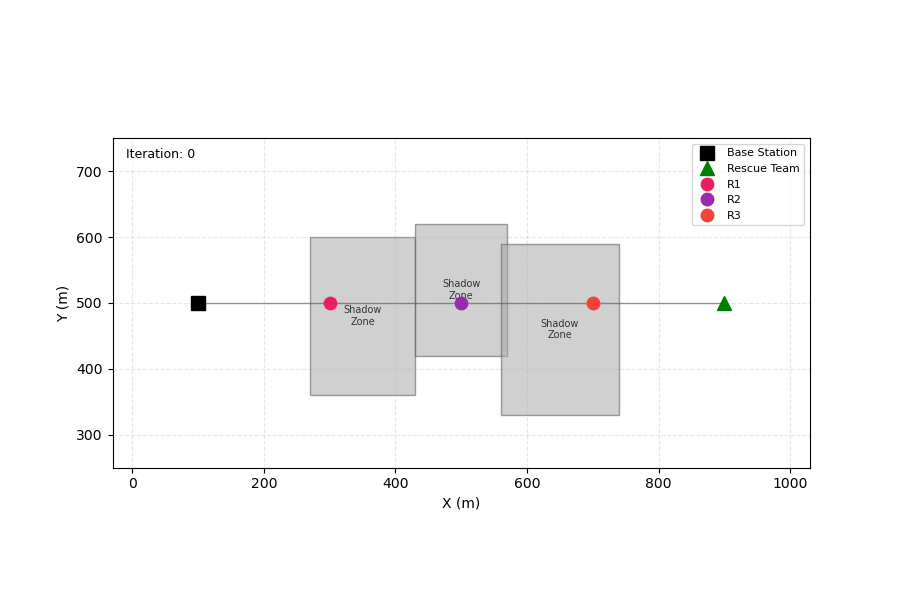

# S047 Base Station Signal Relay

**Domain**: Environmental Monitoring & SAR | **Difficulty**: ⭐⭐ | **Status**: ✅ Completed

---

## Problem Definition

**Setup**: A ground base station (BS) at a known position and a rescue team deep in a mountain valley are out of direct radio range. Three relay drones must be positioned in the airspace above a 1000 × 1000 m operating area to form a communication chain bridging the BS (at (100, 500) m) and the rescue team (at (900, 500) m). The intervening terrain features three shadow zones (ridge lines and valley walls) that create additional signal attenuation. Each drone acts as a store-and-forward repeater. The quality of the end-to-end link is governed by the **weakest** link in the chain (the bottleneck).

**Objective**: Find the three relay positions that maximise the minimum single-hop SNR across all four links in the chain:

$$\max_{\mathbf{p}_1, \mathbf{p}_2, \mathbf{p}_3} \; \min_{k \in \{0,1,2,3\}} \text{SNR}_k$$

**Comparison Strategies**:
1. **Uniform spacing** — relays placed at equal fractional distances along the straight BS-to-team line
2. **Greedy hop-by-hop** — each relay placed to maximise the SNR of the current hop independently
3. **Gradient ascent on min-SNR** — iterative coordinate ascent directly optimising the bottleneck objective

---

## Mathematical Model

### Log-Distance Path Loss with Terrain Shadowing

$$L(d) = L_0 + 10 n \log_{10}\!\left(\frac{d}{d_0}\right) + \Delta_{shadow} \cdot \mathbf{1}[\text{midpoint} \in \text{shadow zone}] \quad \text{(dB)}$$

where $L_0 = 20 \log_{10}(4\pi d_0 f_c / c)$, $n = 2.8$ (mixed terrain), and $\Delta_{shadow} = 15$ dB.

### Per-Link SNR

$$\text{SNR}_k \;[\text{dB}] = P_{tx} - L(d_k) - N_{floor}$$

A link is viable if $\text{SNR}_k \geq \text{SNR}_{min} = 10$ dB.

### Gradient Ascent on Soft-Min SNR

Because $J = \min_k \text{SNR}_k$ is non-differentiable, gradient ascent uses a smooth approximation:

$$J_{soft} = -\frac{1}{\alpha} \ln \!\left(\sum_{k=0}^{3} e^{-\alpha \cdot \text{SNR}_k}\right), \qquad \alpha = 0.5$$

Relay positions are updated iteratively with step size $\eta = 5$ m per iteration for 2000 iterations total.

---

## Key Parameters

| Parameter | Value | Notes |
|-----------|-------|-------|
| Carrier frequency $f_c$ | 2.4 GHz | ISM band |
| Reference distance $d_0$ | 1 m | |
| Path loss exponent $n$ | 2.8 | Mixed terrain |
| Transmit power $P_{tx}$ | 30 dBm | All nodes |
| Noise floor $N_{floor}$ | -95 dBm | |
| Minimum viable SNR | 10 dB | |
| Max comm range $d_{max}$ | 600 m | Per hop |
| Terrain shadow penalty $\Delta_{shadow}$ | 15 dB | |
| Number of relay drones | 3 | |
| Shadow zone count | 3 obstructions | |
| Soft-min temperature $\alpha$ | 0.5 | |
| Gradient ascent step $\eta$ | 5 m / iteration | |
| Gradient ascent iterations | 2000 | |
| Operating area | 1000 × 1000 m | |
| Base station position | (100, 500) m | |
| Rescue team position | (900, 500) m | |

---

## Implementation

```
src/03_environmental_sar/s047_signal_relay.py   # Main simulation script
```

```bash
conda activate drones
python src/03_environmental_sar/s047_signal_relay.py
```

---

## Results

**Key findings**:
- **Uniform spacing**: bottleneck SNR **5.53 dB** — below the 10 dB viability threshold because links pass through shadow zones
- **Gradient ascent (optimised)**: bottleneck SNR **14.21 dB** — improvement of **+8.68 dB** over uniform; relays migrate away from shadow zones and balance link distances
- Gradient ascent converges within ~2000 iterations; rapid initial improvement followed by a plateau

**Terrain Map** — 1000 × 1000 m operating area with shadow zones (grey rectangles), BS (black square), rescue team (green triangle), and relay positions for each strategy; link SNR values annotated:



**SNR Bar Chart** — Grouped bar chart with four link bars per strategy; horizontal dashed line at $\text{SNR}_{min} = 10$ dB; bottleneck link highlighted:



**Convergence Curve** — Bottleneck SNR (dB) vs. gradient ascent iteration number; shows rapid initial improvement then plateau:



**Bottleneck Comparison** — Horizontal bar chart comparing $\min_k \text{SNR}_k$ across all three strategies:



**Animation**:



---

## Extensions

1. **3D altitude optimisation**: extend relay positions to $(x, y, z)$, allowing drones to climb above ridge lines; add an altitude penalty term (energy cost) to balance SNR gain against flight endurance.
2. **Stochastic shadowing**: replace fixed $X_\sigma = 0$ with Monte Carlo realisation $X_\sigma \sim \mathcal{N}(0, \sigma_{sh}^2)$; optimise expected bottleneck SNR or the 10th-percentile (robust design).
3. **Dynamic relay — moving rescue team**: the rescue team moves at 1 m/s; implement a receding-horizon controller that re-solves the relay placement every 30 s.
4. **Heterogeneous transmit power**: assign individual $P_{tx,i}$ budgets per relay drone subject to $\sum_i P_{tx,i} \leq P_{total}$; co-optimise positions and power allocation.
5. **Relay count selection**: vary $N_{relays} \in \{1, 2, 3, 4, 5\}$ and plot the trade-off between bottleneck SNR improvement and drone resource cost.

---

## Related Scenarios

- Prerequisites: [S041 Wildfire Boundary Scan](../../scenarios/03_environmental_sar/S041_wildfire_boundary_scan.md), [S046 3D Trilateration](../../scenarios/03_environmental_sar/S046_trilateration.md)
- Follow-ups: [S048 Lawnmower Coverage](../../scenarios/03_environmental_sar/S048_lawnmower.md), [S051 Post-Disaster Comm Network](../../scenarios/03_environmental_sar/S051_post_disaster_comm_network.md)
- Algorithmic cross-reference: [S059 Sonar Buoy Relay](../../scenarios/03_environmental_sar/S059_sonar_buoy_relay.md), [S049 Dynamic Zone Assignment](../../scenarios/03_environmental_sar/S049_dynamic_zone.md) (multi-agent positioning)
