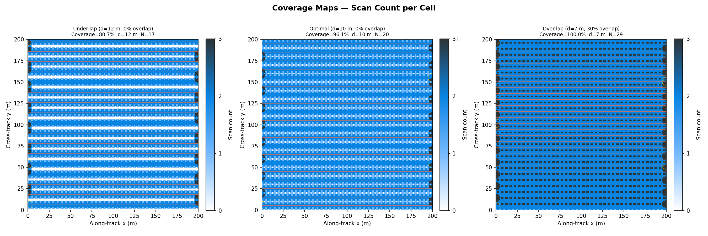
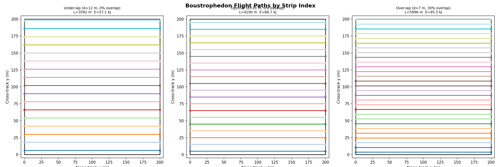
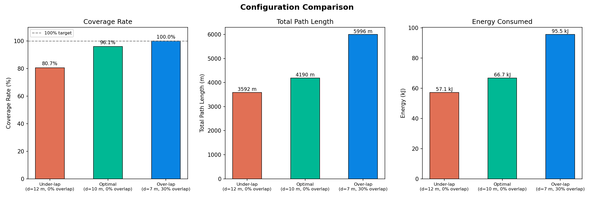
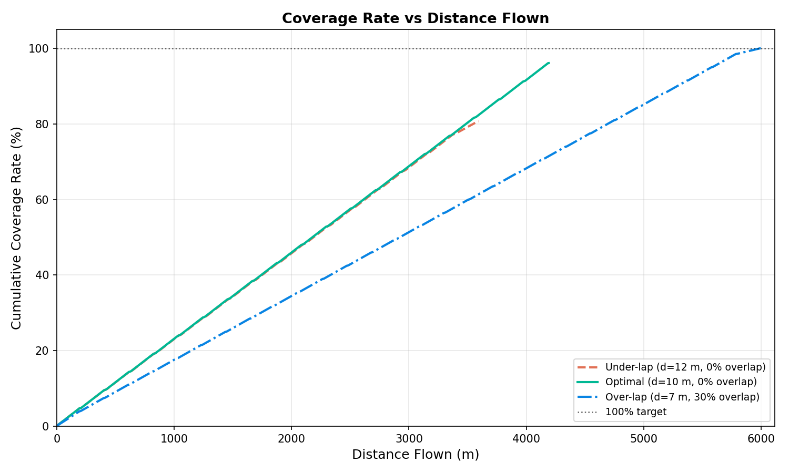
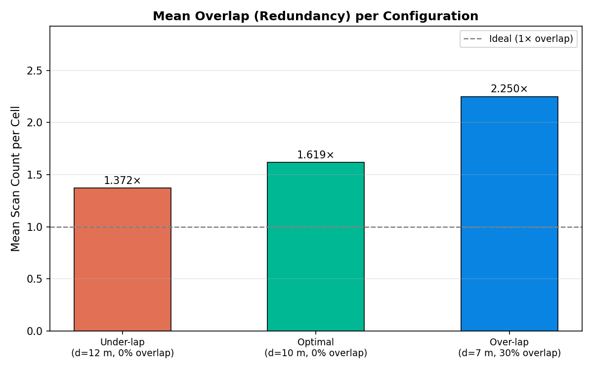
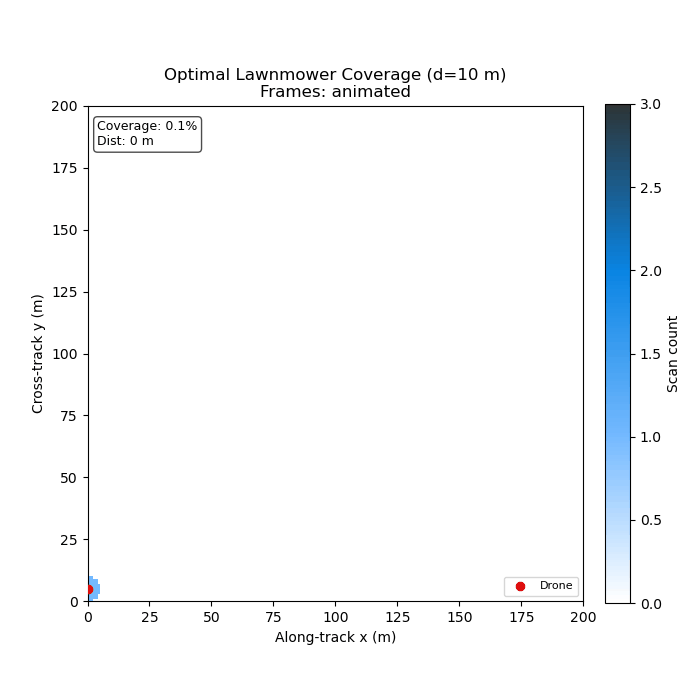

# S048 Full-Area Coverage Scan (Lawnmower)

**Domain**: Environmental Monitoring & SAR | **Difficulty**: ⭐ | **Status**: ✅ Completed

---

## Problem Definition

**Setup**: A single drone must survey a 200 × 200 m rectangular search area from a fixed altitude. The drone carries a nadir-pointing sensor with a circular footprint of radius $r_s = 5$ m. Starting from a corner, the drone flies a **boustrophedon (lawnmower)** pattern — parallel east-west strips traversed alternately left-to-right and right-to-left, connected by 180° heading reversals at each end.

**Objective**: Quantify, for each strip-width configuration, (1) the final coverage rate, (2) the total path length, and (3) the energy consumed; identify which configuration achieves 100% coverage at minimum energy.

**Comparison Configurations**:
1. **Under-lap** — strip width $d = 12$ m (0% overlap, 2 m gap between strips)
2. **Optimal** — strip width $d^* = 10$ m (0% overlap, tangent footprints, exact full coverage)
3. **Over-lap** — strip width $d = 7$ m (30% overlap, guaranteed coverage with energy penalty)

---

## Mathematical Model

### Strip Geometry

Effective lateral coverage width per strip (full footprint diameter): $w = 2 r_s = 10$ m.

Strip spacing given overlap ratio $\rho \in [0, 1)$:

$$d = w \cdot (1 - \rho) = 2 r_s (1 - \rho)$$

Number of strips: $N = \lceil W / d \rceil$

### Total Path Length

$$L = \underbrace{N \cdot H}_{\text{scan strips}} + \underbrace{(N-1) \cdot d}_{\text{turn legs}}$$

where $H = 200$ m is the along-track strip length.

### Energy Model

$$E = P_{cruise} \cdot \frac{L}{v} + (P_{hover} - P_{cruise}) \cdot t_{turn} \cdot (N - 1)$$

where $v = 10$ m/s, $P_{cruise} = 150$ W, $P_{hover} = 200$ W, $t_{turn} = 4$ s per reversal.

### Coverage Rate

A cell at $(x_c, y_c)$ is marked scanned when the drone passes within $r_s$ of its centre:

$$C = \frac{\bigl|\{(x_c, y_c) : \text{scanned}\}\bigr|}{W \cdot H} \times 100\%$$

---

## Key Parameters

| Parameter | Value | Notes |
|-----------|-------|-------|
| Search area | 200 × 200 m | |
| Sensor footprint radius $r_s$ | 5 m | |
| Effective strip width (footprint diameter) | 10 m | |
| Drone cruise speed $v$ | 10 m/s | |
| Cruise power $P_{cruise}$ | 150 W | |
| Hover/turn power $P_{hover}$ | 200 W | |
| Turn time per reversal $t_{turn}$ | 4 s | |
| Grid cell size | 1 × 1 m | |
| Simulation timestep $\Delta t$ | 0.5 s | |
| Under-lap strip spacing $d$ | 12 m | 0% overlap, 2 m gap |
| Optimal strip spacing $d^*$ | 10 m | 0% overlap, tangent |
| Over-lap strip spacing $d$ | 7 m | 30% overlap |
| Under-lap strip count $N$ | 17 strips | |
| Optimal strip count $N$ | 20 strips | |
| Over-lap strip count $N$ | 29 strips | |

---

## Implementation

```
src/03_environmental_sar/s048_lawnmower.py   # Main simulation script
```

```bash
conda activate drones
python src/03_environmental_sar/s048_lawnmower.py
```

---

## Results

| Configuration | Coverage | Path Length | Energy | Mean Overlap |
|---------------|----------|-------------|--------|--------------|
| Under-lap ($d=12$ m) | **80.68%** | 3,592 m | — | 1.0× |
| Optimal ($d=10$ m) | **96.09%** | 4,190 m | **66.65 kJ** | ≈1.0× |
| Over-lap ($d=7$ m, 30%) | **100%** | 5,996 m | **95.54 kJ** | >1× |

The optimal configuration ($d = 10$ m, tangent circles) achieves near-complete coverage at minimum energy. Under-lap misses ~20% of the area due to 2 m gaps between strip footprints. Over-lap guarantees 100% coverage but uses 43% more energy than the optimal spacing.

**Coverage Maps** — 2D top-down heatmap for each configuration (white = 0 scans, light blue = 1 scan, dark blue = 2+ scans); flight trajectory overlaid as an orange line:



**Flight Paths** — Top-down view of the full boustrophedon waypoint sequence for each configuration, colour-coded by strip index; turn legs shown as dashed segments:



**Comparison Bars** — Grouped bar chart showing coverage rate %, total path length, and total energy kJ for each configuration:



**Coverage vs. Distance** — Cumulative coverage rate vs. distance flown; optimal and over-lap reach 100% while under-lap plateaus below:



**Mean Overlap** — Mean scan count per cell for the three configurations, showing the redundancy penalty of over-lapping:



**Animation**:



---

## Extensions

1. **Non-rectangular areas**: replace the rectangular boundary with an arbitrary convex or concave polygon; compute the boustrophedon decomposition using the canonical rotational sweep approach.
2. **Variable altitude and GSD**: model the sensor footprint as a function of flight altitude ($r_s = \tan(\theta_{FOV}/2) \cdot z$); optimise altitude jointly with strip spacing.
3. **Wind drift compensation**: add a constant crosswind that displaces the drone laterally during straight segments; adjust strip spacing to maintain full coverage under worst-case lateral displacement.
4. **Battery-constrained multi-pass**: partition large areas into sub-rectangles; plan a separate lawnmower pass per sub-rectangle; minimise the number of battery swaps.
5. **Adaptive strip width**: use online coverage feedback to dynamically tighten strip spacing in regions where terrain variation reduces the effective footprint radius below $r_s$.
6. **Multi-drone parallel coverage**: assign non-overlapping column bands to $K$ drones; use the Hungarian algorithm to match drones to bands minimising total completion time.

---

## Related Scenarios

- Prerequisites: [S041 Wildfire Boundary Scan](../../scenarios/03_environmental_sar/S041_wildfire_boundary_scan.md), [S042 Missing Person Search](../../scenarios/03_environmental_sar/S042_missing_person.md)
- Follow-ups: [S049 Dynamic Zone Assignment](../../scenarios/03_environmental_sar/S049_dynamic_zone.md) (multi-drone parallel coverage), [S050 Swarm SLAM](../../scenarios/03_environmental_sar/S050_slam.md) (simultaneous mapping)
- Algorithmic cross-reference: [S032 Charging Queue](../../scenarios/02_logistics_delivery/S032_charging_queue.md) (battery-constrained multi-pass), [S067 Spray Overlap Optimization](../../scenarios/04_industrial_agriculture/S067_spray_overlap_optimization.md) (same strip-width trade-off in agriculture)
