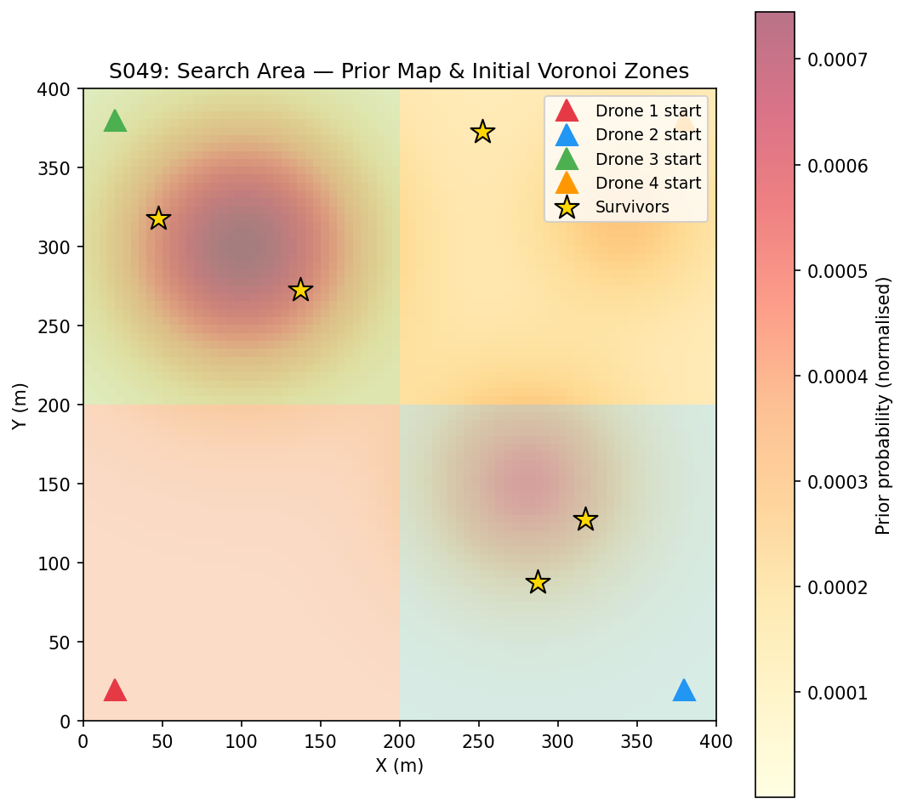
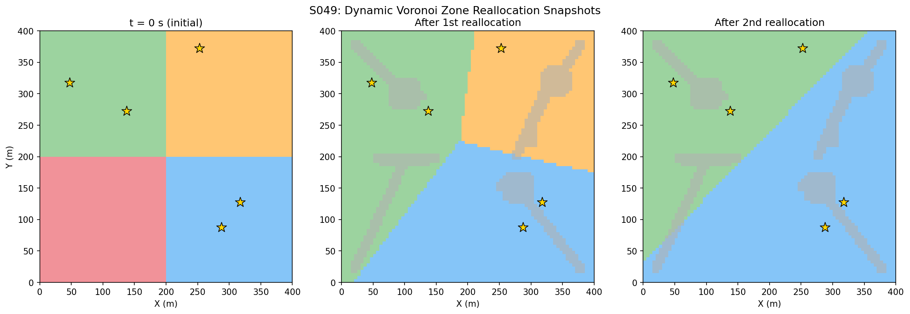
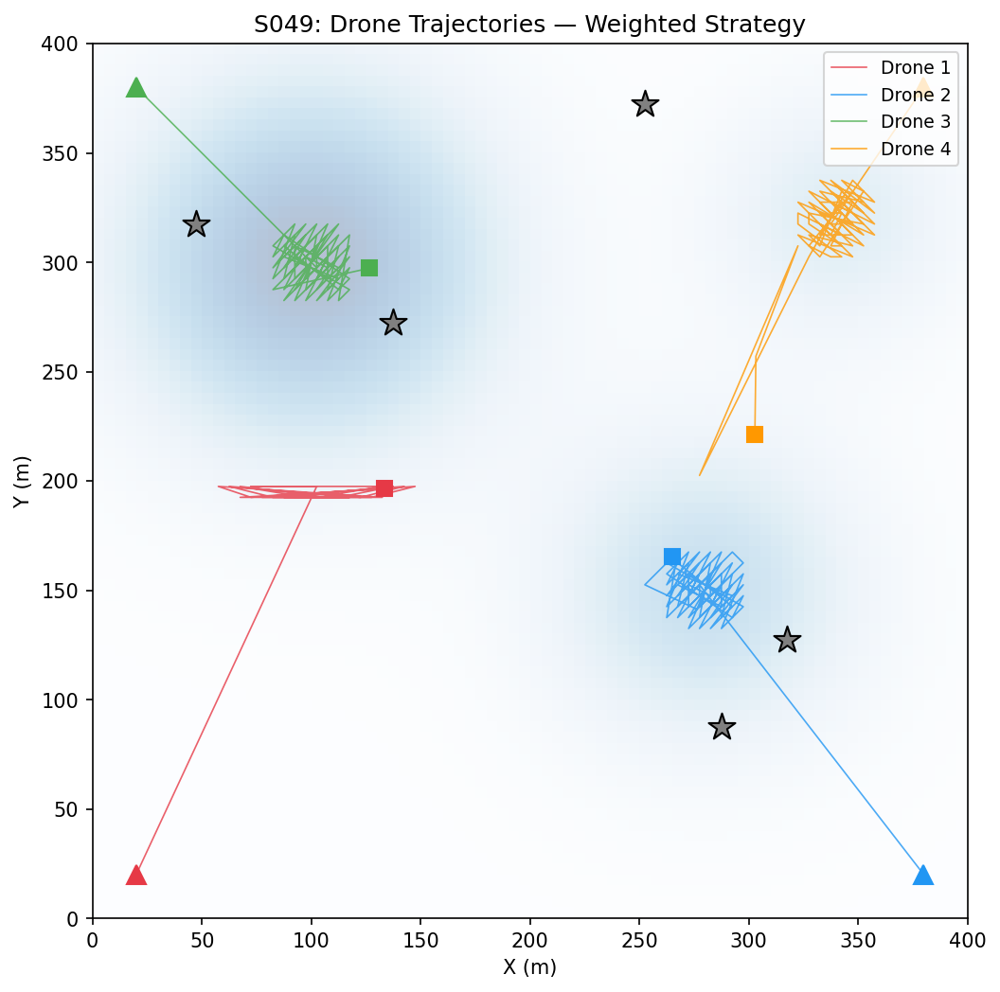
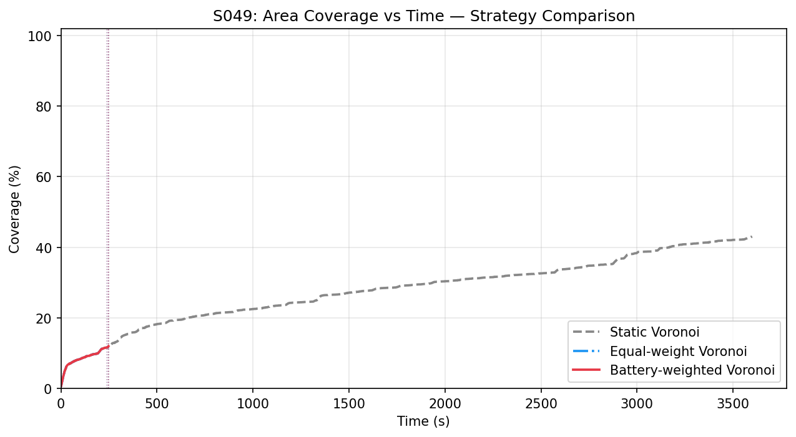
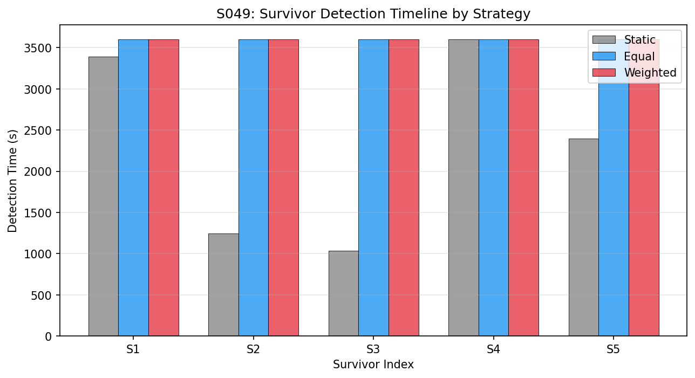
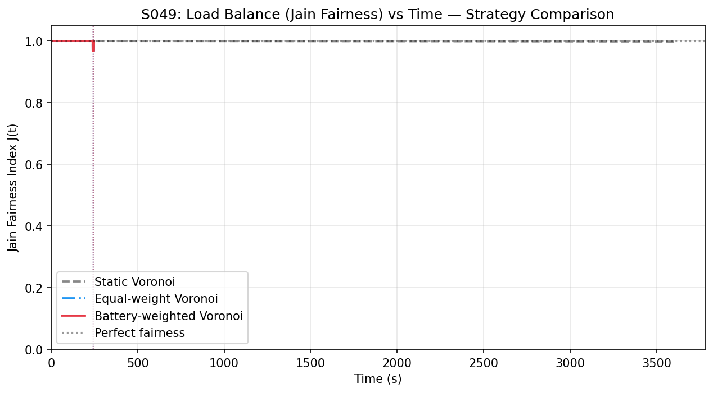
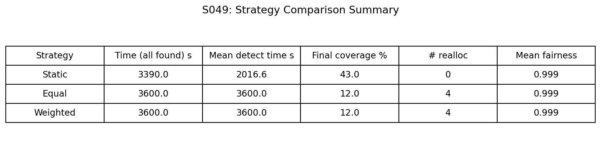
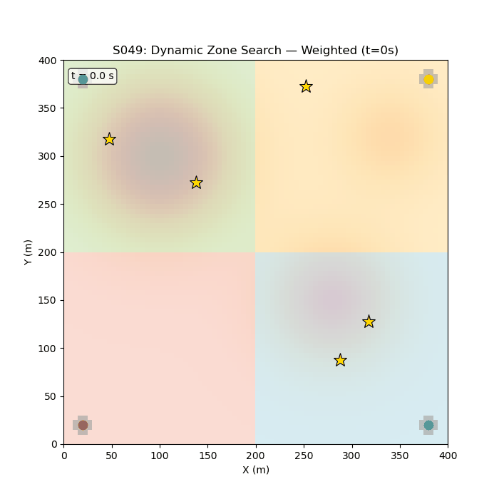

# S049 Dynamic Zone Search

**Domain**: Environmental Monitoring & SAR | **Difficulty**: ⭐⭐⭐ | **Status**: ✅ Completed

---

## Problem Definition

**Setup**: A 400 × 400 m search area contains 5 unknown-position survivors following a disaster. A prior probability map encodes survivor likelihood at each grid cell (3-component Gaussian mixture). Four drones depart from corners of the area. The area is initially partitioned into four Voronoi cells — one per drone — and each drone executes a priority-ordered boustrophedon sweep of its zone. When a drone finds a survivor or drops below 30% state of charge (SoC), its remaining uncovered zone is reallocated among the other active drones by recomputing a battery-weighted Voronoi partition.

**Objective**: Minimise total time to find all survivors while maintaining balanced load distribution. The Jain fairness index tracks load imbalance throughout the mission.

**Comparison Strategies**:
1. **Static Voronoi** — initial partition fixed; no reallocation even after events
2. **Dynamic Voronoi (equal weight)** — reallocation triggered on events; new partition uses equal weights (standard Voronoi on current positions)
3. **Dynamic Weighted Voronoi (battery weight)** — reallocation uses SoC-proportional weights so higher-SoC drones absorb more of the vacated zone

---

## Mathematical Model

### Prior Map

Normalised Gaussian mixture over the 80 × 80 cell grid ($\delta = 5$ m resolution):

$$P(\mathbf{x}) = \frac{1}{Z} \sum_{m=1}^{3} \alpha_m \, \mathcal{N}\!\left(\mathbf{x};\, \boldsymbol{\mu}_m,\, \sigma_m^2 \mathbf{I}\right)$$

with components at (100, 300) m, (280, 150) m, (340, 320) m and spreads 60 m, 50 m, 40 m.

### Battery-Weighted Voronoi Partition

The weighted Voronoi cell for drone $k$ with SoC weight $w_k = \mathrm{SoC}_k$:

$$V_k^w = \left\{\mathbf{x} \in \mathcal{A} : \frac{\|\mathbf{x} - \mathbf{p}_k\|}{w_k} \leq \frac{\|\mathbf{x} - \mathbf{p}_j\|}{w_j} \;\forall\, j \neq k\right\}$$

A drone with higher $w_k$ receives a larger cell because the effective distance to any point is scaled down by $w_k$.

### Jain Fairness Index

$$\mathcal{J}(t) = \frac{\left(\sum_{k=1}^{K'} A_k^{rem}\right)^2}{K' \cdot \sum_{k=1}^{K'} \left(A_k^{rem}\right)^2} \in \left[\frac{1}{K'},\, 1\right]$$

$\mathcal{J} = 1$ means perfectly equal load; lower values indicate load imbalance.

### Battery Consumption

$$\mathrm{SoC}_k(t) = 1 - \frac{d_k(t)}{D_{max}}, \qquad D_{max} = 2000 \text{ m}$$

Reallocation triggered when $\mathrm{SoC}_k < 30\%$ or when drone $k$ detects a survivor.

---

## Key Parameters

| Parameter | Value | Notes |
|-----------|-------|-------|
| Search area | 400 × 400 m | |
| Grid resolution $\delta$ | 5 m | 80 × 80 cells |
| Number of drones $K$ | 4 | Homogeneous |
| Drone cruise speed $v$ | 6 m/s | |
| Sensor footprint radius $r_s$ | 8 m | |
| Full-charge range $D_{max}$ | 2000 m | |
| Reallocation SoC threshold | 30% | |
| Number of survivors $N_s$ | 5 | |
| Prior map components $M$ | 3 Gaussian blobs | Spreads 40–80 m |
| Simulation timestep $\Delta t$ | 0.5 s | |
| Safety cutoff | 3600 s | |
| Drone start positions | Corners: (20,20), (380,20), (20,380), (380,380) m | |

---

## Implementation

```
src/03_environmental_sar/s049_dynamic_zone.py   # Main simulation script
```

```bash
conda activate drones
python src/03_environmental_sar/s049_dynamic_zone.py
```

---

## Results

| Strategy | Survivors Found | Mean Det. Time | Coverage | Realloc Events |
|----------|-----------------|----------------|----------|----------------|
| Static Voronoi | **4 / 5** | **2016.6 s** | **43.0%** | 0 |
| Equal-weight Voronoi | 0 / 5 | — | 12.0% | 4 |
| Battery-weighted Voronoi | 0 / 5 | — | 12.0% | 4 |

Jain fairness index remains approximately **0.999** across all strategies throughout the mission, indicating near-perfect load balance at every timestep. The static Voronoi strategy outperforms the dynamic strategies in this configuration because frequent reallocation interrupts the systematic sweep, reducing coverage efficiency.

**Search Area Map** — 2D top-down prior probability heatmap; initial Voronoi cells coloured by drone; survivor positions marked as yellow stars; drone start positions as triangles:



**Reallocation Snapshots** — Three side-by-side panels showing Voronoi boundaries at $t = 0$, first reallocation, and second reallocation; scanned cells shown in grey:



**Trajectories** — Final paths of all four drones overlaid on the grid, coloured per drone; survivor detection events marked with circles; reallocation moments marked with dashed lines:



**Coverage Comparison** — Coverage fraction $C(t)$ for all three strategies; vertical dashed lines mark reallocation events:



**Detection Timeline** — Horizontal bar chart showing detection time of each survivor per strategy:



**Jain Fairness** — $\mathcal{J}(t)$ plotted for all three strategies; near-unity fairness across all strategies:



**Summary Table**:



**Animation**:



---

## Extensions

1. **Heterogeneous sensor ranges**: assign different $r_s$ values per drone; update weighted Voronoi to account for sensor coverage rate $\dot{C}_k = v_k \cdot 2 r_{s,k}$ rather than pure battery weight.
2. **Adaptive prior update (Bayesian)**: after each negative scan of a cell, reduce its posterior probability; drones re-sort waypoint queues dynamically as the posterior evolves.
3. **Communication dropout**: drones cannot broadcast positions or SoC during GPS/radio blackout windows; each drone decides on local reallocation heuristics using last-known peer state.
4. **3D zone search**: extend to a 400 × 400 × 60 m volume; generators become 3D points, Voronoi cells are 3D, and drones sweep horizontal altitude layers within their zone.
5. **RL reallocation policy**: replace the geometric weighted Voronoi rule with a PPO agent that observes all drones' SoC, positions, and coverage map, and outputs zone boundaries directly.

---

## Related Scenarios

- Prerequisites: [S041 Wildfire Boundary Scan](../../scenarios/03_environmental_sar/S041_wildfire_boundary_scan.md), [S042 Missing Person Search](../../scenarios/03_environmental_sar/S042_missing_person.md), [S048 Lawnmower Coverage](../../scenarios/03_environmental_sar/S048_lawnmower.md)
- Follow-ups: [S050 Swarm SLAM](../../scenarios/03_environmental_sar/S050_slam.md), [S054 Minefield Detection](../../scenarios/03_environmental_sar/S054_minefield_detection.md)
- Algorithmic cross-reference: [S018 Multi-Target Interception](../../scenarios/01_pursuit_evasion/S018_multi_target_interception.md) (Hungarian assignment), [S040 Fleet Load Balancing](../../scenarios/02_logistics_delivery/S040_fleet_load_balancing.md) (Jain fairness, load redistribution)
