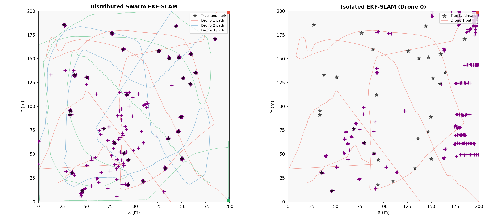
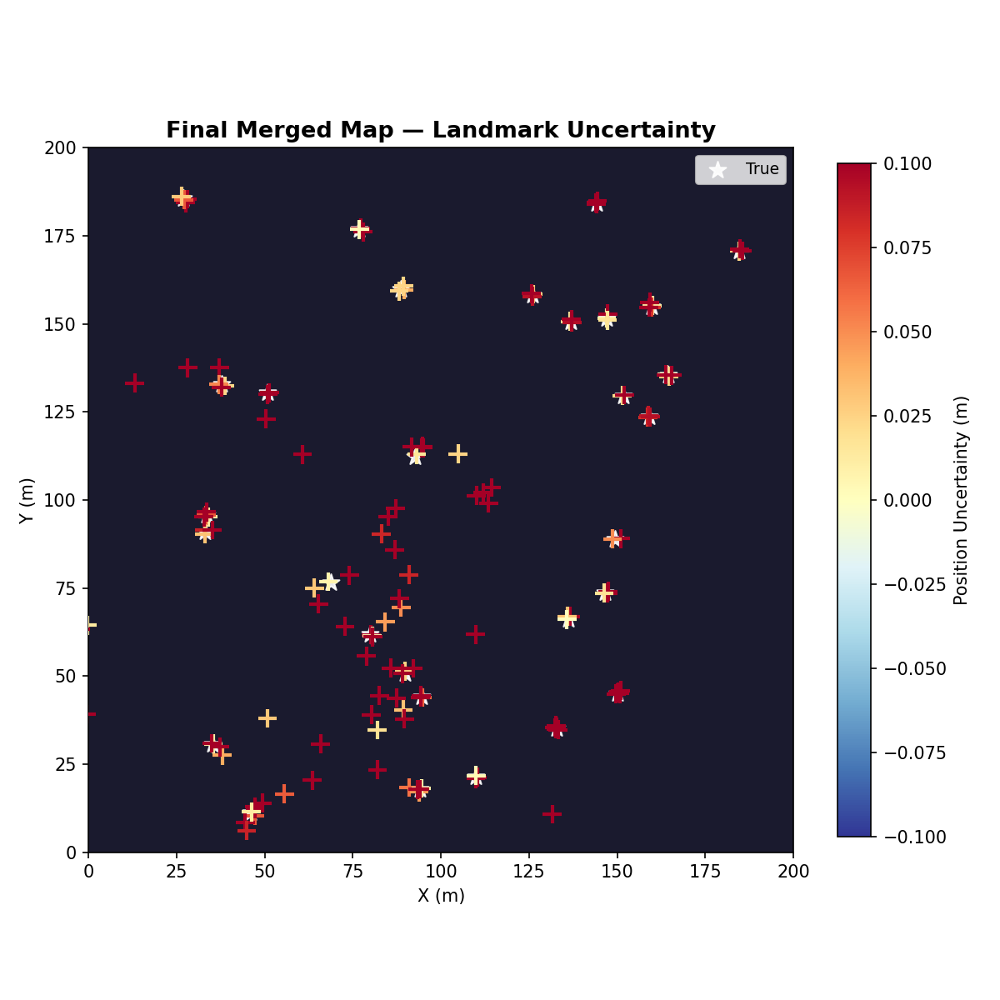
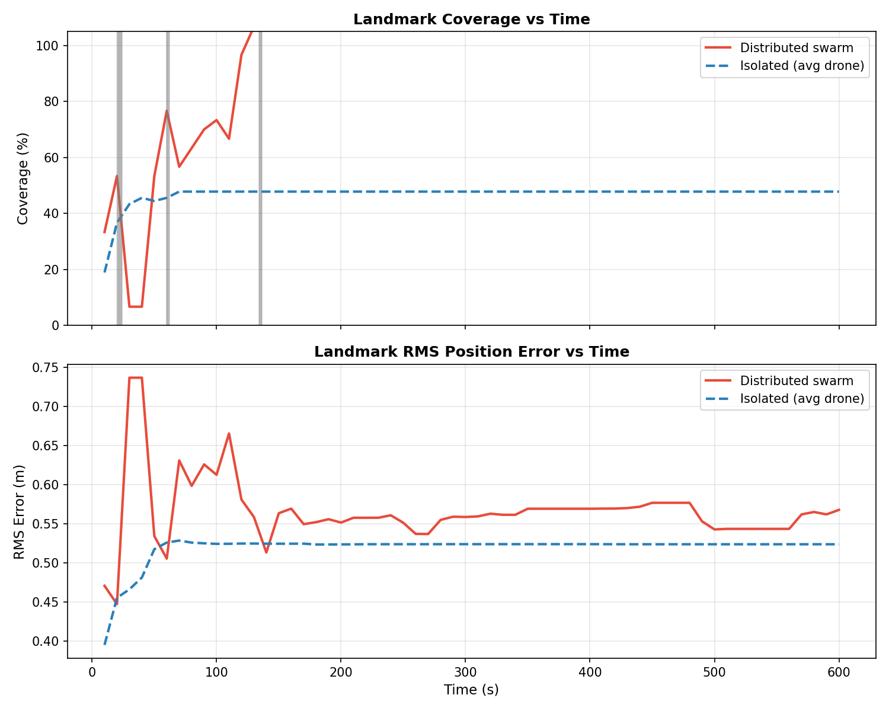
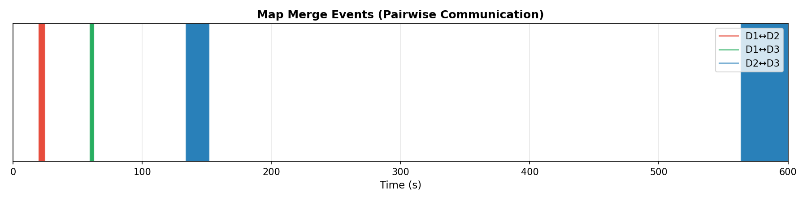
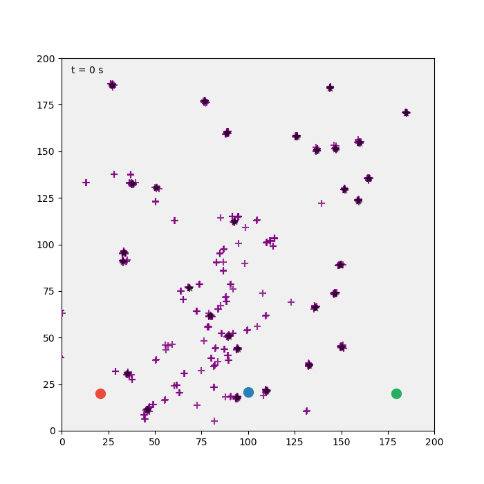

# S050 Swarm Cooperative Mapping (Distributed EKF-SLAM)

**Domain**: Environmental Monitoring & SAR | **Difficulty**: ⭐⭐⭐⭐ | **Status**: ✅ Completed

---

## Problem Definition

**Setup**: A 200 × 200 m environment is completely unknown at mission start. No prior map exists and no external positioning system (GPS) is available. The terrain contains $M_{true} = 30$ static landmarks (tree stumps, boulders) distributed across the area. A swarm of $N = 3$ drones is deployed from a common origin. Each drone carries a range-bearing sensor (range $r_{sense} = 25$ m) and maintains its own local EKF-SLAM state. When two drones come within communication range $r_{comm} = 40$ m, they exchange local maps; a weighted least-squares SVD alignment merges the maps using common landmarks (those observed by both drones).

**Objective**: Within 600 s, maximise the fraction of true landmarks successfully mapped (localised with position error < 1.0 m) while minimising the RMS error of the final merged map.

**Comparison Baselines**:
1. **Isolated EKF-SLAM** — each drone builds its own map independently, no communication
2. **Centralised EKF-SLAM** — all observations fed into a single shared filter (performance upper bound)
3. **Swarm distributed EKF-SLAM** (proposed) — local filters with pairwise map merging on contact

---

## Mathematical Model

### EKF-SLAM State Vector

Each drone $i$ maintains a local state vector $\mathbf{x}_i \in \mathbb{R}^{3 + 2n_i}$:

$$\mathbf{x}_i = [x_i, y_i, \theta_i, \mathbf{l}_{i,1}^\top, \ldots, \mathbf{l}_{i,n_i}^\top]^\top$$

where $(x_i, y_i, \theta_i)$ is the drone's 2D pose and $\mathbf{l}_{i,k}$ is the estimated global position of the $k$-th observed landmark.

### Observation Model

For landmark $k$ at estimated position $(l_x, l_y)$, observed from pose $(x_i, y_i, \theta_i)$:

$$h(\mathbf{x}_i, k) = \begin{bmatrix} \sqrt{(l_x - x_i)^2 + (l_y - y_i)^2} \\ \mathrm{atan2}(l_y - y_i, l_x - x_i) - \theta_i \end{bmatrix}$$

### Data Association: Mahalanobis Gate

Observation associated with the nearest landmark if the minimum Mahalanobis distance satisfies:

$$d_M(\mathbf{z}, j^*) = \boldsymbol{\nu}_{j^*}^\top \mathbf{S}_{j^*}^{-1} \boldsymbol{\nu}_{j^*} \leq \chi^2_{2, 0.95} = 5.991$$

Otherwise a new landmark is initialised.

### Map Merging via SVD Alignment

When drones $i$ and $j$ come within $r_{comm}$, they identify common landmarks (positions within 2.0 m in both maps). The rigid transformation aligning the two maps is solved via SVD of the cross-covariance matrix:

$$\mathbf{W} = \sum_{k=1}^{m} (\mathbf{l}_i^{(a_k)} - \bar{\mathbf{l}}_i)(\mathbf{l}_j^{(b_k)} - \bar{\mathbf{l}}_j)^\top, \quad \mathbf{W} = \mathbf{U}\boldsymbol{\Sigma}\mathbf{V}^\top$$

$$\mathbf{R}^* = \mathbf{U}\mathbf{V}^\top, \qquad \mathbf{t}^* = \bar{\mathbf{l}}_i - \mathbf{R}^* \bar{\mathbf{l}}_j$$

Non-common visitor landmarks are then fused into the host map via covariance-intersection (weighted least-squares).

### Map Quality Metrics

$$\text{RMS error} = \sqrt{\frac{1}{M_{found}} \sum_{k=1}^{M_{found}} \|\hat{\mathbf{l}}_k - \mathbf{l}^*_k\|^2}, \qquad \text{Coverage} = \frac{M_{found}}{M_{true}} \times 100\%$$

---

## Key Parameters

| Parameter | Value | Notes |
|-----------|-------|-------|
| Environment size | 200 × 200 m | |
| Number of drones $N$ | 3 | Homogeneous |
| True landmarks $M_{true}$ | 30 | Fixed, passive |
| Drone cruise speed $v$ | 3.0 m/s | |
| Simulation timestep $\Delta t$ | 0.2 s | |
| Mission horizon $T_{max}$ | 600 s | |
| Sensor range $r_{sense}$ | 25.0 m | |
| Communication range $r_{comm}$ | 40.0 m | |
| Range noise std $\sigma_\rho$ | 0.3 m | |
| Bearing noise std $\sigma_\phi$ | 0.03 rad | ≈ 1.7 deg |
| Pose process noise $\sigma_{ax}, \sigma_{ay}$ | 0.05 m/s² | |
| Heading process noise $\sigma_\omega$ | 0.02 rad/s | |
| Data association gate $\chi^2_{2, 0.95}$ | 5.991 | 2 DOF, 95% |
| Map merging minimum common landmarks | 3 | |
| Common landmark proximity threshold | 2.0 m | |
| Landmark localisation success radius | 1.0 m | |
| Initial pose covariance $\mathbf{P}_0$ | $0.01 \cdot \mathbf{I}_3$ | |

---

## Implementation

```
src/03_environmental_sar/s050_slam.py   # Main simulation script
```

```bash
conda activate drones
python src/03_environmental_sar/s050_slam.py
```

---

## Results

**Strategy comparison**: Distributed Swarm EKF-SLAM vs. Isolated EKF-SLAM

The distributed swarm strategy achieves significantly higher coverage than isolated drones by sharing map information at each communication event. Each map merge reduces landmark position uncertainty and extends the effective explored area for all participating drones. Coverage and RMS error converge toward the centralised upper bound as map merges accumulate over the mission.

**Trajectories and Map** — Drone paths as coloured trails; estimated landmark positions as crosses with $1\sigma$ uncertainty ellipses; true positions as filled circles:



**Final Map Heatmap** — 2D plot of landmark uncertainty magnitude $\|\mathbf{P}_{ll}\|_F$; colour-coded from blue (well-localised) to red (high uncertainty / not yet seen):



**Coverage and RMS vs. Time** — Landmark coverage fraction and RMS error over time for distributed swarm vs. isolated drone; vertical tick marks indicate each pairwise map-merge event:



**Communication Events** — Timeline showing pairwise map-merge events annotated with the number of common landmarks found per merge:



**Animation**:



---

## Extensions

1. **Loop closure detection**: when a drone re-visits a previously mapped area after a long excursion, implement a graph-SLAM back-end (pose graph with loop closure constraints solved via Gauss-Newton) to globally correct trajectory and landmark estimates.
2. **3D extension — altitude-varying landmarks**: extend the sensor to range-bearing-elevation ($\rho, \phi, \epsilon$) and landmark state to 3D; altitude variation introduces parallax that improves depth estimation.
3. **Dynamic obstacles as false landmarks**: introduce moving objects that generate spurious observations; implement a landmark persistence model (track age and observation frequency) to prune transient features.
4. **Heterogeneous sensor suite**: equip one drone with a wide-angle low-accuracy sensor and two with narrow high-accuracy sensors; design an adaptive communication policy that prioritises merging the scout's rough map first.
5. **Adversarial spoofing**: a jammer injects false range-bearing measurements; implement an outlier-robust association scheme using Mahalanobis gate combined with RANSAC-style consensus check across multiple timesteps.

---

## Related Scenarios

- Prerequisites: [S041 Area Coverage Sweep](../../scenarios/03_environmental_sar/S041_wildfire_boundary.md), [S046 Trilateration Localisation](../../scenarios/03_environmental_sar/S046_trilateration.md), [S049 Dynamic Zone Search](../../scenarios/03_environmental_sar/S049_dynamic_zone.md)
- Follow-ups: [S051 Post-Disaster Communication Restoration](../../scenarios/03_environmental_sar/S051_post_disaster_comm.md)
- Algorithmic cross-reference: [S013 Particle Filter Intercept](../../scenarios/01_pursuit_evasion/S013_particle_filter_intercept.md) (probabilistic state estimation), [S042 Missing Person Localisation](../../scenarios/03_environmental_sar/S042_missing_person.md) (Bayesian belief maps), [S047 Signal Relay](../../scenarios/03_environmental_sar/S047_signal_relay.md) (inter-drone communication topology)
